# 智能模型路由访问平台设计方案

> **版本**：v1.5  
> **状态**：与已实现原型（含 API Key 鉴权、容器化 K8s 部署、Higress 集成、应用身份管控阶段 1）对齐  
> **日期**：2026-09-02

***

## 0. 架构方案对比：MAS 独立服务 vs Higress 插件化

> 本节对比两种实现路径的核心差异，说明为何选择方案 A（MAS 独立服务）作为当前架构。

### 0.1 架构概览

| | 方案 A — MAS 独立服务（当前） | 方案 B — Higress 插件化 |
|---|---|---|
| **拓扑** | `Client → Higress (L7) → MAS (L1-L4) → OmniRoute → 引擎` | `Client → Higress (L7 + L1-L4 插件) → OmniRoute → 引擎` |
| **核心载体** | Java 17 + Spring Boot WebFlux 独立进程 | Higress Wasm/Lua 插件，运行在 Envoy filter chain 内 |
| **状态存储** | PostgreSQL（pgvector）+ Caffeine 本地缓存 | 需外部存储（插件无持久状态） |

### 0.2 逐能力对比

| 能力 | 方案 A：MAS 独立实现 | 方案 B：Higress 插件实现 | 差异要点 |
|------|---------------------|-------------------------|----------|
| **L1 鉴权/限流** | PG `mas_api_key` + Caffeine 缓存；AC 自动机敏感词；PG 原子限流 | Wasm 插件需调用外部鉴权服务或内嵌 Redis（项目红线禁用 Redis） | PG 原子操作在 Wasm 中无法直接实现，需 ext_proc 回调外部服务，增加一跳延迟 |
| **L2 精确缓存** | Caffeine L1 (10万条) + PG L2，SHA-256 key | Wasm 无本地高速缓存，需每次查 PG 或引入 Redis | 缺少 Caffeine 层，缓存命中率相同但延迟更高 |
| **L2 语义缓存** | HTTP 调 embedding 模型 + pgvector HNSW 余弦搜索 | Wasm 内做 HTTP + 向量计算极其受限；pgvector SQL 无法在 Wasm 执行 | 语义缓存几乎不可行于纯插件，必须 ext_proc 回调 |
| **L3 意图/难度路由** | 内存模型注册表（30s 刷新）+ 关键词分类 + 加权随机 + 难度评分 | 可在 Lua 中实现规则引擎，但模型注册表需外部同步 | 规则逻辑本身可移植，但状态同步是额外复杂度 |
| **L4 配额预扣/结算** | PG 原子 UPDATE 预扣 → 响应后 refund 差值 | 请求阶段 + 响应阶段两次 PG 写入；Wasm 无事务保证 | 预扣-结算的两阶段模式在插件中实现复杂度高，一致性难保证 |
| **流式 SSE 透传** | Reactor Flux 逐 chunk 透传 + 滑动窗口敏感词审核 + 聚合写缓存 | Envoy 原生支持 SSE 透传，但 chunk 级内容审核需 Lua/Wasm body filter | 滑动窗口审核在 Envoy filter chain 中实现难度大；post-stream 回调写缓存需额外机制 |
| **熔断/故障转移** | 内存 per-endpoint 状态机 (CLOSED→OPEN→HALF_OPEN) | Higress 有内置 outlier detection，但自定义逻辑需插件 | Higress 内置能力可部分替代，但细粒度控制不如自建 |
| **调用日志/审计** | PG `mas_call_log` 异步写入 | 插件内写 PG 不现实，需 ext_proc 或 sidecar 日志 | 审计链路需额外基础设施 |

### 0.3 优劣总结

#### 方案 A（当前 — MAS 独立服务）

**优势：**
- **技术栈自由**：Java 生态完整（Reactor、MyBatis-Plus、Caffeine、jtokkit），pgvector 原生 SQL，无运行时约束
- **状态管理简单**：所有状态在 PG，事务/原子操作/向量索引直接可用
- **流式处理成熟**：Reactor Flux 天然适配 SSE 逐 chunk 处理、滑动窗口审核、聚合写回
- **可测试性**：135 项单测覆盖完整 pipeline，可独立于网关测试
- **运维解耦**：MAS 故障可旁路降级（agent 直连引擎），Higress 故障不影响 MAS 本身
- **迭代速度**：业务逻辑变更只需重新部署 MAS，不涉及网关配置

**劣势：**
- **多一跳延迟**：`Client → Higress → MAS → OmniRoute → 引擎`，比插件化多一跳网络开销（估算约 1-3ms，基于同机房 Pod 间 gRPC/HTTP 往返延迟的典型值；LLM 单次推理典型耗时 2-30s，该延迟占比 < 0.1%，对用户感知无影响）
- **资源占用**：独立 JVM 进程，2 副本各 256-512Mi 内存
- **部署复杂度**：多一个服务需要管理（镜像、HPA、健康检查）

#### 方案 B（Higress 插件化）

**优势：**
- **延迟更低**：逻辑在网关层执行，省去一跳
- **架构更扁平**：少一个独立服务，运维组件减少
- **流量控制原生**：Higress 内置限流、熔断、灰度、observability 可直接复用

**劣势：**
- **Wasm/Lua 运行时约束严重**：
  - 无法直接访问 PG（无 JDBC/R2DBC），所有 DB 操作需 ext_proc 回调外部服务
  - 无法运行 pgvector 向量搜索，语义缓存不可行
  - Wasm 内存受限（通常 16-64MB），无法承载 Caffeine 级本地缓存
  - SSE body filter 中做滑动窗口审核极其复杂
- **Redis 红线**：项目明确禁用 Redis，而 Higress 插件生态高度依赖 Redis 做共享状态（限流、缓存、会话）
- **两阶段事务难实现**：配额预扣-结算在插件中无事务保证，一致性风险
- **调试/测试困难**：Wasm 插件调试工具链不成熟，无法复用现有 135 项单测
- **开发成本极高**：相当于用 Lua/Wasm 重写整个 L1-L4 pipeline，且受限于运行时能力
- **供应商锁定**：深度耦合 Higress 插件 API，迁移成本高

#### 方案 C（混合方案 — 部分插件化）

> 将 L1 鉴权/限流等"轻量无状态"逻辑下沉到 Higress 插件，L2-L4 保留在 MAS 独立服务中。表面上兼顾了两者的优势，但实际分析后认为不可取。

**设想拆分方式：**

| 层级 | 归属 | 理由 |
|------|------|------|
| L1 API Key 鉴权 + 限流 | Higress 插件 | 逻辑简单、无向量计算、无复杂事务 |
| L1 敏感词过滤 | MAS | AC 自动机词表需内存常驻，Wasm 内存受限 |
| L2 多级缓存 | MAS | 依赖 Caffeine + pgvector，插件无法实现 |
| L3 意图/难度路由 | MAS | 模型注册表需 PG 同步 |
| L4 配额预扣/结算 + 执行 | MAS | 两阶段事务需 PG 原子操作 |

**不采用的原因：**

1. **L1 并非独立无状态**：当前 L1 限流依赖 PG 原子 `UPDATE ... WHERE used + tokens <= limit`（见 `RateLimitService`），插件无法直连 PG，仍需 ext_proc 回调 MAS 或外部存储，省掉的一跳又被加回来
2. **拆分后 L1 插件仍需回调 MAS**：API Key 校验需查 `mas_api_key` 表（含 Caffeine 缓存刷新），限流需 PG 原子操作 —— 插件实质上变成了 MAS 的"透传代理"，架构反而更复杂（`Client → Higress 插件 → MAS → OmniRoute → 引擎`，多了一跳插件调度却没有减少业务跳数）
3. **运维复杂度净增**：需要同时维护 Higress 插件配置 + MAS 服务，两套逻辑的版本、灰度、故障排查需双线跟进；L1 插件与 MAS 之间的状态同步（缓存失效、限流计数）引入新的一致性问题
4. **收益极小**：即使 L1 完全在插件中执行（假设可行），省下的 1-3ms 在 LLM 秒级推理中占比 < 0.1%，用户无感知；而引入的架构复杂度是永久性的
5. **测试覆盖割裂**：当前 135 项单测覆盖完整 L1-L4 pipeline，拆分后需额外编写 Wasm 插件测试（工具链不成熟），且集成测试需覆盖插件 ↔ MAS 交互边界

**结论**：方案 C 的核心矛盾在于 —— L1 看似"轻量无状态"，但实际上与 PG 状态紧密耦合（限流原子操作、API Key 缓存），无法真正剥离到插件中而不引入回调。拆分带来的复杂度增量远大于收益。

### 0.4 结论

| 维度 | 推荐 |
|------|------|
| **功能完整度** | 方案 A — 语义缓存、配额结算、流式审核在插件中几乎不可行 |
| **开发成本** | 方案 A — 已实现，方案 B 等于重写 |
| **运行时约束** | 方案 A — Java 无约束，Wasm 限制严重 |
| **延迟** | 方案 B 略优，但差距为估算 1-3ms（同机房 Pod 间 HTTP 往返），对 LLM 推理（秒级）占比 < 0.1%，可忽略 |
| **运维** | 方案 A 多一个服务，但换来了独立迭代和降级能力 |
| **可维护性** | 方案 A — Java 技术栈团队熟悉，方案 B/C 需 Wasm/Lua 技能栈 |
| **混合拆分** | 方案 A — L1 与 PG 状态紧耦合，部分拆分（方案 C）引入回调反而更复杂 |

**方案 A 是当前项目的合理选择**。Higress 插件化方案在理论上更扁平，但受限于 Wasm 运行时能力（无 PG 直连、无向量搜索、无本地缓存）和项目约束（Redis 红线），实现完整 L1-L4 功能的成本极高且存在功能缺失风险。方案 B 适合逻辑简单（仅鉴权+限流+路由）的场景，但 MAS 的语义缓存和配额两阶段事务超出了插件的合理复杂度边界。方案 C（混合方案）看似折中，但 L1 鉴权限流与 PG 状态紧耦合（原子限流、Key 缓存刷新），无法真正剥离到插件中而不引入额外回调，拆分后的架构复杂度反而高于当前方案。

***

## 1. 概述

### 1.1 产品定位定位

智能模型路由访问平台（Model Access & Scheduling，简称 MAS）是一个 **OpenAI 兼容的 HTTP 代理服务**，插在智能体与底层大模型推理引擎之间，所有大模型调用先经过它，通过多级缓存/智能路由/流量管控，管控后再转发给真正的推理引擎。

**本质上就是：给所有大模型调用加了一个"总闸"，实现统一管控，统括缓存减少重复问题计算，智能路由把问题调度给合适的模型避免浪费算力，管控防止token滥用，把有限的token资源用于保障重要业务。**

### 1.2 核心目标

| 目标        | 说明                            |
| --------- | ----------------------------- |
| **统一入口**  | 所有大模型访问请求经过 MAS 统一收口          |
| **降本增效**  | 通过多级缓存（精确+语义）减少重复推理，降低算力消耗    |
| **智能路由**  | 根据请求意图自动选择最优模型/引擎，提升响应质量      |
| **安全管控**  | 输入/输出内容审核、Token 限额、调用频率控制     |
| **零侵入接入** | 高码智能体只需修改一个 base URL 配置即可完成接入 |

### 1.3 接入方式

> 高码智能体只需将 从旧网关地址改为 MAS 平台地址，即可完成接入。不需要改动任何业务逻辑代码。

### 1.4 智能体接入与 API Key 自助申请

> 当前原型仅暴露 `POST /internal/api-keys` 管理端点（附录 H.1），API Key 的创建依赖运维人员手工调用，智能体团队无法自助申请。随着接入团队增多，这一流程将成为瓶颈。本节设计自助申请流程，使各智能体团队可快速、规范地获取接入凭证。

#### 1.4.1 现状与痛点

| 现状 | 痛点 |
|------|------|
| Key 创建仅 `/internal/api-keys` 一个入口，靠网络隔离保护 | 智能体团队需联系运维手动创建，响应慢、流程不可追溯 |
| 创建时仅传 `user_id` + `app_id`，无更多元数据 | 无法按团队/用途/智能体类型维度统计用量和归集成本 |
| Key 不自动关联配额，创建后需另走配额管理 | 新 Key 默认共享全局配额，无法按团队隔离用量保障 |
| 无 Key 列表/查询接口 | 团队无法查看自己名下有哪些 Key、何时过期、用量多少 |
| 吊销仅按 `key_prefix` 单条操作 | 批量吊销（如团队离职）需逐条操作 |

#### 1.4.2 自助申请流程设计

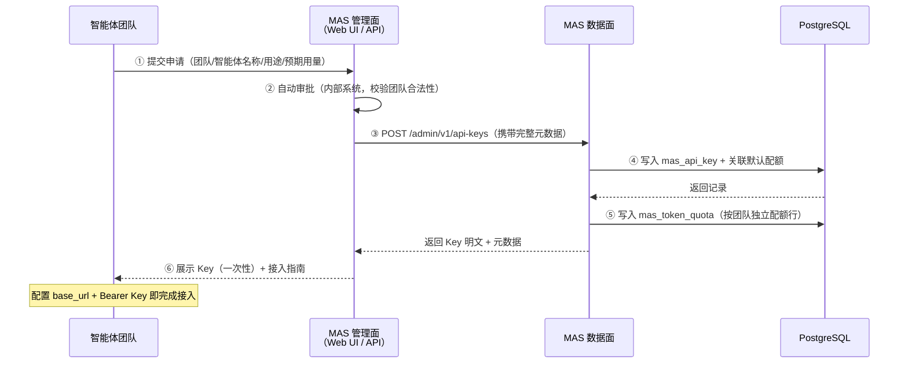

#### 1.4.3 申请信息模型

智能体团队申请 Key 时需提交以下信息：

| 字段 | 必填 | 说明 | 示例 |
|------|------|------|------|
| `team_name` | 是 | 申请团队名称，作为成本归集维度 | `AI平台部-对话组` |
| `agent_name` | 是 | 智能体名称，写入 `mas_call_log.agent_id` 便于审计 | `customer-service-bot` |
| `agent_type` | 是 | 智能体类型（对应 §3.2-3.4 三类） | `agentscope` / `boc_ai` / `agentkit` |
| `purpose` | 否 | 用途说明 | `客服场景自动问答` |
| `expected_daily_tokens` | 否 | 预期日用量，用于自动匹配配额档位 | `50000` |
| `expire_days` | 否 | 有效期天数，默认 365，NULL=永不过期 | `365` |
| `quota_tier` | 否 | 配额档位：`default` / `high` / `unlimited`（需审批），默认 `default` | `default` |

#### 1.4.4 配额档位与自动关联

Key 创建时按 `quota_tier` 自动绑定预定义配额，无需运维手工配置：

| 配额档位 | 每分钟 Token 上限 | 每日 Token 上限 | 适用场景 | 审批要求 |
|---------|-----------------|---------------|---------|----------|
| `default` | 100,000 | 2,000,000 | 一般业务智能体 | 自动审批 |
| `high` | 500,000 | 10,000,000 | 高频/大上下文场景 | 团队负责人审批 |
| `unlimited` | 不限 | 不限 | 核心保障业务 | 平台管理员审批 |

> 配额档位的具体数值后续迁移至 `mas_setting` 管理表（附录 H.2），支持管理面在线调整。

#### 1.4.5 管理 API 增强

在现有附录 H.1 管理 API 基础上，新增以下端点以支撑自助申请：

| 端点 | 方法 | 说明 | 状态 |
|------|------|------|------|
| `/admin/v1/api-keys` | POST | 创建 Key（携带 §1.4.3 完整元数据），自动关联配额 | 增强现有 |
| `/admin/v1/api-keys/list` | GET | 按 `team_name` / `user_id` / `status` 筛选 Key 列表（不返回明文 Key，仅展示 prefix + 元数据 + 用量摘要） | 新增 |
| `/admin/v1/api-keys/{prefix}/rotate` | POST | Key 轮换：生成新 Key 并关联相同配额/身份，旧 Key 进入 grace period（默认 10 分钟）后自动吊销 | 新增 |
| `/admin/v1/api-keys/batch-revoke` | POST | 批量吊销：按 `team_name` 或 `user_id` 批量吊销名下所有 Key | 新增 |
| `/admin/v1/api-keys/{prefix}/usage` | GET | 查询单个 Key 的用量摘要（今日/本周/本月 token 消耗、调用次数、缓存命中率） | 新增 |

#### 1.4.6 数据库变更

`mas_api_key` 表新增字段以承载自助申请元数据：

```sql
-- §1.4 自助申请元数据扩展（幂等 DDL）
ALTER TABLE mas_api_key ADD COLUMN IF NOT EXISTS team_name    VARCHAR(128);
ALTER TABLE mas_api_key ADD COLUMN IF NOT EXISTS agent_name   VARCHAR(128);
ALTER TABLE mas_api_key ADD COLUMN IF NOT EXISTS agent_type   VARCHAR(32);
ALTER TABLE mas_api_key ADD COLUMN IF NOT EXISTS purpose      VARCHAR(256);
ALTER TABLE mas_api_key ADD COLUMN IF NOT EXISTS quota_tier   VARCHAR(16) DEFAULT 'default';
ALTER TABLE mas_api_key ADD COLUMN IF NOT EXISTS created_by   VARCHAR(64) DEFAULT 'admin';
```

> 现有记录 `team_name` / `agent_name` 等新增字段为 NULL，不影响已发放 Key 的鉴权链路。`quota_tier` 默认 `default` 与现有行为一致。

#### 1.4.7 三类智能体接入 Checklist

各类型智能体完成接入的完整步骤：

**Type A — AgentScope Java 高码智能体：**

1. 团队负责人通过管理面提交申请（§1.4.3 信息），获得 API Key
2. 在 Nacos 配置中修改模型服务 base URL 为 MAS 地址
3. 在 Nacos 配置中添加 `Authorization: Bearer <api-key>` 请求头
4. 验证：发送测试请求，检查响应中 `x-mas-meta` 字段确认路由正常

**Type B — BOC AI 低代码平台智能体：**

1. 团队负责人通过管理面提交申请，获得 API Key
2. 在低代码平台模型配置管理界面修改模型服务 URL 为 MAS 地址
3. 在平台「自定义请求头」配置中添加 `Authorization: Bearer <api-key>`
4. 验证：通过平台测试对话功能，确认响应正常

**Type C — AgentKit Python 智能体：**

1. 团队负责人通过管理面提交申请，获得 API Key
2. 修改 `LLMClient` 配置：
   ```python
   client = LLMClient(
       base_url="http://mas-host:port/smart-router",
       api_key="mas-xxxxxxxx",     # 自助申请获得的 Key
       model="qwen-72b"
   )
   ```
3. 验证：运行测试脚本，确认响应正常

#### 1.4.8 安全与治理

| 维度 | 措施 |
|------|------|
| **Key 存储** | 明文不落库，仅存 SHA-256 摘要（已实现）；管理面展示仅显示 `key_prefix`（前 12 字符） |
| **传输安全** | 管理面 API 经 Higress TLS 终止 + 内网 IP 白名单；数据面 Bearer Key 经 HTTPS 传输 |
| **过期策略** | 默认 365 天过期；到期前 7 天通过管理面告警提醒；过期后 Key 自动失效（`ApiKeyService.validate` 已实现过期检查） |
| **轮换机制** | `/rotate` 端点支持零停机轮换：新 Key 立即生效，旧 Key 保留 grace period（默认 10 分钟），期间两个 Key 同时可用 |
| **审计追踪** | 所有 Key 操作（创建/吊销/轮换/配额变更）写入审计日志，记录操作人 + 时间 + 变更内容 |
| **成本归集** | `mas_call_log` 按 `app_id` + `team_name` 维度聚合用量，支持按团队出账单 |

### 1.5 应用身份（app_id）统一管控设计

> 当前 `app_id` 的获取方式分散：实时请求从 HTTP Header `X-App-Id` 读取，API Key 鉴权时从 Key 关联信息读取，历史测试数据通过 SQL 按 `model_id` 回填。应用中文名则硬编码在后端 SQL 的 CASE 语句中。本节设计统一的应用身份管控方案，分三阶段演进。

#### 1.5.1 现状与问题

| 问题 | 影响 |
|------|------|
| `app_id` 来源分散（Header / API Key / SQL 回填） | 数据一致性难保证，审计追溯困难 |
| 应用中文名硬编码在 SQL CASE 语句中 | 新增应用需改代码，无法动态管理 |
| 无应用注册/审批流程 | 无法管控接入质量，成本归集维度缺失 |
| `app_id` 与 API Key 无强制关联 | 无法按应用维度做配额隔离和用量统计 |

#### 1.5.2 管控模式对比

| 维度 | 模式 A：平台注册制 | 模式 B：智能体自声明 | **推荐：混合模式** |
|------|-------------------|---------------------|-------------------|
| **管控力度** | 强（平台审批） | 弱（信任调用方） | 中（注册 + 校验） |
| **数据一致性** | 高（单一来源） | 低（可能重复/冲突） | 高（注册表为准） |
| **接入成本** | 高（需注册流程） | 低（直接调用） | 中（一次注册） |
| **审计追溯** | 完整（有审批记录） | 有限（仅日志） | 完整 |
| **适用场景** | 生产环境、金融合规 | 开发测试、内部工具 | 全场景 |

**推荐方案：混合模式（注册 + 自声明校验）**

- 生产环境：应用必须在平台注册，审批后生成 API Key
- 开发测试：允许 Header 自声明，但标记为"未认证"
- 应用名称：统一由平台维护，智能体不可自定义

#### 1.5.3 整体架构

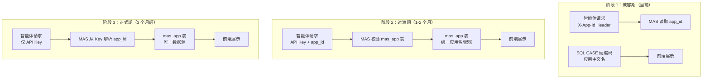

#### 1.5.4 数据库设计

```sql
-- 应用注册表（核心）
CREATE TABLE IF NOT EXISTS mas_app (
    app_id          VARCHAR(32) PRIMARY KEY,
    app_name        VARCHAR(128) NOT NULL,      -- 中文应用名（平台统一维护）
    app_name_en     VARCHAR(64),                -- 英文名（可选）
    dept_id         VARCHAR(32) NOT NULL,       -- 归属部门
    owner_id        VARCHAR(64) NOT NULL,       -- 负责人
    owner_email     VARCHAR(128),               -- 负责人邮箱
    sla_level       VARCHAR(8) DEFAULT 'P1',    -- 默认 SLA 等级
    data_level      VARCHAR(8) DEFAULT 'L2',    -- 默认数据等级
    status          SMALLINT DEFAULT 0,         -- 0=待审批, 1=已启用, 2=已停用, 3=已驳回
    month_quota     BIGINT DEFAULT 0,           -- 月度 Token 配额（0=不限制）
    description     TEXT,                       -- 应用描述/用途说明
    approved_by     VARCHAR(64),                -- 审批人
    approved_at     TIMESTAMP,                  -- 审批时间
    created_at      TIMESTAMP DEFAULT now(),
    updated_at      TIMESTAMP DEFAULT now()
);

-- API Key 表增加 app_id 外键关联
ALTER TABLE mas_api_key ADD COLUMN IF NOT EXISTS app_id VARCHAR(32);
ALTER TABLE mas_api_key ADD CONSTRAINT fk_api_key_app 
    FOREIGN KEY (app_id) REFERENCES mas_app(app_id);

-- 应用接入申请表（审批流程留痕）
CREATE TABLE IF NOT EXISTS mas_app_application (
    apply_id        VARCHAR(32) PRIMARY KEY,
    app_id          VARCHAR(32),                -- 审批通过后写入 mas_app
    applicant_id    VARCHAR(64) NOT NULL,       -- 申请人
    applicant_dept  VARCHAR(32) NOT NULL,
    app_name        VARCHAR(128) NOT NULL,
    purpose         TEXT NOT NULL,              -- 用途说明
    est_month_calls BIGINT,                     -- 预估月调用量
    status          VARCHAR(16) DEFAULT 'PENDING', -- PENDING/APPROVED/REJECTED
    reviewer_id     VARCHAR(64),                -- 审批人
    review_opinion  TEXT,                       -- 审批意见
    created_at      TIMESTAMP DEFAULT now(),
    reviewed_at     TIMESTAMP
);
```

#### 1.5.5 三阶段迁移计划

##### 阶段 1：兼容期（当前实施）

**目标**：建立 `mas_app` 表，导入现有应用数据，保留所有现有调用方式

**变更清单**：

| 序号 | 变更项 | 说明 |
|------|--------|------|
| 1 | 创建 `mas_app` 表 | 执行 DDL，创建应用注册表 |
| 2 | 导入种子数据 | 将现有 4 个应用（APP-CSR 等）写入 `mas_app` |
| 3 | 保留 SQL CASE 映射 | `DashboardService.getAppTcoRank()` 暂时保持硬编码 |
| 4 | 保留 Header 读取 | `PipelineContextFactory` 继续支持 `X-App-Id` |
| 5 | 新增管理 API（可选） | `/internal/apps` 端点，支持应用列表查询 |

**验收标准**：
- `mas_app` 表创建成功，包含 4 条种子数据
- 现有功能（驾驶舱、计量、路由等页面）正常运行
- 应用中文名仍从 SQL CASE 获取（阶段 2 再切换）

##### 阶段 2：过渡期（1-2 个月后）

**目标**：新应用必须注册，应用名从 `mas_app` 表查询

**变更清单**：

| 序号 | 变更项 | 说明 |
|------|--------|------|
| 1 | 修改 `DashboardService` | 移除 SQL CASE，JOIN `mas_app` 获取应用名 |
| 2 | 新增应用注册 API | `POST /internal/apps/apply` 提交申请 |
| 3 | 新增应用审批 API | `POST /internal/apps/{apply_id}/review` |
| 4 | 前端新增应用管理页面 | 应用列表、申请审批、配置编辑 |
| 5 | API Key 强制关联 app_id | 创建 Key 时必须选择已注册应用 |

##### 阶段 3：正式期（3 个月后）

**目标**：废弃 Header 方式，API Key 为唯一身份凭证

**变更清单**：

| 序号 | 变更项 | 说明 |
|------|--------|------|
| 1 | 移除 `X-App-Id` Header 支持 | `PipelineContextFactory` 仅从 API Key 解析 |
| 2 | 清理 SQL CASE 硬编码 | 所有应用名从 `mas_app` 查询 |
| 3 | 未关联 app_id 的 Key 停用 | 批量更新或通知相关团队补充 |

#### 1.5.6 调用时校验逻辑（阶段 2+ 实施）

```java
// PipelineContextFactory.java - 阶段 2 增强版
public PipelineContext create(ServerWebExchange exchange, ObjectNode request) {
    PipelineContext ctx = new PipelineContext();
    
    // 1. 从 Header 获取 app_id（阶段 1 兼容，阶段 3 移除）
    String appIdFromHeader = exchange.getRequest().getHeaders().getFirst("X-App-Id");
    
    // 2. 从 API Key 解析 app_id（推荐方式）
    String auth = exchange.getRequest().getHeaders().getFirst(HttpHeaders.AUTHORIZATION);
    String appIdFromKey = null;
    if (auth != null && auth.startsWith("Bearer ")) {
        String key = auth.substring(7);
        appIdFromKey = apiKeyService.resolveAppId(key);  // 从 mas_api_key 表查询
    }
    
    // 3. 优先级：API Key 关联 > Header 声明
    String finalAppId = appIdFromKey != null ? appIdFromKey : appIdFromHeader;
    
    // 4. 校验 app_id 是否有效（阶段 2+ 实施）
    if (finalAppId != null) {
        AppEntity app = appService.getApp(finalAppId);
        if (app == null || app.getStatus() != 1) {
            throw MasException.unauthorized("应用未注册或已停用：" + finalAppId);
        }
        // 5. 从 mas_app 获取标准中文名（不再硬编码）
        ctx.setAppName(app.getAppName());
    }
    
    ctx.setAppId(finalAppId);
    return ctx;
}
```

#### 1.5.7 前端管理界面（阶段 2+ 实施）

```
┌─────────────────────────────────────────────────────────────────┐
│  应用管理 - 路由平台管理后台                                      │
├─────────────────────────────────────────────────────────────────┤
│  ─────────────────────────────────────────────────────────┐   │
│  │  [+ 新建应用]  [筛选：部门▼] [状态：全部▼]  [搜索...]   │   │
│  └─────────────────────────────────────────────────────────┘   │
│                                                                 │
│  ┌──────────┬──────────┬──────────┬──────────┬──────────┐   │
│  │ 应用 ID   │ 应用名称  │ 归属部门  │ 月度配额  │ 状态     │   │
│  ├──────────┼──────────┼──────────┼──────────┼──────────┤   │
│  │ APP-CSR  │ 智能客服  │ 零售银行  │ 30 亿     │ ✅ 启用  │   │
│  │ APP-AICODING│AI代码助手│信息科技 │ 20 亿     │ ✅ 启用  │   │
│  │ APP-CREDIT│信贷审批  │ 公司银行  │ 15 亿     │ ✅ 启用  │   │
│  │ APP-NEW  │ 新应用    │ 风险管理  │ 0        │ ⏳ 待审批 │   │
│  └──────────┴──────────┴──────────┴──────────┴──────────┘   │
│                                                                 │
│  ┌─────────────────────────────────────────────────────────┐   │
│  │  待审批申请 (2)                                          │   │
│  │  ┌──────────────────────────────────────────────────┐  │   │
│  │  │ APP-NEW | 智能风控助手 | 风险管理部 | 张三         │  │   │
│  │  │ 用途：用于信贷风控报告自动生成，预计月调用 50 万次   │  │   │
│  │  │ [通过] [驳回]                                     │  │   │
│  │  └──────────────────────────────────────────────────┘  │   │
│  └─────────────────────────────────────────────────────────┘   │
└─────────────────────────────────────────────────────────────────┘
```

#### 1.5.8 核心原则

| 原则 | 说明 |
|------|------|
| **单一来源** | 应用名、配额、SLA 等配置只在 `mas_app` 表维护 |
| **审批管控** | 新应用接入需平台审批，防止滥用 |
| **向后兼容** | 阶段 1 保留 Header 方式，逐步迁移到 API Key 关联 |
| **审计留痕** | 所有申请/审批操作记录在 `mas_app_application` 表 |

***

## 2. 整体架构

### 2.1 全链路架构图

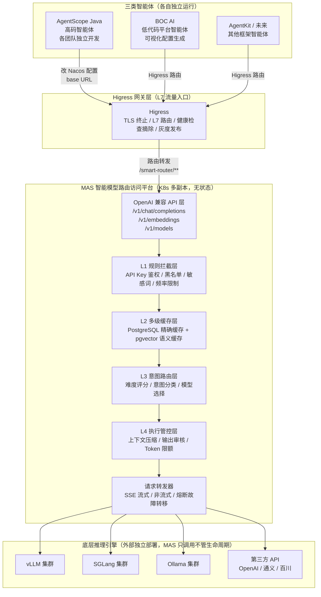


### 2.2 请求处理流程


**各场景性能指标：**

| 场景            | 总耗时   | 说明                       |
| ------------- | ----- | ------------------------ |
| 最佳（L2 精确缓存命中） | ~6ms  | 跳过 L3/L4，直接返回            |
| 良好（L2 语义缓存命中） | ~16ms | 跳过 L3/L4，直接返回            |
| 典型（难度路由）      | ~26ms | L1 + L2 + L3(难度评分) + L4 + 转发 |
| 标准（意图路由）      | ~31ms | L1 + L2 + L3(意图分类) + L4 + 转发 |
| 最差（含压缩 + 审核）  | ~50ms | 全链路 + 上下文压缩              |

### 2.3 与现有系统的关系

| 组件                        | 现有角色                                           | MAS 上线后变化                            |
| ------------------------- | ---------------------------------------------- | ------------------------------------ |
| **Higress**               | L7 反向代理 + 业务路由                                 | 职责收窄为 L7 流量入口：TLS 终止 / `/smart-router/**` 路由 / 健康检查摘除 / 灰度发布；鉴权、限流与业务路由交给 MAS |
| **ChatModelInter** (Java) | 调用 `gateway_service + "/ai/gateway/chatModel"` | 仅需修改 `gateway_service` 指向 MAS 地址     |
| **Nacos 配置**              | `app.algorithm.ai-gateway-service` = 旧网关地址     | 改为 MAS 地址即可                          |

***

## 3. 三类智能体对接方案

### 3.1 对接方式总览

三类智能体的执行方式不同，对接方式也不同，不需要强行抽象统一接口。

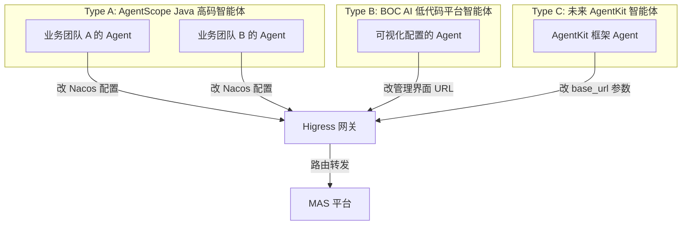


### 3.2 Type A：AgentScope Java 高码智能体

**特点**：由中行各业务团队独立开发，每种智能体有自己独立的前端入口或后端接口，执行链路各异。

**对接方式**：修改 Nacos 配置中的模型服务地址。

```properties
# 修改前（Nacos 配置）
app.algorithm.ai-gateway-service = http://higress:5050/alg-gateway

# 修改后
app.algorithm.ai-gateway-service = http://higress:5050/smart-router
```


**代码层面零改动**。现有 `ChatModelInter.callModel()` 中的调用逻辑不变：

```java
// ChatModelInter.java 中现有代码，无需修改
@Value("${app.algorithm.ai-gateway-service}")
private String gateway_service;

private String agent_url_path = "/ai/gateway/chatModel";

// 请求 URL 自动变为：
// http://higress:8080/smart-router/ai/gateway/chatModel
Request request = new Request.Builder()
    .url(gateway_service + agent_url_path)
    .post(jsonBody)
    .build();
```


对于基于 AgentScope Java 2.0 新建的高码智能体，通过 AgentScope 的 `ModelProvider` SPI 机制，将 `base_url` 配置为 MAS 地址即可：

```yaml
# AgentScope 智能体配置
model:
  provider: mas
  model-id: qwen-72b
  base-url: http://mas-host:port/smart-router
```


### 3.3 Type B：BOC AI 低代码平台智能体

**特点**：通过低代码平台可视化配置生成，模型调用由平台内部封装。

**对接方式**：在低代码平台的模型配置管理界面中，将模型服务的 base URL 修改为 MAS 地址。

| 配置项    | 修改前                               | 修改后                                |
| ------ | --------------------------------- | ---------------------------------- |
| 模型服务地址 | `http://higress:8080/alg-gateway` | `http://higress:8080/smart-router` |
| 接口路径   | `/ai/gateway/chatModel`           | `/v1/chat/completions`（OpenAI 标准）  |

**无需修改低代码平台代码**，仅需在管理界面更新 URL 配置。

### 3.4 Type C：未来 AgentKit 智能体

**特点**：使用字节跳动 AgentKit 框架开发，天然支持 OpenAI 兼容协议。

**对接方式**：AgentKit 的 LLM Client 配置 `base_url` 为 MAS 地址。

```python
from agentkit import LLMClient

client = LLMClient(
    base_url="http://mas-host:port/smart-router",
    api_key="your-api-key",
    model="qwen-72b"
)
```


### 3.5 三类智能体对比

| 维度   | Type A 高码           | Type B 低代码   | Type C AgentKit |
| ---- | ------------------- | ------------ | --------------- |
| 开发方式 | Java 代码开发           | 可视化配置        | Python 代码开发     |
| 框架   | AgentScope Java 2.0 | BOC AI 低代码平台 | 字节跳动 AgentKit   |
| 接入改动 | 改 Nacos 配置          | 改管理界面 URL    | 改 base_url 参数   |
| 协议   | OpenAI 兼容 / 自定义     | OpenAI 兼容    | OpenAI 兼容       |
| 改动量  | **仅配置**             | **仅配置**      | **仅配置**         |

***

## 4. 接口协议设计

### 4.1 OpenAI 兼容接口

MAS 平台对外暴露 OpenAI 标准兼容接口，确保任何支持 OpenAI SDK 的客户端都能直接接入。

#### 4.1.1 Chat Completions（核心接口）

**POST** `/smart-router/v1/chat/completions`

**请求体（非流式）：**

```json
{
  "model": "qwen-72b",
  "messages": [
    {"role": "system", "content": "你是一个有帮助的助手。"},
    {"role": "user", "content": "什么是机器学习？"}
  ],
  "temperature": 0.7,
  "max_tokens": 2048,
  "stream": false,
  "user": "agent-007"
}
```

> **身份字段**：`user` 为 OpenAI 标准可选字段，MAS 将其解析为**智能体标识（审计用途）**，写入 `mas_call_log.agent_id`。它是「自报身份」，不参与鉴权；可信身份以 API Key 绑定的 `user_id` 为准（身份链与鉴权开关详见附录 G.1）。智能体零改造接入时可借此字段区分请求来自哪个智能体。


**响应体（非流式）：**

```json
{
  "id": "chatcmpl-abc123",
  "object": "chat.completion",
  "created": 1723456789,
  "model": "qwen-72b",
  "choices": [
    {
      "index": 0,
      "message": {
        "role": "assistant",
        "content": "机器学习是..."
      },
      "finish_reason": "stop"
    }
  ],
  "usage": {
    "prompt_tokens": 25,
    "completion_tokens": 150,
    "total_tokens": 175
  },
  "x-mas-meta": {
    "cache_hit": false,
    "routed_to": "vllm-cluster-01",
    "pipeline_cost_ms": 36
  }
}
```


**流式请求（SSE）：**

```json
{
  "model": "qwen-72b",
  "messages": [{"role": "user", "content": "什么是机器学习？"}],
  "stream": true
}
```


**流式响应（SSE）：**

```
data: {"id":"chatcmpl-abc123","object":"chat.completion.chunk","choices":[{"index":0,"delta":{"role":"assistant","content":"机器"},"finish_reason":null}]}

data: {"id":"chatcmpl-abc123","object":"chat.completion.chunk","choices":[{"index":0,"delta":{"content":"学习"},"finish_reason":null}]}

data: {"id":"chatcmpl-abc123","object":"chat.completion.chunk","choices":[{"index":0,"delta":{},"finish_reason":"stop"}]}

data: [DONE]
```

> **帧标准化（已实现约束）**：MAS 自产的所有 SSE 帧——内容阻断帧、`x-mas-meta` 元信息帧、错误帧——都构造为**合法的 `chat.completion.chunk`**（补齐 `id`/`object`/`created`/`model`/`choices`），`x-mas-meta` 作为附加字段内嵌，保证严格解析的 OpenAI SDK 不会因非法帧中断。


#### 4.1.2 Embeddings

**POST** `/smart-router/v1/embeddings`

```json
{
  "model": "bge-m3",
  "input": "要向量化的文本"
}
```


#### 4.1.3 Models 列表

**GET** `/smart-router/v1/models`

```json
{
  "object": "list",
  "data": [
    {"id": "qwen-72b", "object": "model", "owned_by": "mas"},
    {"id": "deepseek-v3", "object": "model", "owned_by": "mas"}
  ]
}
```


### 4.2 兼容旧协议接口

为兼容现有调用方式，MAS 同时支持旧协议路径：

| 旧路径                                  | 映射到                                 | 说明                     |
| ------------------------------------ | ----------------------------------- | ---------------------- |
| `/smart-router/ai/gateway/chatModel` | `/smart-router/v1/chat/completions` | 兼容现有 ChatModelInter 调用 |
| `/smart-router/ai/gateway/chatAgent` | 转发至 Agent 服务                        | 兼容现有 AgentLlmInter 调用  |

**已实现的兼容能力**（字段映射定稿见附录 G.3）：

- **请求参数完整映射**：`modelId→model`、`maxTokens→max_tokens`，并补齐 `topP→top_p`、`frequencyPenalty→frequency_penalty`、`presencePenalty→presence_penalty`、`stop`、`n`
- **支持流式**：旧协议 `stream: true` 时按 SSE 透传（此前旧网关不支持）
- **响应包裹**：成功时 `{"code":0,"message":"success","data":{content,requestId,modelId,usage}}`；错误时 HTTP 状态码按附录 G.2，同时 `code` 映射为旧协议错误码（400→1000、401→1001、403→1002、429→1003、504→1004、502→1005、其余→-1）

### 4.3 扩展字段

MAS 在标准 OpenAI 响应中增加 `x-mas-meta` 扩展字段，提供路由元信息（可选返回）：

| 字段                            | 类型      | 说明                        |
| ----------------------------- | ------- | ------------------------- |
| `x-mas-meta.cache_hit`        | boolean | 是否命中缓存                    |
| `x-mas-meta.cache_level`      | string  | 缓存层级：`exact` / `semantic` |
| `x-mas-meta.routed_to`        | string  | 路由到的推理引擎端点；缓存命中时为 `cache:exact` / `cache:semantic`；熔断故障转移时为 `failover:<模型>` |
| `x-mas-meta.pipeline_cost_ms` | number  | MAS 内部调度耗时（ms）            |
| `x-mas-meta.intent`           | string  | 识别的意图分类（`simple` / `complex` / `chat` / `embedding` 等） |
| `x-mas-meta.difficulty`       | number  | 难度评分（0-1，难度路由时返回）         |
| `x-mas-meta.content_blocked`  | boolean | 输出审核命中标记（仅命中时返回）          |
| `x-mas-meta.failover`         | boolean | 是否经过熔断故障转移（仅触发时返回）        |

> 缓存命中响应在路由决策前短路返回，因此不含 `intent`/`difficulty`；断言路由行为时请求体须避开缓存（唯一化提问或先 `POST /internal/cache/flush`）。

***

## 5. 四层调度策略详细设计

### 5.1 L1 规则拦截层

**职责**：在请求进入后续处理前，基于预定义规则快速过滤不合规/不需要的请求。

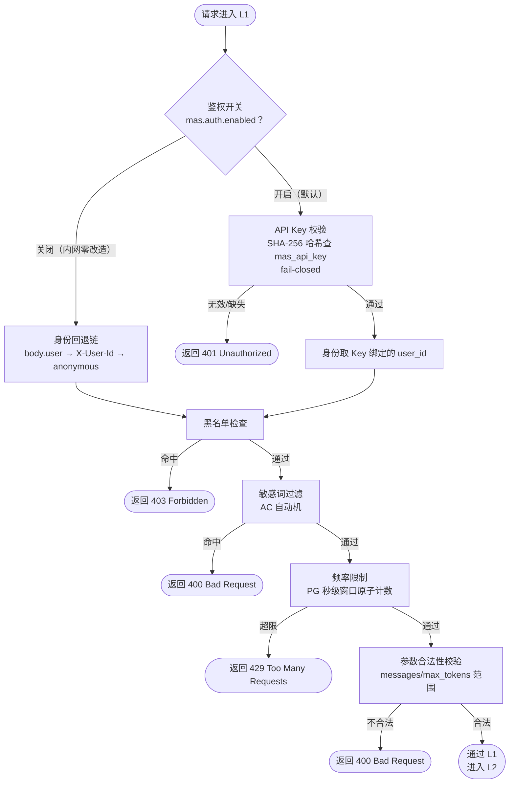


**规则类型：**

| 规则类型 | 实现方式                 | 耗时   | 说明                       |
| ---- | -------------------- | ---- | ------------------------ |
| API Key 鉴权 | Bearer token → SHA-256 → 查 `mas_api_key` + Caffeine 缓存（5min） | O(1) | 已实现完整鉴权体系：支持过期时间、按前缀撤销、`mas.auth.enabled=false` 一键关闭（内网零改造接入） |
| 黑名单  | 配置列表 + `mas_blacklist` 表并集查找           | O(1) | 用户/模型/IP 三类主体，支持过期时间     |
| 敏感词  | AC 自动机（Aho‑Corasick） | O(n) | 输入内容敏感词匹配                |
| 频率限制 | PostgreSQL `mas_rate_limit` 秒级窗口原子计数（`INSERT ... ON CONFLICT DO UPDATE WHERE token_count < qps`） | O(1) | 每用户每秒 `per-user-qps` 次；PG 实现保证多副本部署下限流全局一致；定时清理过期窗口行 |
| 参数校验 | 规则校验器                | O(1) | messages 非空、max_tokens ≤ 8192 且为正 |

**降级策略**：**鉴权 fail-closed**——API Key 校验链任何异常或空结果一律拒绝（401），杜绝静默放行；其余规则组件自身异常时 **fail-open** 放行并记录告警日志，保证可用性优先。

### 5.2 L2 多级缓存层

**职责**：对重复或语义相似的请求直接返回缓存结果，避免重复推理，大幅降低算力消耗。

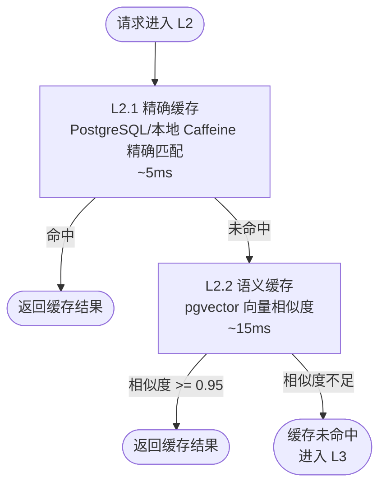


#### 5.2.1 L2.1 精确缓存

**缓存键生成规则：**

```
cache_key = SHA256(model + "|" + messages + "|" + temperature + "|" + max_tokens)
```

> 序列化细则定稿见附录 G.4：messages 按原顺序紧凑 JSON（不排序）、排除 `stream` 字段、temperature / max_tokens 缺省占位 `null`。


**存储方案**：本地 Caffeine（一级，原型默认）+ PostgreSQL `mas_exact_cache` 表（二级，可跨实例共享）。**不引入 Redis**。

| 配置项  | 值       | 说明                              |
| ---- | ------- | ------------------------------- |
| TTL  | 30 分钟   | 缓存过期时间（PG 行级 expire_at 或定时清理） |
| 最大条目 | 100,000 | Caffeine 本地上限，超出后 LRU 淘汰           |
| 序列化  | JSON    | value 为完整的 chat completion 响应       |

#### 5.2.2 L2.2 语义缓存

**流程**：

1. 将请求 `messages` 通过 Embedding 模型转为向量
2. 在 PostgreSQL `pgvector` 扩展的向量表中检索最近邻（`<=> ` 余弦距离）
3. 若相似度 >= 阈值（默认 0.95，可按意图覆盖），返回缓存结果
4. 否则标记为缓存未命中

**存储方案**：PostgreSQL + `pgvector` 扩展（向量列 `vector(1024)` + 近似索引 `hnsw`）。**不引入 Faiss / Redis**。

| 配置项   | 值            | 说明           |
| ----- | ------------ | ------------ |
| 向量维度  | 1024（bge‑m3） | Embedding 维度 |
| 索引类型  | hnsw（pgvector） | 向量近似索引；hnsw 无最小行数要求，空表即可建（原型默认） |
| 相似度阈值 | 0.95（`mas.cache.semantic-threshold-by-intent` 可按意图覆盖） | 高于此值视为命中 |
| TTL   | 60 分钟        | 语义缓存过期时间（行级 expire_at） |
| 最大条目  | 50,000       | 超出后按 TTL 清理    |

**降级策略**：语义缓存服务不可用时，自动跳过 L2.2，直接进入 L3。

### 5.3 L3 意图路由层

**职责**：根据请求内容判断意图和难度，选择最合适的模型和推理引擎。

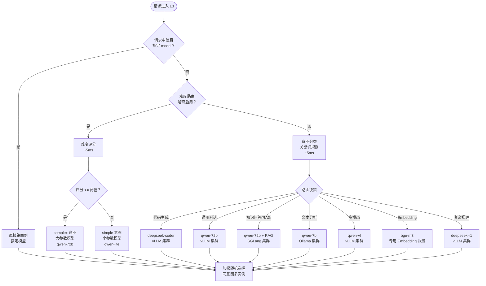


#### 5.3.1 路由优先级

L3 按以下优先级进行路由决策（从高到低）：

1. **显式模型指定**：请求中明确指定 `model` 字段时，直接路由到该模型（不存在则返回 404）
2. **难度路由**（可配置开关）：无显式 model 且 `mas.routing.difficulty.enabled=true` 时，根据问题难度评分自动分流
3. **意图路由**：基于关键词规则识别意图类型，选择对应专业模型
4. **默认模型**：兜底使用 `mas.routing.default-model` 配置的模型

#### 5.3.2 难度路由（Difficulty-Based Routing）

**设计目标**：自动识别问题难易程度，将简单问题分流到小参数模型（降本），复杂问题路由到大参数模型（保质）。

**评分规则**（`RuleDifficultyClassifier`）：

基于以下特征加权计算难度评分（范围 [0, 1]）：

| 特征维度         | 权重     | 说明                                          |
| ------------ | ------ | ------------------------------------------- |
| **文本长度**     | 0.1-0.5 | >300 字 +0.5；100-300 字 +0.3；40-100 字 +0.1    |
| **复杂任务信号词**  | 0.2/个  | 命中"证明/推导/设计方案/架构/对比分析/优化/重构/算法/规划/深入分析"等 +0.2 |
| **简单问答信号词**  | -0.2   | 短文本（≤40字）+ 命中"是什么/什么是/多少钱/几点/翻译/总结一下" -0.2  |
| **多子任务结构**   | +0.15  | 多行文本（≥3行）或枚举结构（1. 2. ①②③ - 等）              |
| **代码上下文**    | +0.15  | 包含代码块（```）或代码关键词（function/class）          |

**路由决策**：

```
if (难度评分 >= mas.routing.difficulty.threshold):
    选择 intent_type='complex' 的模型（大参数模型，如 qwen-72b）
else:
    选择 intent_type='simple' 的模型（小参数模型，如 qwen-lite/qwen2.5:0.5b）
```

**配置项**（`application.yml`）：

```yaml
mas:
  routing:
    difficulty:
      enabled: true      # 难度路由开关，默认启用
      threshold: 0.5     # 难度评分阈值（0-1），>= 阈值走 complex 模型
```

**示例**：

| 用户输入                             | 难度评分  | 路由结果     | 说明                   |
| -------------------------------- | ----- | -------- | -------------------- |
| "什么是机器学习？"                       | 0.0   | simple   | 短文本 + 简单问答信号词        |
| "如何优化 Java 应用的内存使用？"            | 0.45  | simple   | 中等长度 + 单个复杂词（未达阈值）   |
| "请设计一个分布式缓存架构方案，对比 Redis 和 Memcached 的优缺点" | 0.95  | complex  | 长文本 + 多个复杂信号词 + 多子任务 |
| "帮我写一个快速排序的 Python 实现"          | 0.55  | complex  | 中等长度 + 代码关键词 + 算法信号词 |

**收益**：

- **成本优化**：简单问答（占比约 30-40%）使用小模型，单次推理成本降低 70-80%
- **质量保证**：复杂任务保持使用大参数模型，不影响响应质量
- **用户体验**：小模型推理延迟更低（100-200ms vs 500-1000ms），简单查询响应更快

#### 5.3.3 意图分类

当难度路由未启用或 `mas_model_config` 表中未配置 `simple`/`complex` 意图的模型时，回退到意图分类路由。

使用关键词规则将请求分为以下意图类别：

| 意图类别         | 关键词示例                   | 默认路由模型         |
| ------------ | ----------------------- | -------------- |
| `chat`       | 通用对话（默认）                | qwen‑72b       |
| `code`       | "写代码/实现/bug/函数"         | deepseek‑coder |
| `translate`  | "翻译/translate"          | qwen‑7b        |
| `math`       | "计算/公式/方程"              | deepseek‑r1    |
| `rag`        | 知识问答（需检索增强）             | qwen‑72b + RAG |
| `analysis`   | 文本分析/总结/提取               | qwen‑7b        |
| `multimodal` | 图片/多模态理解                | qwen‑vl        |
| `embedding`  | 文本向量化                   | bge‑m3         |
| `simple`     | 简单问题（难度路由专用）            | qwen‑lite      |
| `complex`    | 复杂问题（难度路由专用）            | qwen‑72b       |

#### 5.3.4 负载均衡与故障转移

在确定意图后，叠加以下策略：

| 策略       | 说明                                   |
| -------- | ------------------------------------ |
| **加权选择** | 同意图下多模型实例时，按 `weight` 字段加权随机选择       |
| **熔断故障转移** | 已实现 `ModelHealthTracker` 按端点熔断：连续失败达 `failure-threshold`（默认 5）后熔断打开 `open-duration`（默认 30s），期间请求**预检式**切换到同意图健康模型（响应 `x-mas-meta.routed_to=failover:<模型>`、`failover=true`）；半开期最多放行 `half-open-max-attempts`（默认 2）个探测请求，成功则闭合 |
| **灰度路由** | 支持按用户/应用维度将流量路由到新版本模型（预留能力）        |

**熔断器配置**（`application.yml`）：

```yaml
mas:
  circuit-breaker:
    failure-threshold: 5      # 连续失败次数阈值，达到后熔断打开
    open-duration: 30s        # 熔断打开时长，期间全部走故障转移
    half-open-max-attempts: 2 # 半开期探测请求数，成功闭合/失败重新打开
```

**降级策略**：

- 难度评分异常时，默认使用 `complex` 模型（保守策略，保证质量）
- 意图分类失败时，默认路由到 `mas.routing.default-model` 配置的模型
- 目标模型不存在时，返回 404 `model_not_found` 错误

### 5.4 L4 执行管控层

**职责**：在请求转发前和响应返回后，执行安全管控和质量优化。


**Token 配额管理：**

| 维度   | 默认配额                 | 说明              |
| ---- | -------------------- | --------------- |
| 单次请求 | max_tokens <= 8192   | 单次最大输出 token    |
| 每分钟  | 100,000 tokens/min   | 每用户每分钟 token 限额 |
| 每天   | 5,000,000 tokens/day | 每用户每天 token 限额  |

***

## 6. 部署架构：容器化、Kubernetes 与 Higress 集成

### 6.1 部署拓扑与职责边界

MAS 以**容器化无状态服务**部署在 Kubernetes 集群内，推理引擎在集群外（或集群内）**独立部署**，Higress 作为 L7 流量入口。三者的关系与职责边界如下：

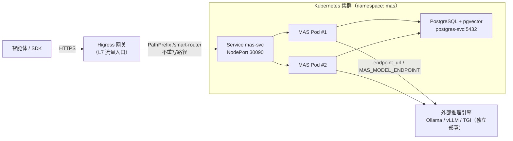

**职责边界（定稿）**：

| 层 | 组件 | 职责 | 明确不做 |
| --- | --- | --- | --- |
| 流量入口 | **Higress** | TLS 终止；`/smart-router/**` 前缀路由（不重写路径）；基于 `/smart-router/actuator/health` 的健康检查与不健康副本摘除；灰度/金丝雀发布入口 | 不做业务鉴权、不做限流、不做模型路由 |
| 业务网关 | **MAS**（K8s 多副本） | API Key 鉴权（`mas.auth.enabled` 可关）；黑名单/敏感词/频率限制；多级缓存；难度/意图路由与熔断故障转移；配额与审计 | 不管推理引擎生命周期；不持久化自身状态（全部状态在 PostgreSQL，副本可随时扩缩） |
| 推理层 | **Ollama / vLLM / TGI 等** | 纯模型推理，暴露 OpenAI 兼容接口 | 不感知路由/管控逻辑 |

**关键设计决策**：

1. **路径前缀不重写**：Higress 以 `PathPrefix: /smart-router` 转发，MAS 通过 `spring.webflux.base-path: /smart-router` 承接，全链路路径一致，便于日志与追踪对齐（详见 §6.4 与附录 B）。
2. **MAS 无状态、可水平扩展**：鉴权、限流、缓存、调用记录全部落 PostgreSQL（限流为 PG 原子计数，多副本全局一致；精确/语义缓存二级存储为 PG 共享）；本地 Caffeine 仅为一级加速，副本间不要求一致。
3. **推理引擎外部化**：MAS 只通过 `mas_model_config.endpoint_url`（或 `MAS_MODEL_ENDPOINT` 环境变量）调用引擎，不随平台部署/启动任何模型服务；引擎地址按模型粒度配置，支持混合多云/多集群引擎。
4. **旁路降级**：MAS 整体不可用时，智能体将 Nacos 中的 `app.algorithm.ai-gateway-service` 指回推理引擎直连地址即可旁路（缓存/管控能力暂时缺失，可用性优先）。
5. **双鉴权模式**：默认 `mas.auth.enabled=true`，MAS 以 API Key 体系独立鉴权（不依赖网关）；内网零改造接入场景可置 `false`，身份回退 `body.user → X-User-Id → anonymous`（附录 G.1）。若全行要求统一在 Higress 做 OAuth2/OIDC 认证，可与 MAS API Key 并存：Higress 认证调用方身份，MAS API Key 标识业务用户。

### 6.2 容器镜像设计

`smart-model-router/Dockerfile` 采用多阶段构建，产物为单一运行镜像：

```dockerfile
# ---- Stage 1: 构建 ----
FROM maven:3.9-eclipse-temurin-17 AS builder
WORKDIR /build
COPY pom.xml .
RUN mvn dependency:go-offline -B
COPY src ./src
RUN mvn package -DskipTests -B

# ---- Stage 2: 运行（多架构兼容） ----
FROM eclipse-temurin:17-jre-jammy
RUN apt-get update \
    && apt-get install -y --no-install-recommends wget \
    && groupadd -r app && useradd -r -g app app \
    && rm -rf /var/lib/apt/lists/*
WORKDIR /app
COPY --from=builder /build/target/*.jar app.jar
USER app
EXPOSE 9090
HEALTHCHECK --interval=15s --timeout=5s --start-period=30s --retries=3 \
    CMD wget -qO- http://localhost:9090/smart-router/actuator/health || exit 1
ENTRYPOINT ["java", "-jar", "app.jar"]
```

| 要点 | 说明 |
| --- | --- |
| 基础镜像 | `eclipse-temurin:17-jre-jammy`（Adoptium 无 arm64 alpine 变体，jammy 多架构兼容，x86_64/arm64 均可构建） |
| 安全 | 非 root 用户 `app` 运行 |
| 健康检查 | 镜像级 HEALTHCHECK 与 K8s 探针均探测 `/smart-router/actuator/health`（注意带 base-path 前缀） |
| 配置注入 | 全部经环境变量（`MAS_DB_URL` / `MAS_DB_USERNAME` / `MAS_DB_PASSWORD` / `MAS_MODEL_ENDPOINT`），镜像不含环境相关配置 |

### 6.3 Kubernetes 资源设计与启动时序

资源清单位于 `smart-model-router/k8s/`，部署顺序：`namespace → postgres → mas-configmap → mas-deployment → mas-service`。

| 清单 | 资源 | 说明 |
| --- | --- | --- |
| `namespace.yaml` | Namespace `mas` | 全部资源独立命名空间隔离 |
| `postgres.yaml` | PVC 5Gi + Deployment + ConfigMap `postgres-init` + Service `postgres-svc`（ClusterIP） | `pgvector/pgvector:pg16` 镜像；**initdb 脚本在 PG 首次初始化时执行**：建 `mas` 用户/库 → `CREATE EXTENSION vector` → 全部 8 张表 DDL → 授权 → 种子数据（5 模型 + 测试 API Key） |
| `mas-configmap.yaml` | ConfigMap `mas-config` + `mas-seed-sql` | `mas-config`：DB 连接与 `MAS_MODEL_ENDPOINT`（外部推理服务地址占位符，部署前替换）；`mas-seed-sql`：`data-k8s.sql` 幂等种子（`ON CONFLICT DO UPDATE`） |
| `mas-deployment.yaml` | Deployment `mas`（**2 副本**） | initContainer `wait-db-seed` 等待 PG 就绪后补执行 `data-k8s.sql`（兜底种子）；liveness/readiness 探针指向 `/smart-router/actuator/health`；资源 256Mi~512Mi |
| `mas-service.yaml` | Service `mas-svc`（NodePort 30090） | Higress backendRef 或 `kubectl port-forward` 的接入点 |

**启动时序（首次部署的关键设计）**：

```
1. postgres Pod 首次启动 → /docker-entrypoint-initdb.d/init-pg.sql 执行
   （建库建表 + 授权 + 种子，此时 mas_api_key / mas_model_config 已就绪）
2. mas Pod 启动 → initContainer 等待 pg_isready 后再次执行 data-k8s.sql（幂等兜底）
3. mas 应用启动 → 直接读到完整表结构与种子数据，无"表不存在"时序问题
```

> 设计取舍：表结构与种子放在 **PG initdb 阶段**而非应用侧自动建表，是因为 initContainer 种子脚本在表创建之前执行会静默失败；initdb 一次性完成建表+授权+种子，保证应用首次启动即可用。存量库升级走 `schema.sql` 内的 `ADD COLUMN IF NOT EXISTS` 迁移语句。

### 6.4 Higress 路由配置

Higress 新增路由规则，将 `/smart-router/**` 路径转发到 MAS Service：

```yaml
# Higress 路由配置（新增部分）
apiVersion: networking.higress.io/v1
kind: HttpRoute
metadata:
  name: smart-router
spec:
  parentRefs:
    - name: default-gateway
  hostnames:
    - "*"
  rules:
    - matches:
        - path:
            type: PathPrefix
            value: /smart-router
      backendRefs:
        - name: mas-svc      # K8s Service（mas-service.yaml），勿直连 Pod
          port: 9090
          weight: 100
```

配套要求：

- **健康检查**：Higress 对 `mas-svc:9090` 配置主动健康检查，探测路径 `GET /smart-router/actuator/health`（200 为健康），不健康副本自动摘除；MAS 滚动更新期间流量无损。
- **不做路径重写**：见附录 B「路径决策」。
- **长连接与 SSE**：流式响应为长连接，Higress 路由需关闭响应缓冲（禁用 proxy buffering），`idle timeout` 不小于 `mas.backend.timeout`（默认 60s）。
- **内部端点隔离**：`/smart-router/internal/**`（缓存清理、API Key 管理）与 `/smart-router/actuator/**` 仅允许内网/管理域名可达，Higress 上不对公网路由开放（附录 H.4）。

<br />

> **路径决策（重要，AI 编程必须遵循）**：Higress 使用 `PathPrefix: /smart-router` 转发，**不做路径重写**，因此 MAS 收到的完整路径为 `/smart-router/v1/...`。MAS 必须注册在全局前缀 `/smart-router` 下（Spring Boot 3.3 通过 `spring.webflux.base-path: /smart-router`，或控制器统一 `@RequestMapping("/smart-router")`）。所有控制器路径以此为前缀，详见 §9.2。

### 6.5 本地验证环境（Colima + kind）

原型在 macOS 上用 Colima（Docker daemon）+ kind 单节点集群完成端到端验证，流程如下：

```bash
# 1. 启动 Docker 运行时与集群
colima start --cpu 4 --memory 8
kind create cluster --name mas

# 2. 构建并加载镜像（kind 节点直接导入本地镜像，无需推送仓库）
docker build -t mas-app:latest .
kind load docker-image mas-app:latest --name mas
kind load docker-image pgvector/pgvector:pg16 --name mas

# 3. 按序部署
kubectl apply -f k8s/namespace.yaml
kubectl apply -f k8s/postgres.yaml
kubectl wait --for=condition=ready pod -l app=postgres -n mas --timeout=120s
kubectl apply -f k8s/mas-configmap.yaml
kubectl apply -f k8s/mas-deployment.yaml
kubectl apply -f k8s/mas-service.yaml
kubectl wait --for=condition=ready pod -l app=mas -n mas --timeout=120s

# 4. 接入验证
kubectl port-forward svc/mas-svc 9090:9090 -n mas
curl -s http://localhost:9090/smart-router/actuator/health   # {"status":"UP"}
```

**集群访问外部推理引擎**：验证环境的 Ollama 运行在宿主机（非集群内），MAS Pod 经 Colima VM 网关地址访问宿主服务（本机实测 `192.168.5.2:11434`），对应写入 `mas_model_config.endpoint_url`。生产环境替换为真实推理服务地址即可，机制不变。

**部署后 13 项功能验证清单**（均经 `port-forward` 对集群内服务实测通过）：

| # | 验证项 | 预期 |
| --- | --- | --- |
| 1 | 健康检查 | `{"status":"UP"}` |
| 2 | 无 API Key | 401 `invalid_api_key` |
| 3 | 无效 API Key | 401（fail-closed，不得放行） |
| 4 | 逻辑模型对话（qwen-lite） | 200 + `x-mas-meta.routed_to` 指向引擎端点 |
| 5 | 物理模型名零改造 + `user` 字段 | 200；`mas_call_log` 落库 `user_id`（Key 绑定）与 `agent_id`（body.user）分离 |
| 6 | 难度路由（省略 model） | 复杂问句 `intent=complex`，简单问句 `intent=simple` |
| 7 | 流式输出 | 每帧均为合法 `chat.completion.chunk`，以 `[DONE]` 收尾 |
| 8 | 精确缓存 | 相同请求第二次 `cache_hit=true` |
| 9 | 旧协议 `/ai/gateway/chatModel` | `code=0` 包裹响应 |
| 10 | Embeddings（bge-m3） | 1024 维向量 |
| 11 | 敏感词输入 | 400 `input_blocked` |
| 12 | 限流（40 并发 > 20 QPS） | 出现 429 |
| 13 | 熔断故障转移（注册死端点模型） | 熔断后自动 `failover:` 至健康模型 |

> 重复执行该清单时，断言路由/意图的请求体须每轮唯一化（如追加时间戳后缀），否则精确/语义缓存命中会短路路由（`routed_to=cache:*`），属预期行为而非故障。

***

## 7. 核心流程时序图

### 7.1 高码智能体调用 LLM 完整时序

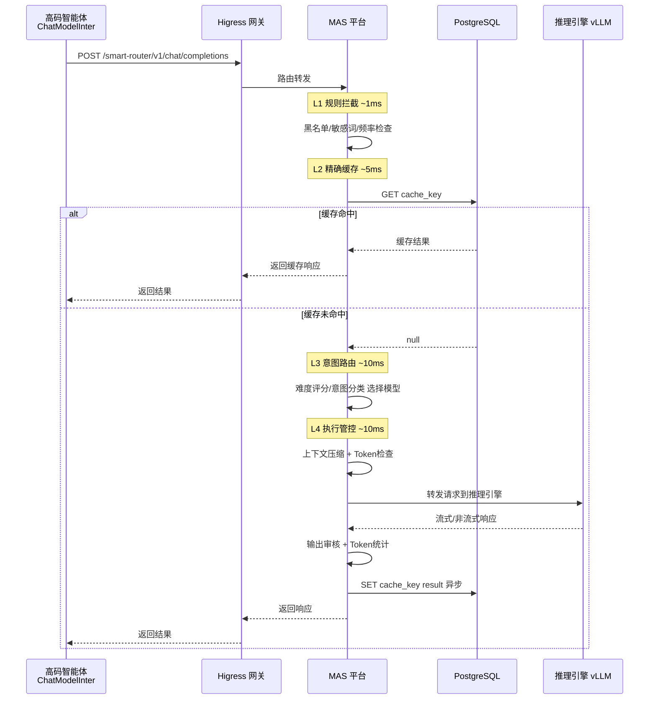


### 7.2 AgentScope Java 智能体调用时序

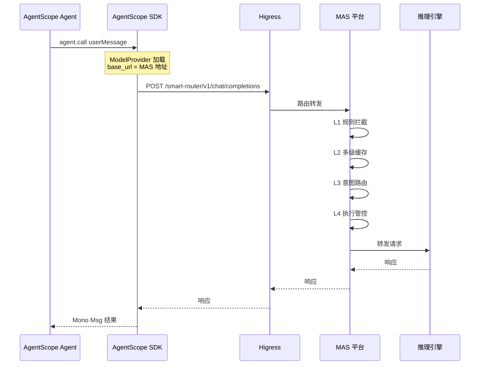


***

## 8. 数据模型

### 8.1 核心表设计

#### 8.1.1 模型配置表 `mas_model_config`

| 字段                 | 类型           | 可空  | 说明                             |
| ------------------ | ------------ | --- | ------------------------------ |
| id                 | bigint       | NO  | 主键                             |
| model_id           | varchar(64)  | NO  | 模型唯一标识（如 qwen‑72b）             |
| model_name         | varchar(128) | NO  | 模型显示名称                         |
| provider           | varchar(32)  | NO  | 提供商（vllm/sglang/ollama/openai） |
| endpoint_url       | varchar(512) | NO  | 推理引擎地址                         |
| intent_type        | varchar(32)  | NO  | 默认意图类型                         |
| weight             | int          | NO  | 路由权重                           |
| status             | tinyint      | NO  | 状态：0 禁用 1 启用                   |
| max_context_tokens | int          | YES | 最大上下文 token 数                  |
| created_at         | datetime     | NO  | 创建时间                           |
| updated_at         | datetime     | NO  | 更新时间                           |

#### 8.1.2 调用记录表 `mas_call_log`

| 字段                | 类型           | 可空  | 说明                  |
| ----------------- | ------------ | --- | ------------------- |
| id                | bigint       | NO  | 主键                  |
| trace_id          | varchar(32)  | NO  | 链路追踪 ID             |
| app_id            | varchar(64)  | YES | 调用方应用 ID            |
| user_id           | varchar(64)  | YES | 调用方用户 ID            |
| agent_id          | varchar(64)  | YES | 智能体自报身份（请求体 `user` 字段，仅审计） |
| model_id          | varchar(64)  | NO  | 使用的模型               |
| intent_type       | varchar(32)  | YES | 识别的意图               |
| cache_hit         | tinyint      | NO  | 是否缓存命中              |
| cache_level       | varchar(16)  | YES | 缓存层级 exact/semantic |
| routed_to         | varchar(128) | YES | 路由到的引擎地址            |
| prompt_tokens     | int          | YES | 输入 token 数          |
| completion_tokens | int          | YES | 输出 token 数          |
| total_tokens      | int          | YES | 总 token 数           |
| pipeline_cost_ms  | int          | YES | MAS 调度耗时(ms)        |
| total_cost_ms     | int          | YES | 总耗时(ms)             |
| status            | tinyint      | NO  | 状态：0 成功 1 失败        |
| created_at        | datetime     | NO  | 调用时间                |

#### 8.1.3 Token 配额表 `mas_token_quota`

| 字段          | 类型          | 可空 | 说明                   |
| ----------- | ----------- | -- | -------------------- |
| id          | bigint      | NO | 主键                   |
| quota_type  | varchar(16) | NO | 配额维度：user/app/global |
| quota_key   | varchar(64) | NO | 配额对象标识               |
| period      | varchar(16) | NO | 周期：minute/hour/day   |
| token_limit | bigint      | NO | token 上限             |
| token_used  | bigint      | NO | 已使用 token 数          |
| reset_at    | datetime    | NO | 下次重置时间               |

#### 8.1.4 API Key 表 `mas_api_key`（已实现）

L1 API Key 鉴权体系的存储底座（详见 §5.1 与附录 G.1）。

| 字段         | 类型           | 可空  | 说明                                       |
| ---------- | ------------ | --- | ---------------------------------------- |
| id         | bigint       | NO  | 主键                                       |
| key_hash   | varchar(64)  | NO  | API Key 的 SHA‑256 摘要（唯一，明文不落库）          |
| key_prefix | varchar(12)  | NO  | Key 前缀（如 `mas‑test`），用于识别与展示             |
| user_id    | varchar(64)  | NO  | Key 绑定的可信身份（鉴权通过后作为 `user_id` 进入后续链路）   |
| app_id     | varchar(64)  | YES | 可选绑定的应用                                  |
| status     | tinyint      | NO  | 1=有效 0=吊销                                |
| expire_at  | datetime     | YES | 过期时间（NULL=永不过期）                          |
| created_at | datetime     | NO  | 创建时间                                     |

#### 8.1.5 分布式限流表 `mas_rate_limit`（已实现）

替代 Bucket4j 内存桶的 PG 秒级滑动窗口限流，多副本部署下全局一致（详见 §5.1 与附录 G.7）。

| 字段          | 类型          | 可空 | 说明                                   |
| ----------- | ----------- | -- | ------------------------------------ |
| user_id     | varchar(64) | NO | 限流对象（身份链解析出的 `user_id`）              |
| window_key  | varchar(32) | NO | 秒级窗口键（如 `20260831120000`）            |
| token_count | int         | NO | 当前窗口内已放行的请求数                          |
| window_end  | datetime    | NO | 窗口过期时间（定时清理依据）                        |

> 唯一约束 `(user_id, window_key)`；放行依赖原子语句 `INSERT … ON CONFLICT DO UPDATE … WHERE token_count < :limit`，无需行锁即保证并发一致。

#### 8.1.6 黑名单表 `mas_blacklist`（已实现）

管理面预留表已在原型落地：L1 黑名单校验读取配置 + 本表并集（详见 §5.1 与附录 H.2）。

| 字段           | 类型           | 可空  | 说明                                  |
| ------------ | ------------ | --- | ----------------------------------- |
| id           | bigint       | NO  | 主键                                  |
| subject_type | varchar(16)  | NO  | 主体类型：user/agent/app/ip              |
| subject_key  | varchar(128) | NO  | 主体标识                                |
| reason       | varchar(256) | YES | 拉黑原因                                |
| expire_at    | datetime     | YES | 过期时间（NULL=永久）                       |
| created_by   | varchar(64)  | NO  | 操作者（默认 `system`）                    |
| created_at   | datetime     | NO  | 创建时间                                |

> **PostgreSQL DDL（可直接执行；语义缓存前需先 `CREATE EXTENSION IF NOT EXISTS vector;`）**

```sql
-- 向量扩展（语义缓存前置，需 pgvector 已安装）
CREATE EXTENSION IF NOT EXISTS vector;

-- 8.1.1 模型配置表
CREATE TABLE mas_model_config (
    id                  BIGSERIAL PRIMARY KEY,
    model_id            VARCHAR(64)  NOT NULL,
    model_name          VARCHAR(128) NOT NULL,
    provider            VARCHAR(32)  NOT NULL,
    endpoint_url        VARCHAR(512) NOT NULL,
    intent_type         VARCHAR(32)  NOT NULL,
    weight              INT          NOT NULL DEFAULT 100,
    status              SMALLINT     NOT NULL DEFAULT 1,
    max_context_tokens  INT,
    created_at          TIMESTAMP    NOT NULL DEFAULT CURRENT_TIMESTAMP,
    updated_at          TIMESTAMP    NOT NULL DEFAULT CURRENT_TIMESTAMP,
    UNIQUE (model_id)
);

-- 8.1.2 调用记录表
CREATE TABLE mas_call_log (
    id                  BIGSERIAL PRIMARY KEY,
    trace_id            VARCHAR(32)  NOT NULL,
    app_id              VARCHAR(64),
    user_id             VARCHAR(64),
    agent_id            VARCHAR(64),
    model_id            VARCHAR(64)  NOT NULL,
    intent_type         VARCHAR(32),
    cache_hit           SMALLINT     NOT NULL DEFAULT 0,
    cache_level         VARCHAR(16),
    routed_to           VARCHAR(128),
    prompt_tokens       INT,
    completion_tokens   INT,
    total_tokens        INT,
    pipeline_cost_ms    INT,
    total_cost_ms       INT,
    status              SMALLINT     NOT NULL DEFAULT 0,
    created_at          TIMESTAMP    NOT NULL DEFAULT CURRENT_TIMESTAMP
);
CREATE INDEX idx_call_log_created ON mas_call_log (created_at);
-- 存量库升级：补 agent_id 列（请求体 OpenAI 标准 user 字段，智能体自报身份）
ALTER TABLE mas_call_log ADD COLUMN IF NOT EXISTS agent_id VARCHAR(64);

-- 8.1.3 Token 配额表
CREATE TABLE mas_token_quota (
    id          BIGSERIAL PRIMARY KEY,
    quota_type  VARCHAR(16)  NOT NULL,
    quota_key   VARCHAR(64)  NOT NULL,
    period      VARCHAR(16)  NOT NULL,
    token_limit BIGINT       NOT NULL,
    token_used  BIGINT       NOT NULL DEFAULT 0,
    reset_at    TIMESTAMP    NOT NULL DEFAULT CURRENT_TIMESTAMP,
    UNIQUE (quota_type, quota_key, period)
);

-- L2.1 精确缓存表
CREATE TABLE mas_exact_cache (
    cache_key     VARCHAR(64) PRIMARY KEY,   -- SHA256(model|messages|temperature|max_tokens)
    model_id      VARCHAR(64),
    response_json TEXT       NOT NULL,
    created_at    TIMESTAMP  NOT NULL DEFAULT CURRENT_TIMESTAMP,
    expire_at     TIMESTAMP  NOT NULL
);
CREATE INDEX idx_exact_cache_expire ON mas_exact_cache (expire_at);

-- L2.2 语义缓存表（pgvector）
CREATE TABLE mas_semantic_cache (
    id            BIGSERIAL PRIMARY KEY,
    model_id      VARCHAR(64),
    embedding     vector(1024),
    response_json TEXT       NOT NULL,
    created_at    TIMESTAMP  NOT NULL DEFAULT CURRENT_TIMESTAMP,
    expire_at     TIMESTAMP  NOT NULL
);
-- hnsw 无最小行数要求（ivfflat lists=100 在空表上建索引会失败），原型默认选型
CREATE INDEX idx_semantic_cache_vec ON mas_semantic_cache
    USING hnsw (embedding vector_cosine_ops);

-- 8.1.6 黑名单表（附录 H.2，L1 与配置黑名单取并集）
CREATE TABLE mas_blacklist (
    id           BIGSERIAL PRIMARY KEY,
    subject_type VARCHAR(16)  NOT NULL,
    subject_key  VARCHAR(128) NOT NULL,
    reason       VARCHAR(256),
    expire_at    TIMESTAMP,
    created_by   VARCHAR(64)  NOT NULL DEFAULT 'system',
    created_at   TIMESTAMP    NOT NULL DEFAULT CURRENT_TIMESTAMP,
    UNIQUE (subject_type, subject_key)
);

-- 8.1.4 API Key 鉴权体系
CREATE TABLE mas_api_key (
    id          BIGSERIAL PRIMARY KEY,
    key_hash    VARCHAR(64)  NOT NULL UNIQUE,  -- SHA-256(key)，明文不落库
    key_prefix  VARCHAR(12)  NOT NULL,          -- 前缀用于识别（如 mas-xxxx）
    user_id     VARCHAR(64)  NOT NULL,
    app_id      VARCHAR(64),
    status      SMALLINT     NOT NULL DEFAULT 1, -- 1=active, 0=revoked
    expire_at   TIMESTAMP,
    created_at  TIMESTAMP    NOT NULL DEFAULT CURRENT_TIMESTAMP
);
CREATE INDEX idx_api_key_hash ON mas_api_key (key_hash);

-- 8.1.5 分布式限流（替代 Bucket4j 内存桶，支持多实例部署）
CREATE TABLE mas_rate_limit (
    user_id     VARCHAR(64)  NOT NULL,
    window_key  VARCHAR(32)  NOT NULL,  -- 秒级窗口键如 '20260831120000'
    token_count INT          NOT NULL DEFAULT 0,
    window_end  TIMESTAMP    NOT NULL,
    UNIQUE (user_id, window_key)
);
CREATE INDEX idx_rate_limit_window ON mas_rate_limit (window_end);
```

***

## 9. 技术选型

### 9.1 核心技术栈

| 组件 | 技术选型 | 版本 | 许可证 | 选型理由 |
| --- | --- | --- | --- | --- |
| **服务框架** | Spring Boot 3 + WebFlux | **3.3.5** | Apache-2.0 | 与现有后端技术栈一致，WebFlux 支持高并发 SSE（3.0.9 已 EOL，定稿 3.3.x） |
| **HTTP 客户端** | WebClient (Reactor) | - | Apache-2.0 | 非阻塞，适配 WebFlux；流式透传不开缓冲 |
| **数据访问** | **MyBatis‑Plus 3.5.7**（`mybatis-plus-spring-boot3-starter`）+ JDBC/HikariCP | 3.5.7 | Apache-2.0 | 原型定稿：放弃 R2DBC（生态适配成本高），阻塞 SQL 经 `ReactiveDbAdapter` 桥接至 `Schedulers.boundedElastic()`，不占用事件循环线程 |
| **缓存‑精确** | 本地 Caffeine + PostgreSQL `mas_exact_cache` | - | Apache-2.0 / PostgreSQL | 不引入 Redis；本地一级缓存 + PG 二级跨实例共享 |
| **缓存‑语义** | PostgreSQL + `pgvector` 扩展（hnsw 索引） | 0.7+ | PostgreSQL License | 向量检索直接落在 PG，信创友好，规避 Faiss/Redis |
| **Embedding** | 复用外部 bge‑m3 推理服务 | - | - | MAS 经 OpenAI 兼容 `/v1/embeddings` 调用外部 Embedding 模型 |
| **意图/难度分类** | 规则分类器（`RuleIntentClassifier` / `RuleDifficultyClassifier`） | - | - | 原型以关键词 + 长度 + 结构特征打分（阈值 0.5），零模型依赖；DJL/ONNX 本地推理为生产演进方向 |
| **Token 计数** | jtokkit | 1.1.0 | MIT | 纯 Java BPE 分词，本地估算 prompt/completion token 数 |
| **敏感词** | Aho‑Corasick（`org.ahocorasick`） | 0.6.3 | Apache-2.0 | 多模式匹配，O(n) 复杂度 |
| **频率限制** | **PostgreSQL 秒级滑动窗口**（`mas_rate_limit` 原子语句） | - | PostgreSQL License | 原型定稿：放弃 Bucket4j 内存桶，PG 原子 `ON CONFLICT` 计数，多副本部署全局限流一致 |
| **熔断故障转移** | **自研 `ModelHealthTracker`**（按 endpoint 半开状态机） | - | - | 原型定稿：不引入 Resilience4j；失败阈值/开路时长/半开试探均可配置（§5.3.4） |
| **可观测性** | Spring Boot Actuator + Micrometer Prometheus | - | Apache-2.0 | `/actuator/health` 供 K8s 探针，`/actuator/prometheus` 暴露指标 |
| **数据库** | PostgreSQL + pgvector（生产可换 openGauss / KingbaseES） | 16 | PostgreSQL License | 统一存储配置/记录/缓存/鉴权/限流，符合信创与零 AGPL 约束 |
| **测试** | spring‑boot‑starter‑test + reactor‑test + 数据驱动集成套件 | - | Apache-2.0 | 135 个单测 + `tests/` 目录数据驱动黑盒套件（附录 G.9） |

> **许可证红线**：全栈均为 Apache-2.0 / MIT / PostgreSQL License，**无 copyleft / AGPL 风险**。已移除 Redis（8 为 AGPL）、Faiss（需 JNI 且叠加 Redis）、MySQL（GPL 风险），统一 PostgreSQL。原型阶段不依赖任何外部缓存中间件；Nacos 注册中心与 Spring AI 路由不在原型范围（路由/熔断为自研实现，见 §5.3）。

### 9.2 项目结构

```
smart-model-router/
├── pom.xml
├── Dockerfile                             # 多阶段构建（§6.2）
├── docker-compose.yml                     # 本地 PG + 应用编排（开发用）
├── k8s/                                   # K8s 资源清单（§6.3）
│   ├── postgres.yaml                      #   PVC + PG Deployment + initdb ConfigMap + Service
│   ├── mas-deployment.yaml                #   MAS Deployment（2 副本 + initContainer）
│   ├── mas-service.yaml                   #   mas-svc NodePort 30090
│   └── mas-configmap.yaml                 #   mas-config 环境变量 + K8s 种子 SQL
├── tests/                                 # 数据驱动黑盒测试套件（附录 G.9）
│   ├── cases.json                         #   用例定义
│   ├── gen_cases.py                       #   用例生成
│   └── run_cases.py                       #   执行器
├── src/main/java/com/sunyard/llm/mas/
│   ├── MasApplication.java                # 启动类
│   ├── web/
│   │   ├── ChatCompletionController.java  # /smart-router/v1/chat/completions
│   │   ├── EmbeddingController.java       # /smart-router/v1/embeddings
│   │   ├── ModelController.java           # /smart-router/v1/models
│   │   ├── LegacyCompatController.java    # /smart-router/ai/gateway/chatModel 兼容旧路径
│   │   ├── ApiKeyAdminController.java     # 管理面：/internal/api-keys（POST/DELETE）
│   │   ├── CacheAdminController.java      # 管理面：/internal/cache/flush（POST）
│   │   └── TraceWebFilter.java            # trace_id 注入（X-Trace-Id）
│   ├── pipeline/
│   │   ├── RoutingPipeline.java           # 流水线编排器
│   │   ├── PipelineContext.java           # 流水线上下文
│   │   ├── PipelineContextFactory.java    # 上下文构建（身份链/参数解析）
│   │   └── stage/
│   │       ├── L1RuleInterceptStage.java
│   │       ├── L2MultiLevelCacheStage.java
│   │       ├── L3IntentRoutingStage.java
│   │       └── L4ExecutionControlStage.java
│   ├── service/
│   │   ├── ApiKeyService.java             # API Key 鉴权（SHA-256 + Caffeine，fail-closed）
│   │   ├── BlacklistService.java          # 黑名单（配置 ∪ mas_blacklist）
│   │   ├── SensitiveWordFilter.java       # AC 多模式敏感词
│   │   ├── RateLimitService.java          # PG 秒级窗口限流
│   │   ├── ExactCacheService.java         # 精确缓存（Caffeine + PG）
│   │   ├── SemanticCacheService.java      # 语义缓存（pgvector）
│   │   ├── CacheKeyGenerator.java         # 缓存键（SHA-256）
│   │   ├── IntentClassifier.java          # 意图分类接口
│   │   ├── RuleIntentClassifier.java      # 规则意图分类实现
│   │   ├── DifficultyClassifier.java      # 难度分类接口
│   │   ├── RuleDifficultyClassifier.java  # 规则难度评分实现（阈值 0.5）
│   │   ├── ModelRouter.java               # 模型路由（意图/难度 → 档位 → 权重）
│   │   ├── ModelHealthTracker.java        # 熔断状态机（§5.3.4）
│   │   ├── ModelConfig.java               # 模型配置加载与缓存
│   │   ├── ForwardService.java            # 请求转发（流式透传 + 熔断故障转移）
│   │   ├── QuotaService.java              # Token 配额
│   │   ├── CallLogService.java            # 调用记录落库
│   │   ├── TokenCounter.java              # jtokkit token 计数
│   │   └── ChatService.java               # 流水线入口编排
│   ├── entity/                            # MyBatis-Plus 实体（7 张表）
│   ├── mapper/                            # MyBatis-Plus Mapper（8 个）
│   ├── util/
│   │   └── ReactiveDbAdapter.java         # 阻塞 JDBC → Mono（boundedElastic）
│   ├── exception/
│   │   ├── MasException.java              # 业务异常（错误码）
│   │   └── GlobalExceptionHandler.java    # @ControllerAdvice 统一错误体（附录 G.2）
│   ├── config/
│   │   ├── MasProperties.java             # 配置属性（完整清单见附录 G.6）
│   │   ├── DatabaseConfig.java            # 数据源/MyBatis-Plus 配置
│   │   └── WebClientConfig.java           # WebClient 配置
│   └── model/
│       └── MasMeta.java                   # x-mas-meta 扩展元信息
└── src/main/resources/
    ├── application.yml                    # 含 spring.webflux.base-path: /smart-router
    ├── sensitive-words.txt                # L1/L4 敏感词词表（每行一个词，可为空）
    └── db/
        ├── schema.sql                     # 8 张表 DDL（§8，幂等）
        └── data.sql                       # 本地种子数据（5 模型 + 测试 API Key）
```

> 与早期设计的差异：`controller/` 包实际命名为 `web/`；`repository/`（R2DBC）由 `entity/ + mapper/`（MyBatis‑Plus）替代；管理面 API 已在原型实现子集（API Key 管理、缓存清理），其余仍预留（附录 H）。


***

## 10. 可运行原型方案

### 10.1 原型目标

实现一个最小可运行的 MAS 平台，具备：

* OpenAI 兼容的 `/smart-router/v1/chat/completions` 接口（流式 + 非流式）

* L1 规则拦截（API Key 鉴权 + 黑名单 + 敏感词过滤 + 频率限制，PostgreSQL 秒级窗口）

* L2 多级缓存（本地 Caffeine + PostgreSQL `mas_exact_cache` 精确缓存 + pgvector 语义缓存）

* L3 路由（模型指定优先 + 意图映射 + 默认路由，规则/配置驱动，**不加载 .onnx 意图分类模型**，预留 `IntentClassifier` SPI）

* L4 执行管控（Token 统计 + 配额检查 + 输出审核 + 上下文截断压缩）

* 请求转发到后端推理引擎（原型用本地 **Ollama** 或 **mock LLM 服务**，见附录 D）

**不包含**（后续迭代）：意图分类模型（DJL/ONNX 加载 .onnx，原型仅以规则分类器实现并预留 `IntentClassifier` SPI）、摘要式上下文压缩（原型仅实现截断策略）、管理面前端配置界面（管理 API 子集已实现：API Key 管理、缓存清理，见附录 H）。

> 范围调整说明：原型范围由 v1.0 的最小原型扩展为完整 L1-L4，语义缓存、敏感词过滤、输出审核、上下文压缩（截断式）均已纳入，可执行编程规格见附录 G。

### 10.2 开发步骤

> 范围说明：下表按完整 L1-L4 原型重排（v1.0 最小原型为 14 天，扩展后约 19 天）。

| 阶段        | 任务                                                  | 预计工时 | 产出       |
| --------- | --------------------------------------------------- | ---- | -------- |
| Day 1‑2   | 项目骨架搭建：Spring Boot 3 + WebFlux 初始化，OpenAI 请求/响应模型定义，统一错误体（附录 G.2）与 trace_id | 2 天  | 可启动的空服务  |
| Day 3‑4   | 请求转发器：WebClient 非阻塞转发，SSE 流式透传（附录 G.5）      | 2 天  | 能透传到推理引擎 |
| Day 5‑6   | L1 规则拦截：API Key 鉴权 + 黑名单 + 敏感词 AC 自动机 + 频率限制（PostgreSQL 秒级窗口）                  | 2 天  | 基础安全过滤   |
| Day 7‑9   | L2 多级缓存：Caffeine + PG 精确缓存 + pgvector 语义缓存（含 embedding 调用与降级策略） | 3 天  | 重复/相似请求缓存命中 |
| Day 10‑12 | L3 路由 + L4 管控：模型指定/意图映射路由、Token 统计与配额、输出审核、上下文截断压缩                   | 3 天  | 完整四层流水线    |
| Day 13‑14 | 旧协议兼容层 `/ai/gateway/chatModel`（附录 G.3） + 集成测试（附录 G.9）  | 2 天  | 兼容层与回归保障   |
| Day 15‑16 | Higress 路由配置 + 联调                                   | 2 天  | 端到端打通    |
| Day 17‑19 | 压测 + 调优                                             | 3 天  | 性能基线     |

### 10.3 原型验证场景

| 场景         | 验证内容                     | 预期结果           |
| ---------- | ------------------------ | -------------- |
| 基础转发       | 智能体 → MAS → 推理引擎         | 正常返回对话结果       |
| 流式响应       | SSE 流式透传                 | 逐字输出正常         |
| 精确缓存       | 相同请求第二次                  | 命中缓存，耗时 < 10ms |
| 语义缓存       | 语义相似问法第二次                | 命中缓存，`x-mas-meta.cache_level == "semantic"` |
| 黑名单拦截      | 被禁用户调用                   | 返回 403         |
| 敏感词拦截      | 输入含敏感词                   | 返回 400         |
| 频率限制       | 短时间大量请求                  | 超限返回 429       |
| Higress 联调 | 智能体 → Higress → MAS → 引擎 | 全链路打通          |

#### 10.3.1 可执行验证命令集（可直接复制运行）

> 约定：MAS 本地监听 `http://localhost:9090`，全局前缀 `/smart-router`；K8s 部署经 NodePort 为 `http://<node>:30090`，经 Higress 访问为 `http://localhost:8080/smart-router`。以下以直连 MAS 为例。
>
> 鉴权：`mas.auth.enabled` 默认 `true`，所有请求须携带种子数据中的测试 Key（明文 `mas-test-key-001`，见附录 C）：`Authorization: Bearer mas-test-key-001`，身份为 `test-user`；设 `false` 时退化为内网零改造模式（身份回退 `body.user` → `X-User-Id` → `anonymous`）。
>
> 后端为外部推理引擎（本地 Ollama 或 K8s 外部服务），逻辑名经 `mas.backend.model-overrides` 映射为物理名（如 `qwen-72b → gpt-oss:20b`）。

```bash
AUTH='Authorization: Bearer mas-test-key-001'
```

**① 基础转发（非流式）**

```bash
curl -s -X POST http://localhost:9090/smart-router/v1/chat/completions \
  -H "$AUTH" -H "Content-Type: application/json" \
  -d '{"model":"qwen-72b","messages":[{"role":"user","content":"你好，介绍一下杭州"}],"stream":false}' \
  | tee /tmp/r1.json
# 断言：返回 JSON 含 "choices"[0]."message"."content" 且 x-mas-meta.routed_to 非空
jq -e '.choices[0].message.content' /tmp/r1.json >/dev/null && echo "PASS: 基础转发"
```

**② 流式响应（SSE）**

```bash
curl -N -X POST http://localhost:9090/smart-router/v1/chat/completions \
  -H "$AUTH" -H "Content-Type: application/json" \
  -d '{"model":"qwen-72b","messages":[{"role":"user","content":"写一句诗"}],"stream":true}' \
  | grep -c '"delta"'   # 统计 chunk 数
# 断言：输出包含多个 data: {...} 行（均为合法 chat.completion.chunk），且以 "data: [DONE]" 结尾
```

**③ 精确缓存（第二次相同请求应命中）**

```bash
BODY='{"model":"qwen-72b","messages":[{"role":"user","content":"固定问题：1+1=?"}],"stream":false}'
curl -s -X POST http://localhost:9090/smart-router/v1/chat/completions -H "$AUTH" -H "Content-Type: application/json" -d "$BODY" >/dev/null
curl -s -X POST http://localhost:9090/smart-router/v1/chat/completions -H "$AUTH" -H "Content-Type: application/json" -d "$BODY" \
  | jq -e '.x-mas-meta.cache_hit == true' >/dev/null && echo "PASS: 精确缓存命中"
# 断言：第二次响应 x-mas-meta.cache_hit == true 且 pipeline_cost_ms < 10
# 注意：缓存命中会短路 L3（meta 无 intent，routed_to=cache:exact/semantic）；
# 多副本下首次可能落在另一副本的本地缓存之外，重试至多 5 次以覆盖副本调度
```


**③-b 语义缓存（语义相似问法应命中，依赖附录 C 种子的 bge-m3 或附录 F mock embeddings）**

```bash
# 前提：③ 已写入"固定问题：1+1=?"的缓存；此处换一种问法
SBODY='{"model":"qwen-72b","messages":[{"role":"user","content":"请问 1 加 1 等于几"}],"stream":false}'
curl -s -X POST http://localhost:9090/smart-router/v1/chat/completions -H "$AUTH" -H "Content-Type: application/json" -d "$SBODY" \
  | jq -e '.x-mas-meta.cache_hit == true and .x-mas-meta.cache_level == "semantic"' >/dev/null && echo "PASS: 语义缓存命中"
# 断言：cache_hit == true 且 cache_level == "semantic"；真实 bge-m3 与 mock 伪向量的相似度行为不同，
# mock 模式下仅验证链路连通（同文本必命中），阈值行为以真实 bge-m3 为准（默认 0.95，可按意图覆盖）
```

**④ 黑名单拦截（被禁用户返回 403）**

```bash
# 鉴权开启模式：身份来自 API Key（test-user），需将 test-user 写入 mas_blacklist
#   INSERT INTO mas_blacklist(subject_type, subject_key, reason) VALUES ('user','test-user','测试拉黑');
# 验证后删除：DELETE FROM mas_blacklist WHERE subject_key='test-user';
# 鉴权关闭模式（mas.auth.enabled=false）：身份回退 X-User-Id，直接用配置黑名单
curl -s -o /dev/null -w "%{http_code}\n" -X POST http://localhost:9090/smart-router/v1/chat/completions \
  -H "$AUTH" -H "X-User-Id: banned-user" \
  -H "Content-Type: application/json" \
  -d '{"model":"qwen-72b","messages":[{"role":"user","content":"hi"}],"stream":false}'
# 断言：HTTP 状态码 == 403
# 说明：配置黑名单（mas.blacklist.users: [banned-user]）与 mas_blacklist 表取并集
```

**⑤ 频率限制（短时间大量请求返回 429）**

```bash
# 限流对象为身份链解析出的 user_id（鉴权开启时为 test-user），阈值 mas.rate-limit.per-user-qps=20
for i in $(seq 1 50); do
  code=$(curl -s -o /dev/null -w "%{http_code}" -X POST http://localhost:9090/smart-router/v1/chat/completions \
    -H "$AUTH" -H "Content-Type: application/json" \
    -d '{"model":"qwen-72b","messages":[{"role":"user","content":"hi"}],"stream":false}')
  if [ "$code" = "429" ]; then echo "PASS: 触发限流 ($code)"; break; fi
done
```

**⑥ 鉴权负例（无 Key / 无效 Key → 401，fail-closed）**

```bash
curl -s -o /dev/null -w "%{http_code}\n" -X POST http://localhost:9090/smart-router/v1/chat/completions \
  -H "Content-Type: application/json" \
  -d '{"model":"qwen-72b","messages":[{"role":"user","content":"hi"}],"stream":false}'
# 断言：401（无 Key）；将 Authorization 换为 'Bearer wrong-key' 同样断言 401（无效 Key）
```

**⑦ Higress 联调（经网关访问）**

```bash
curl -s -X POST http://localhost:8080/smart-router/v1/chat/completions \
  -H "$AUTH" -H "Content-Type: application/json" \
  -d '{"model":"qwen-72b","messages":[{"role":"user","content":"经 Higress 测试"}],"stream":false}' \
  | jq -e '.choices[0].message.content' >/dev/null && echo "PASS: Higress 全链路打通"
```

> K8s 环境的完整 13 项功能验证清单（含难度路由、物理名零改造、旧协议兼容、Embeddings、熔断故障转移）见 §6.5。

***

## 11. 落地计划

### 11.1 分阶段实施

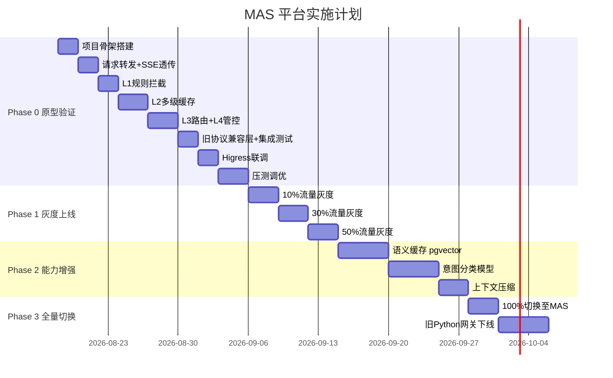


### 11.2 各阶段验收标准

| 阶段           | 周期    | 核心交付        | 验收标准                    |
| ------------ | ----- | ----------- | ----------------------- |
| Phase 0 原型验证 | 3 周   | 完整 L1-L4 可运行 MAS | 端到端打通，§10.3.1 验证场景全部通过   |
| Phase 1 灰度上线 | 1.5 周 | 灰度流量切换      | 错误率 < 0.1%，延迟无明显劣化      |
| Phase 2 能力增强 | 2 周   | 语义缓存 + 意图路由 | 缓存命中率 > 30%，路由准确率 > 90% |
| Phase 3 全量切换 | 1.5 周 | 旧网关下线       | 全量运行稳定，旧网关完全下线          |

***

## 12. 风险与应对

| 风险         | 可能性 | 影响 | 应对策略                                        |
| ---------- | --- | -- | ------------------------------------------- |
| MAS 单点故障   | 中   | 高  | K8s 多副本部署（原型 2 副本）+ Higress 健康检查自动摘除；降级开关可旁路 MAS 直连推理引擎；DB 故障时鉴权 fail-closed 拒绝、其余 L1 规则 fail-open 放行（§5.1 降级策略） |
| 多副本本地缓存一致性 | 中   | 低  | Caffeine 一级缓存与 API Key 缓存均为实例本地：PG 为权威二级，本地 TTL 短（API Key 5 分钟），Key 吊销最迟 5 分钟全局生效；`/internal/cache/flush` 清 PG + 命中副本本地缓存，其余副本本地项按 TTL 自然回落。生产可演进为失效事件广播 |
| 语义缓存误命中    | 中   | 中  | 阈值可调（默认 0.95）；提供手动清除缓存接口                    |
| 意图分类不准     | 低   | 中  | 模型指定优先（跳过分类）；持续收集样本迭代模型                     |
| SSE 流式透传延迟 | 低   | 中  | WebFlux 非阻塞架构；首 token 延迟增加不超过 5ms           |
| 灰度期间数据不一致  | 低   | 低  | 新旧网关共用 PostgreSQL 缓存；调用记录双写                 |

***

## 13. 评审记录

| 评审人    | 日期     | 结论     | 意见     |
| ------ | ------ | ------ | ------ |
| <br /> | <br /> | <br /> | <br /> |

***

## 14. 可运行原型规格附录（AI 编程可交付）

> 本附录是「喂给 AI 编程助手」的规格说明。目标：**端到端生成可运行、可自测的完整 L1-L4 MAS 原型**（范围见 §10.1）。AI 工具必须严格遵循，不得擅自引入附录之外的技术选型（尤其禁止 Redis / Faiss / MySQL）。**附录 G 为可执行编程规格定稿；附录 E 与 G 冲突时以 G 为准。**

### A. 技术栈定稿（零 AGPL 红线）

| 用途 | 选型 | 版本 | 许可证 |
| --- | --- | --- | --- |
| 服务框架 | Spring Boot WebFlux | 3.3.5 | Apache-2.0 |
| HTTP 客户端 | WebClient (Reactor Netty) | 同 Boot | Apache-2.0 |
| 数据访问 | MyBatis‑Plus（spring-boot3-starter）+ JDBC/HikariCP，经 `ReactiveDbAdapter` 桥接 | 3.5.7 | Apache-2.0 |
| 精确缓存 | Caffeine（本地）+ PostgreSQL 表 `mas_exact_cache` | - | Apache-2.0 / PG |
| 语义缓存 | PostgreSQL + pgvector（hnsw 索引） | 0.7+ | PostgreSQL License |
| 意图/难度分类 | 规则分类器（**原型不加载 .onnx**；DJL/ONNX 为生产演进方向） | - | - |
| 敏感词 | Aho‑Corasick (org.ahocorasick) | 0.6.3 | Apache-2.0 |
| 限流 | PostgreSQL 秒级窗口（`mas_rate_limit` 原子语句，多副本一致） | - | PostgreSQL License |
| 熔断故障转移 | 自研 `ModelHealthTracker`（不引入 Resilience4j） | - | - |
| 数据库 | PostgreSQL + pgvector（openGauss / KingbaseES 可替） | 16 | PostgreSQL License |
| Token 计数 | jtokkit | 1.1.0 | MIT |
| 可观测性 | Spring Boot Actuator + Micrometer Prometheus | 同 Boot | Apache-2.0 |

**硬约束**：不引入 Redis、Faiss、MySQL 或任何 GPL/AGPL 组件。意图分类模型（DJL/ONNX）仅在生产阶段加载，原型以「规则/配置路由 + 精确缓存 + 语义缓存」跑通。Nacos 与 Spring AI 不在原型范围（路由/熔断为自研实现）。

### B. 路径决策（写死，禁止猜测）

- Higress 使用 `PathPrefix: /smart-router` 转发且**不做路径重写**，MAS 收到的完整路径含 `/smart-router` 前缀。
- MAS 通过 `spring.webflux.base-path: /smart-router` 注册全局前缀。
- 最终端点（写死）：
  - `POST /smart-router/v1/chat/completions`
  - `POST /smart-router/v1/embeddings`
  - `GET  /smart-router/v1/models`
  - `POST /smart-router/ai/gateway/chatModel`（旧协议兼容，内部转发到上面 chat/completions）
- **禁止**让控制器直接注册 `/v1/...` 而不带前缀，否则经 Higress 必 404。

### C. 数据库初始化（PostgreSQL + pgvector）

建表语句见 §8（8 张表：`mas_model_config` / `mas_call_log` / `mas_token_quota` / `mas_exact_cache` / `mas_semantic_cache` / `mas_blacklist` / `mas_api_key` / `mas_rate_limit`，含 pgvector 扩展与索引；实现位于 `src/main/resources/db/schema.sql`，幂等）。启动顺序：

```sql
-- 1) 安装 pgvector 扩展（需在已安装 pgvector 的 PG 实例上执行一次）
CREATE EXTENSION IF NOT EXISTS vector;
-- 2) 执行 §8 的 DDL（即 db/schema.sql）
-- 3) 种子数据（与 src/main/resources/db/data.sql 一致）：
--    complex / simple 两档逻辑模型，难度路由评分 >= 阈值走 complex 档
INSERT INTO mas_model_config (model_id, model_name, provider, endpoint_url, intent_type, weight, status)
VALUES ('qwen-72b','Qwen-72B','external','http://localhost:11434/v1','complex',100,1)
ON CONFLICT (model_id) DO UPDATE SET intent_type = EXCLUDED.intent_type;
INSERT INTO mas_model_config (model_id, model_name, provider, endpoint_url, intent_type, weight, status)
VALUES ('qwen-lite','Qwen-Lite','external','http://localhost:11434/v1','simple',100,1)
ON CONFLICT (model_id) DO UPDATE SET intent_type = EXCLUDED.intent_type;
-- 4) embedding 模型：语义缓存（L2.2）寻址依据（mas.cache.embedding-model）；
--    缺失或端点不可用时 L2.2 按降级策略跳过，不影响其他功能
INSERT INTO mas_model_config (model_id, model_name, provider, endpoint_url, intent_type, weight, status)
VALUES ('bge-m3','BGE-M3','external','http://localhost:11434/v1','embedding',100,1)
ON CONFLICT (model_id) DO NOTHING;
-- 5) 零改造接入：登记后端物理模型名（与 mas.backend.model-overrides 目标一致）。
--    智能体原本直接向推理引擎发送物理名时，切换到路由地址后请求体无需改动即可命中转发
INSERT INTO mas_model_config (model_id, model_name, provider, endpoint_url, intent_type, weight, status)
VALUES ('gpt-oss:20b','GPT-OSS-20B','external','http://localhost:11434/v1','complex',100,1)
ON CONFLICT (model_id) DO UPDATE SET intent_type = EXCLUDED.intent_type;
INSERT INTO mas_model_config (model_id, model_name, provider, endpoint_url, intent_type, weight, status)
VALUES ('qwen2.5:0.5b','Qwen2.5-0.5B','external','http://localhost:11434/v1','simple',100,1)
ON CONFLICT (model_id) DO UPDATE SET intent_type = EXCLUDED.intent_type;
-- 6) 默认测试 API Key（明文 mas-test-key-001，SHA-256 存储，绑定身份 test-user）
INSERT INTO mas_api_key (key_hash, key_prefix, user_id, status)
VALUES ('4967cdac0abe235793aadaf37ab545e8c40e01904687e99d87e68a9c4f6c048a', 'mas-test', 'test-user', 1)
ON CONFLICT (key_hash) DO NOTHING;
```

### D. 原型运行环境（AI 工具据此一键启动）

**docker-compose.yml**（PostgreSQL+pgvector + 可选 Ollama）：

```yaml
services:
  postgres:
    image: ankane/pgvector:v0.7.0          # 已带 pgvector 的 PostgreSQL 16
    environment:
      POSTGRES_USER: mas
      POSTGRES_PASSWORD: mas123
      POSTGRES_DB: mas
    ports:
      - "5432:5432"
    healthcheck:
      test: ["CMD-SHELL", "pg_isready -U mas"]
      interval: 5s
      timeout: 5s
      retries: 10
  ollama:
    image: ollama/ollama
    ports:
      - "11434:11434"
    # 启动后执行：
    #   docker compose exec ollama ollama pull qwen2.5:0.5b   # 对话模型
    #   docker compose exec ollama ollama pull bge-m3         # 语义缓存 embedding；无 GPU/离线时跳过，由附录 F mock 的 /v1/embeddings 承接
```

**application.yml（关键片段）**：

```yaml
spring:
  webflux:
    base-path: /smart-router
  datasource:
    url: ${MAS_DB_URL:jdbc:postgresql://localhost:5432/mas}
    username: ${MAS_DB_USERNAME:mas}
    password: ${MAS_DB_PASSWORD:mas123}
  application:
    name: mas
mas:
  auth:
    enabled: true                             # 鉴权开关：false 时身份回退 body.user → X-User-Id → anonymous
  backend:
    default-endpoint: ${MAS_MODEL_ENDPOINT:http://localhost:11434/v1}   # 外部推理引擎；无 GPU 时改用 mock（见 F）
    model-overrides:                          # 逻辑名 → 物理名映射（未配置的 model_id 原样转发）
      qwen-72b: gpt-oss:20b
      qwen-lite: qwen2.5:0.5b
  cache:
    exact-ttl: 30m
  rate-limit:
    per-user-qps: 20
  blacklist:
    users:
      - banned-user
```

**pom.xml 关键依赖**（Spring Boot 3.3.x parent 管理版本，下方省略 version 处由 parent 管理）：

```xml
<dependencies>
  <dependency>
    <groupId>org.springframework.boot</groupId>
    <artifactId>spring-boot-starter-webflux</artifactId>
  </dependency>
  <!-- 数据访问：MyBatis-Plus + JDBC（阻塞 SQL 经 ReactiveDbAdapter 桥接至 boundedElastic） -->
  <dependency>
    <groupId>com.baomidou</groupId>
    <artifactId>mybatis-plus-spring-boot3-starter</artifactId>
    <version>3.5.7</version>
  </dependency>
  <dependency>
    <groupId>org.springframework.boot</groupId>
    <artifactId>spring-boot-starter-jdbc</artifactId>
  </dependency>
  <dependency>
    <groupId>org.postgresql</groupId>
    <artifactId>postgresql</artifactId>
    <scope>runtime</scope>
  </dependency>
  <dependency>
    <groupId>com.github.ben-manes.caffeine</groupId>
    <artifactId>caffeine</artifactId>
  </dependency>
  <dependency>
    <groupId>com.knuddels</groupId>
    <artifactId>jtokkit</artifactId>
    <version>1.1.0</version>
  </dependency>
  <!-- Aho-Corasick 敏感词 -->
  <dependency>
    <groupId>org.ahocorasick</groupId>
    <artifactId>ahocorasick</artifactId>
    <version>0.6.3</version>
  </dependency>
  <!-- 可观测性：/actuator/health 与 /actuator/prometheus，见附录 G.9 -->
  <dependency>
    <groupId>org.springframework.boot</groupId>
    <artifactId>spring-boot-starter-actuator</artifactId>
  </dependency>
  <dependency>
    <groupId>io.micrometer</groupId>
    <artifactId>micrometer-registry-prometheus</artifactId>
  </dependency>
</dependencies>
```

**启动顺序**：

```bash
docker compose up -d
docker compose exec ollama ollama pull qwen2.5:0.5b   # 无 GPU 时跳过，改用 mock（见 F）
docker compose exec ollama ollama pull bge-m3         # 语义缓存 embedding；无 GPU/离线时跳过，由附录 F mock 承接
mvn spring-boot:run                                    # 或 ./mvnw spring-boot:run
```

### E. 原型范围红线（AI 工具务必遵守）

1. **意图分类模型不加载 .onnx**，但预留 `IntentClassifier` SPI 接口（默认实现为规则/关键词分类）。L3 路由按「请求显式 `model` 字段优先 → 否则按 `mas_model_config` 默认意图映射 → 否则关键词规则推断意图 → 否则默认 `mas.routing.default-model`」实现，纯配置/规则驱动。
2. **实现精确缓存（L2.1）与语义缓存（L2.2）**：语义缓存基于 pgvector，阈值默认 0.95，细则见附录 G.4/G.7。
3. **实现输出审核（敏感词 AC 自动机脱敏替换）与上下文压缩（截断策略）**；摘要式压缩预留接口，原型不实现。
4. **不引入 Redis / Faiss / MySQL / 任何外部缓存或向量中间件**。原型只依赖 PostgreSQL 与本地内存（Caffeine）；限流为 PG 秒级窗口原子语句。
5. **SSE 必须流式透传**：用 `WebClient` 的 `retrieve().bodyToFlux(...)` 直接转发 `Flux`，禁止缓冲整段再返回。
6. **Token 统计**：用 jtokkit 近似计数写 `mas_call_log`；`usage` 字段若后端已返回则直接透传。流式响应按聚合后的完整文本计数（见附录 G.5）。
7. **零配置可跑**：应用启动时自动建表（或执行 §8 DDL）并插入附录 C 种子数据（`qwen-72b → Ollama endpoint` 与 `bge-m3 → embedding endpoint`），无需手工初始化。
8. 所有响应统一附加 `x-mas-meta`（cache_hit / cache_level / routed_to / pipeline_cost_ms / intent / difficulty / content_blocked / failover），便于 §10.3.1 断言。
9. **敏感词过滤在 L1（输入）与 L4（输出审核）均启用**，词表从 classpath `sensitive-words.txt` 加载（每行一个词），为空时跳过。
10. **认证与身份识别、统一错误响应契约见附录 G.1/G.2**，不得自定义错误体结构。

### F. 无 GPU / 离线 Mock 模式（可选）

无 Ollama/显卡时，用下面的极简 mock 服务器代替后端，让原型纯本地可跑：

```python
# mock_llm.py —— 返回 OpenAI 兼容的 chat/completions（含 SSE）与 embeddings
import json, hashlib
from http.server import BaseHTTPRequestHandler, HTTPServer

def fake_embedding(text, dim=1024):
    # 确定性伪向量：同文本同向量、不同文本可区分，满足语义缓存命中/未命中两类测试
    h = int.from_bytes(hashlib.sha256(text.encode()).digest(), 'big')
    vec = [((h >> (i % 224)) & 0xFF) / 255.0 for i in range(dim)]
    n = sum(x * x for x in vec) ** 0.5 or 1.0
    return [round(x / n, 6) for x in vec]

class H(BaseHTTPRequestHandler):
    def do_POST(self):
        n = int(self.headers.get('Content-Length', 0))
        body = json.loads(self.rfile.read(n) or b'{}')
        if self.path.endswith('/v1/embeddings'):
            text = body.get('input', '')
            if isinstance(text, list): text = text[0] if text else ''
            self.send_response(200); self.send_header('Content-Type', 'application/json'); self.end_headers()
            self.wfile.write(json.dumps({"data":[{"embedding":fake_embedding(text),"index":0}],
                                         "usage":{"prompt_tokens":5,"total_tokens":5}}).encode())
            return
        stream = body.get('stream', False)
        if stream:
            self.send_response(200); self.send_header('Content-Type', 'text/event-stream'); self.end_headers()
            for w in ["你好", "，", "这是", "Mock", "回复"]:
                self.wfile.write(f"data: {json.dumps({'choices':[{'delta':{'content':w}}]})}\n\n".encode())
            self.wfile.write(b"data: [DONE]\n\n")
        else:
            self.send_response(200); self.send_header('Content-Type', 'application/json'); self.end_headers()
            self.wfile.write(json.dumps({"choices":[{"message":{"role":"assistant","content":"Mock 回复"}}],
                                         "usage":{"prompt_tokens":5,"completion_tokens":5,"total_tokens":10}}).encode())
    def log_message(self, *a): pass

HTTPServer(('0.0.0.0', 11434), H).serve_forever()
```

将 `application.yml` 中 `mas.backend.default-endpoint` 指向 `http://localhost:11434/v1`（与 Ollama 路径一致），即可复用同一套转发逻辑。

**一键验证脚本 `verify.sh`**（已数据驱动化：100 条黑盒用例定义在 `tests/cases.json`，自动携带测试 Key 并输出报告）：

```bash
#!/usr/bin/env bash
# 一键验证入口（设计方案附录 F / §10.3.1）：已数据驱动化。
# 用例定义在 tests/cases.json（100 条黑盒用例），执行器为 tests/run_cases.py，
# 报告（含每条用例的路由明细）输出至 reports/test-report.md。
cd "$(dirname "$0")"
exec python3 tests/run_cases.py "$@"
```

> 该套件默认不携带 API Key，适用于 `mas.auth.enabled=false` 的本地回归；鉴权开启环境（如 K8s）的验证以 §6.5 的 13 项功能清单为准，手工 curl 须带 `Authorization: Bearer mas-test-key-001`（见 §10.3.1）。

### G. 可执行编程规格（定稿，与附录 E 冲突时以本节为准）

> 本节是完整 L1-L4 原型的编程定稿规格。AI 编程工具按本节逐条实现，不得自行发挥契约细节。

#### G.1 认证与身份识别契约（定稿）

| 项 | 规则 |
| --- | --- |
| 鉴权开关 | `mas.auth.enabled`（默认 `true`）：开启时强制 API Key 校验；关闭时退化为内网零改造模式，身份回退链 `body.user → X-User-Id → anonymous` |
| API Key 校验 | `Authorization: Bearer <key>` → SHA‑256 摘要查 `mas_api_key`（Caffeine 本地缓存 5 分钟）→ 校验 `status=1` 与 `expire_at` → 绑定身份 `user_id`；明文 Key 不落库 |
| fail-closed | 缺失 Key、无效 Key、过期 Key、吊销 Key，或校验链路空信号（`Mono.empty()`），一律 401 拒绝，**禁止静默放行** |
| 身份链 | 鉴权开启：`user_id` = Key 绑定身份（用于黑名单、限流、配额、调用记录）；鉴权关闭：按上表回退链 |
| 智能体自报身份 | 请求体 OpenAI 标准 `user` 字段 → `mas_call_log.agent_id`，仅审计，**不作为可信身份**参与黑名单/限流 |
| app_id | Key 绑定的 `app_id`（或 `X-App-Id` 请求头），写入 `mas_call_log.app_id` |
| 认证失败 | 返回 401，错误体遵循 G.2（`code: invalid_api_key`） |
| Key 生命周期 | 管理端点 `POST /internal/api-keys`（创建，返回一次性明文）/ `DELETE /internal/api-keys?prefix=`（按前缀吊销）；吊销最迟 5 分钟全局生效（本地缓存 TTL） |

#### G.2 统一错误响应契约

所有异常必须返回 OpenAI 错误结构，禁止自定义：

```json
{"error": {"message": "human readable message", "type": "invalid_request_error", "code": "blacklisted"}}
```

状态码与 type/code 映射表（写死）：

| 场景 | HTTP | type | code |
| --- | --- | --- | --- |
| Bearer 校验失败 | 401 | authentication_error | invalid_api_key |
| L1 黑名单拦截 | 403 | permission_error | blacklisted |
| L1 输入敏感词命中 | 400 | content_filter | input_blocked |
| L1 频率限制超限 | 429 | rate_limit_error | rate_limited |
| 参数非法（model 不存在、max_tokens 越界等） | 400 | invalid_request_error | invalid_param |
| 请求的模型未在 `mas_model_config` 注册 | 404 | invalid_request_error | model_not_found |
| L4 Token 配额不足 | 402 | quota_error | quota_exceeded |
| 后端引擎超时 | 504 | upstream_error | engine_timeout |
| 后端引擎其他错误 | 502 | upstream_error | engine_error |
| MAS 内部未分类异常 | 500 | internal_error | internal |

后端引擎返回的错误必须包装为上表结构，**禁止透传引擎原始错误体**。

#### G.3 旧协议 `/ai/gateway/chatModel` 字段映射规格（定稿）

兼容层已按本节实现（`LegacyCompatController`），映射表即代码事实；与真实 ChatModelInter 报文如有出入，仅需调整映射函数。

**请求映射（旧协议 → OpenAI）：**

| 旧字段 | OpenAI 字段 | 说明 |
| --- | --- | --- |
| `modelId` | `model` | 缺失时走默认路由 |
| `messages` | `messages` | 结构一致（role/content 数组），原样透传 |
| `stream` | `stream` | 默认 false；**已支持流式**（SSE 透传 chunk，末尾 `data: [DONE]`） |
| `temperature` | `temperature` | 存在才映射 |
| `maxTokens` | `max_tokens` | 存在才映射 |
| `topP` | `top_p` | 存在才映射 |
| `frequencyPenalty` | `frequency_penalty` | 存在才映射 |
| `presencePenalty` | `presence_penalty` | 存在才映射 |
| `stop` | `stop` | 存在才映射 |
| `n` | `n` | 存在才映射 |

**响应映射（OpenAI → 旧协议，非流式）：**

| OpenAI 字段 | 旧字段 | 说明 |
| --- | --- | --- |
| `choices[0].message.content` | `data.content` | 旧响应包裹为 `{"code":0,"message":"success","data":{...}}` |
| `usage` | `data.usage` | 原样透传 |
| `id` / `model` | `data.requestId` / `data.modelId` | - |

**错误码映射（HTTP 状态 → 旧协议 `code`，写死）：**

| HTTP | 旧 code | 含义 |
| --- | --- | --- |
| 400 | 1000 | 参数错误 |
| 401 | 1001 | 鉴权失败 |
| 403 | 1002 | 黑名单 |
| 429 | 1003 | 限流 |
| 504 | 1004 | 上游超时 |
| 502 | 1005 | 上游错误 |
| 其他 | -1 | 未分类错误 |

错误响应体为 `{"code":<旧 code>,"message":"<错误信息>","data":null}`，HTTP 状态码仍按 G.2 映射；流式请求出错时同样回退为上述 JSON 错误体。

#### G.4 缓存键与序列化规则（写死）

1. `cache_key = SHA256(model + "\n" + jsonMessages + "\n" + temperature + "\n" + maxTokens)`
   - `jsonMessages`：messages 按请求原始顺序（**不排序**）序列化为紧凑 JSON（无空格），每条仅保留 `role` 与 `content` 两个字段
   - `stream` 字段一律排除在键外；temperature / max_tokens 缺省时以字符串 `null` 占位
2. 精确缓存命中：重生成响应 `id`（新 UUID）与 `created`（当前秒级时间戳），其余原样返回；`x-mas-meta.cache_hit=true, cache_level="exact"`
3. 语义缓存：仅以**最后一条 `role=user` 的 message 文本**做 embedding；命中条件为余弦相似度 >= `mas.cache.semantic-threshold`；返回时同样重生成 `id`/`created`，`cache_level="semantic"`
4. 写缓存：非流式响应完成后**同时写精确与语义两级**；流式响应聚合完成后再写（见 G.5）；两级写入均为异步、失败仅告警不阻断

#### G.5 流式处理规格

1. SSE 透传：`WebClient.retrieve().bodyToFlux(String.class)` 按行转发，**禁止缓冲整段**（附录 E.5）；低延迟透传，首 token 不等待聚合
2. 透传同时用 `doOnNext` 增量拼接各 chunk 的 `delta.content`；`onComplete` 后异步：写两级缓存（G.4）、用 jtokkit 对聚合全文统计 token、写 `mas_call_log`
3. 流式场景缓存命中回放：将缓存的完整响应拆为单 token/chunk 序列，按 OpenAI `chat.completion.chunk` 格式逐条输出，末尾补 `data: [DONE]`
4. 流式响应中途后端断流：已输出的 chunk 不回滚，追加一条含 `finish_reason="error"` 的 chunk 后结束（不输出 `[DONE]` 之外的错误体）
5. **帧标准化**：MAS 自产的一切帧（缓存回放、错误帧、x-mas-meta 帧）均为合法 `chat.completion.chunk` JSON（`x-mas-meta` 内嵌于 chunk），客户端可按同一结构解析全部帧

#### G.6 配置项清单（`MasProperties` 绑定，前缀 `mas`）

| 配置键 | 类型 | 默认值 | 说明 |
| --- | --- | --- | --- |
| `mas.auth.enabled` | bool | `true` | 鉴权开关：`false` 时跳过 API Key 校验，身份回退 `body.user → X-User-Id → anonymous` |
| `mas.backend.default-endpoint` | string | `http://localhost:11434/v1` | 外部推理引擎兜底地址（环境变量 `MAS_MODEL_ENDPOINT` 覆盖） |
| `mas.backend.timeout` | duration | `60s` | 后端引擎响应超时，超时按 G.2 返 504 |
| `mas.backend.model-overrides` | map | `{qwen-72b: gpt-oss:20b, qwen-lite: qwen2.5:0.5b}` | 路由 model_id → 后端物理模型名；未配置者原样转发 |
| `mas.cache.exact-ttl` | duration | `30m` | 精确缓存 TTL |
| `mas.cache.max-exact-entries` | int | `100000` | Caffeine 本地上限 |
| `mas.cache.semantic-ttl` | duration | `60m` | 语义缓存 TTL |
| `mas.cache.semantic-threshold` | double | `0.95` | 语义命中全局阈值 |
| `mas.cache.semantic-threshold-by-intent` | map | `{chat: 0.93, embedding: 0.97}` | 按意图覆盖语义阈值，未配置意图回退全局值 |
| `mas.cache.max-semantic-entries` | int | `50000` | 语义缓存表上限，超出按 TTL 清理 |
| `mas.cache.embedding-model` | string | `bge-m3` | embedding 模型标识，需在 `mas_model_config` 中注册（intent_type=embedding） |
| `mas.rate-limit.per-user-qps` | int | `20` | 每用户 QPS（PG 秒级窗口，多副本一致） |
| `mas.blacklist.users` | list<string> | `[banned-user]` | 配置式黑名单，与 `mas_blacklist` 表取并集 |
| `mas.sensitive-words.path` | string | `classpath:sensitive-words.txt` | AC 词表路径，文件缺失/为空时跳过敏感词检查 |
| `mas.quota.per-user-per-minute` | long | `100000` | 每分钟 token 限额 |
| `mas.quota.per-user-per-day` | long | `5000000` | 每天 token 限额 |
| `mas.routing.default-model` | string | `qwen-72b` | 兜底路由模型 |
| `mas.routing.difficulty.enabled` | bool | `true` | 难度路由开关：无显式 `model` 时按难度评分分流 |
| `mas.routing.difficulty.threshold` | double | `0.5` | 评分 ≥ 阈值 → complex 档（大参数模型），否则 simple 档 |
| `mas.compress.max-context-tokens` | int | `4096` | 超过则触发 L4 截断压缩 |
| `mas.circuit-breaker.failure-threshold` | int | `5` | 连续失败达阈值后熔断该 endpoint |
| `mas.circuit-breaker.open-duration` | duration | `30s` | 开路时长，到期进入半开 |
| `mas.circuit-breaker.half-open-max-attempts` | int | `2` | 半开期试探请求数，成功即闭合 |

> 管理面提示：以上除连接类（datasource、default-endpoint）外的配置项，后续均迁移至数据库由前端界面管理（附录 H.2）。原型阶段建议通过 `SettingProvider` 接口读取配置（默认实现读 `MasProperties`），避免后续接入管理面时重构四层流水线代码。

#### G.7 L1-L4 各 Stage 实现要点

- **L1**：API Key 鉴权（`mas.auth.enabled` 开关，**fail-closed**）→ 黑名单（配置列表 + `mas_blacklist` 表取并集）→ 敏感词（AC 自动机，启动时加载词表构建）→ 频率限制（PG `mas_rate_limit` 秒级窗口原子计数）→ 参数校验；除鉴权外，其余规则组件自身异常时 **fail-open** 放行并记录告警日志
- **L2**：先 Caffeine 后 PG `mas_exact_cache`（命中回填 Caffeine）；未命中再走语义缓存——调用 `mas.cache.embedding-model` 对应服务取向量，pgvector `<=>` 余弦检索取 Top1 判阈值（可按意图覆盖）；**缓存命中即短路返回，不进入 L3 难度/意图分类**（`routed_to=cache:exact/semantic`）；embedding 服务或 PG 异常时**降级跳过对应层**直接进 L3
- **L3**：显式 `model` 字段优先（含物理名零改造直通）→ 无显式 `model` 时按难度评分分流（`RuleDifficultyClassifier`，评分 ≥ `mas.routing.difficulty.threshold` → complex 档，否则 simple 档）→ 关键词规则推断意图（`RuleIntentClassifier`）→ 按 `mas_model_config.intent_type` 匹配启用中模型 → 默认 `mas.routing.default-model`；同意图多实例时按 `weight` 加权轮询；**自研 `ModelHealthTracker` 熔断**（按 endpoint 记录失败，开路后自动切换同档备用模型，`routed_to=failover:<model>`，§5.3.4）
- **L4**：上下文压缩按「保留全部 system message + 最近 N 轮 user/assistant」截断（jtokkit 估算 token 数，不超过 `mas.compress.max-context-tokens`）；配额检查对 `mas_token_quota` 原子累加（`UPDATE ... WHERE token_used + :delta <= token_limit`，失败返 402）；输出审核对非流式全文做 AC 敏感词替换为 `***`，流式在聚合后审核（仅记录告警，不阻断已输出内容）

#### G.8 代码规范与环境

- Java 17、Spring Boot 3.3.5；包名 `com.sunyard.llm.mas`（与 §9.2 一致）
- WebFlux 请求路径保持非阻塞，**禁止在事件循环线程调用 `block()`**；数据访问为 MyBatis‑Plus 阻塞 JDBC，一律经 `ReactiveDbAdapter`（`Mono.fromCallable(...).subscribeOn(Schedulers.boundedElastic())`）桥接；注意 `fromCallable` 返回 `null` 会产生空信号，需要失败语义处必须 `switchIfEmpty(Mono.error(...))`
- trace_id：入口生成（`TraceWebFilter`），写入响应头 `X-Trace-Id` 与 `mas_call_log.trace_id`，贯穿全链路日志
- 日志：JSON 行格式（logback 配置），字段含 `timestamp / level / trace_id / stage / message`
- 异常统一由 `@ControllerAdvice`（`GlobalExceptionHandler`）输出 G.2 结构；Stage 间通过 `PipelineContext` 传递 trace_id、用户身份、各层耗时

#### G.9 测试与可观测性

- **单元测试**：135 个（Spring Boot Test + reactor-test + Mockito），覆盖缓存键生成（G.4 规则回归）、AC 敏感词匹配、PG 秒级窗口限流、配额原子累加、旧协议字段映射（G.3）、API Key 鉴权（无效/过期/空信号 fail-closed）、难度评分与熔断状态机
- **数据驱动黑盒套件**：`tests/cases.json`（100 条）+ `tests/run_cases.py`，入口 `verify.sh`，报告输出 `reports/test-report.md`；K8s 环境另有 13 项功能验证清单（§6.5）
- **可观测性**：暴露 `/smart-router/actuator/health`（含 PG 连通性检查）与 `/smart-router/actuator/prometheus`；核心指标：请求计数/耗时（按 stage 分桶）、缓存命中率、限流触发数、后端错误率

### H. 管理面设计（部分已实现，其余后续迭代预留）

> 目标：为前端配置界面提供一套 REST 管理 API，实现模型路由、配额、黑名单、敏感词、缓存、运行参数的在线管理。**管理面是纯增量，不改变四层流水线、缓存键规则与协议契约**；数据面与管理面共用同一 PostgreSQL。
>
> **已实现子集**（前缀 `/smart-router/internal`，原型阶段以网络隔离保护，见 §6.4 内部端点隔离）：
> - `POST /internal/api-keys`：创建 API Key（返回一次性明文，落库仅存 SHA‑256）
> - `DELETE /internal/api-keys?prefix=<key_prefix>`：按前缀吊销（最迟 5 分钟全局生效）
> - `POST /internal/cache/flush`：清空精确缓存（本地 + PG）与语义缓存（PG）

#### H.1 管理 API 清单

统一前缀 `/smart-router/admin/v1`，与数据面端点隔离；响应统一 `{"code":0,"message":"success","data":{...}}`，错误时 `code≠0`（管理面面向内部运维，不强制 OpenAI 错误体）。

| 分组 | 端点 | 说明 |
| --- | --- | --- |
| API Key | `POST /internal/api-keys`；`DELETE /internal/api-keys?prefix=` | **已实现**；对应 `mas_api_key`（G.1） |
| 模型路由 | `GET/POST/PUT/DELETE /models`；`PUT /models/{model_id}/status`；`PUT /models/{model_id}/weight` | 对应 `mas_model_config`；启停/权重调整即灰度开关 |
| Token 配额 | `GET/PUT /quotas`；`POST /quotas/{id}/reset` | 对应 `mas_token_quota` |
| 黑名单 | `GET/POST/DELETE /blacklist` | `mas_blacklist` 表**已实现**并接入 L1（§8.1.6），管理 API 待补 |
| 敏感词 | `GET /sensitive-words`；`PUT /sensitive-words`（整包替换） | 写入后触发各实例 AC 自动机重建（H.3） |
| 运行参数 | `GET/PUT /settings` | 对应 `mas_setting`（H.2）：限流 QPS、缓存 TTL、语义阈值、默认模型、压缩上限等 |
| 缓存管理 | `POST /internal/cache/flush`（**已实现**）；后续补 `GET /cache/stats` 与按 model_id 分级清除 | 兑现 §12 风险表的「手动清除缓存接口」 |
| 调用记录 | `GET /logs` | 分页查询 `mas_call_log`，按 app_id/user_id/model_id/时间/缓存命中筛选，供用量大盘 |
| 审计 | `GET /audits` | 分页查询 `mas_config_audit`（H.5） |

#### H.2 配置数据库化迁移表（静态配置 → 管理表）

原型阶段写在 `application.yml` / classpath 的配置，接入管理面时按下表迁移；迁移后 `application.yml` 仅保留连接类配置（datasource、default-endpoint 兜底）。

| 原静态配置 | 迁移目标 | 说明 |
| --- | --- | --- |
| `mas.blacklist.users` | `mas_blacklist`（**已实现**，§8.1.6） | 表已落地并接入 L1，配置项与表取并集，管理 API 待补 |
| `sensitive-words.txt` | 新表 `mas_sensitive_word` | 字段：word、status；**变更后必须重建 AC 自动机**（H.3 热加载覆盖） |
| `mas.rate-limit.*`、`mas.cache.*`、`mas.quota.*`、`mas.routing.*`、`mas.compress.max-context-tokens` | 新表 `mas_setting` | KV 结构：setting_key、setting_value、version、updated_by、updated_at |
| `mas_model_config` / `mas_token_quota` / `mas_api_key` | 保持现表 | 已是数据库表，直接对接管理 API |

```sql
-- 附录 H 预留表 DDL（mas_blacklist 已在 §8.1.6 实现，此处仅列后续两张预留表）
CREATE TABLE mas_sensitive_word (
    id         BIGSERIAL PRIMARY KEY,
    word       VARCHAR(128) NOT NULL UNIQUE,
    status     SMALLINT     NOT NULL DEFAULT 1,  -- 0 禁用 1 启用
    updated_by VARCHAR(64),
    updated_at TIMESTAMP    NOT NULL DEFAULT CURRENT_TIMESTAMP
);

CREATE TABLE mas_setting (
    setting_key   VARCHAR(64) PRIMARY KEY,
    setting_value VARCHAR(1024) NOT NULL,
    version       BIGINT        NOT NULL DEFAULT 1,   -- 每次更新 +1，供热加载轮询
    updated_by    VARCHAR(64),
    updated_at    TIMESTAMP     NOT NULL DEFAULT CURRENT_TIMESTAMP
);
```

#### H.3 热加载与多实例一致性机制（定稿：Nacos 通知 + DB 兜底轮询）

多实例部署下，管理 API 写入 DB 后需保证所有实例生效，机制定稿为：

1. **事实源 = PostgreSQL 管理表**；`application.yml` 仅作启动兜底
2. 管理 API 写库成功后，通过 **Nacos 发布配置变更通知**（dataId：`mas-config-notify`，内容为 `mas_setting.version` 与各表 `max(updated_at)`），各实例监听后立即重载
3. 各实例同时以 **10 秒周期轮询 DB 版本号兜底**（防 Nacos 通知丢失）；一致性窗口 ≤ 10s
4. 重载动作：刷新模型路由内存快照（原子替换，不阻断在途请求）、重建黑名单 Set、重建 AC 自动机（敏感词）、更新限流参数与缓存阈值
5. 重载失败时**保留旧配置继续服务**并告警，严禁因配置加载失败导致服务不可用

#### H.4 管理员鉴权方案

| 阶段 | 方案 |
| --- | --- |
| 原型/内部验证 | 管理 API 网络隔离（仅内网/Higress 管理域名可达）+ 静态令牌 `X-Admin-Token` 校验 |
| 生产 | 接全行统一认证（OAuth2/OIDC），RBAC 两角色：`admin`（读写）/ `viewer`（只读）；鉴权优先放 Higress 层，应用层用 Spring Security WebFlux 兼容 |

管理 API 必须携带管理员身份（静态令牌映射的 admin_id 或 OIDC 主体），写入审计表（H.5）；未携带/无效一律 401。

#### H.5 配置变更审计表

所有写类管理操作（含缓存清除）强制写审计，支持「谁在何时把什么从 A 改成 B」回溯：

```sql
CREATE TABLE mas_config_audit (
    id          BIGSERIAL PRIMARY KEY,
    admin_id    VARCHAR(64)  NOT NULL,
    action      VARCHAR(32)  NOT NULL,   -- create / update / delete / clear_cache / reload
    target_type VARCHAR(32)  NOT NULL,   -- model / quota / blacklist / setting / sensitive_word / cache
    target_key  VARCHAR(128),
    before_json TEXT,
    after_json  TEXT,
    client_ip   VARCHAR(64),
    created_at  TIMESTAMP    NOT NULL DEFAULT CURRENT_TIMESTAMP
);
CREATE INDEX idx_audit_created ON mas_config_audit (created_at);
```

#### H.6 前端界面说明

- 前端不在本方案技术约束内，仅依赖 H.1 管理 API；推荐页面：模型路由管理（启停/权重/灰度）、配额管理、黑名单与敏感词、缓存管理、调用日志与用量大盘、审计查询
- 写操作要求二次确认，并展示变更前后 diff（数据取自审计表 before_json/after_json）
- 模型启停、权重调整建议与 §5.3.2 灰度路由联动：新版本模型先低权重上线，界面逐步调权

#### H.7 落地节奏

- 管理面安排在 **Phase 2 能力增强阶段**同步交付，不阻塞 Phase 0/1
- 实现时仅在 `web/` 包新增管理控制器与管理服务层，L1-L4 流水线代码零改动（已实现子集即按此方式落地：`web/ApiKeyAdminController`、`web/CacheAdminController`）；前提是原型阶段已按附录 G.6 提示通过 `SettingProvider` 接口读配置
- 验收标准：管理 API 全部可用；修改任一配置后所有实例 ≤10s 生效；审计记录完整；前端页面完成六类管理操作闭环

