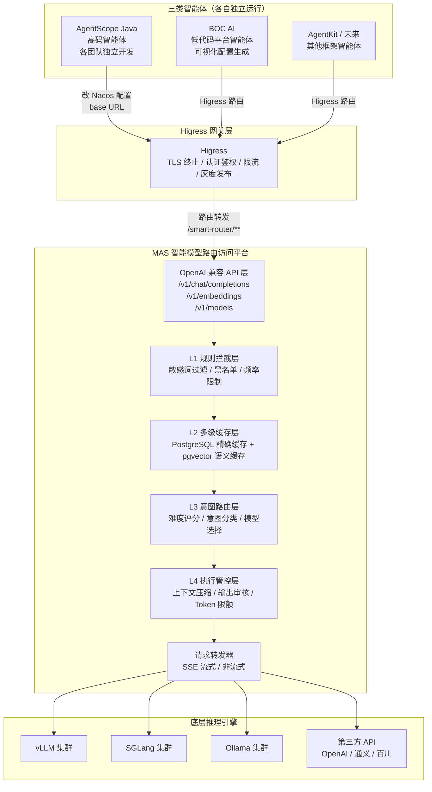
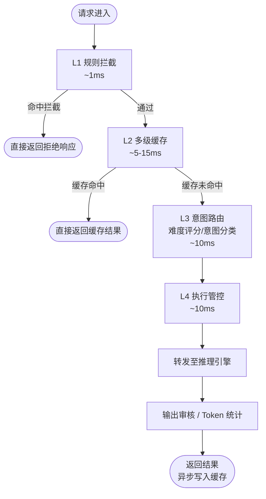
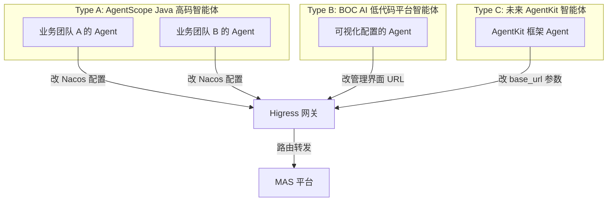
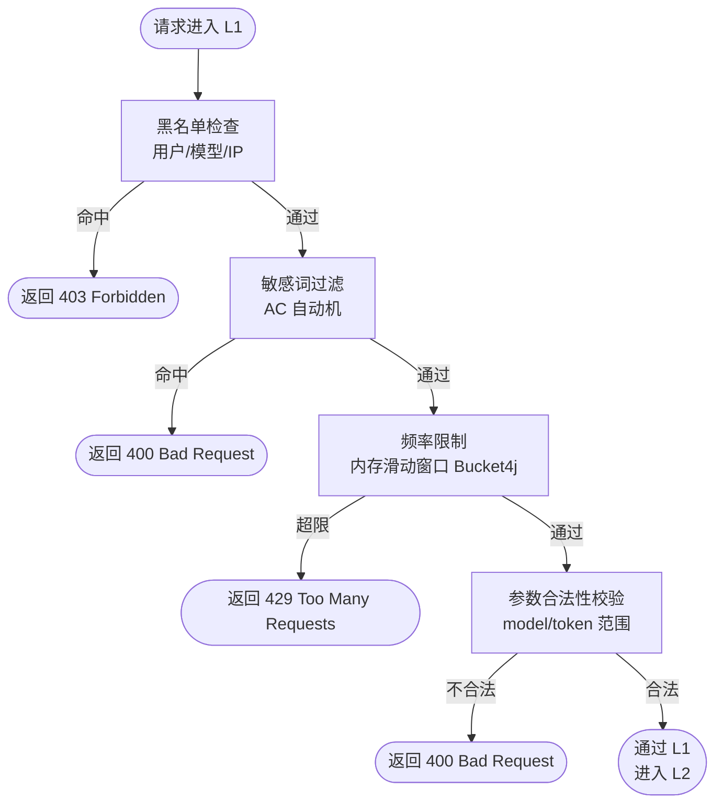
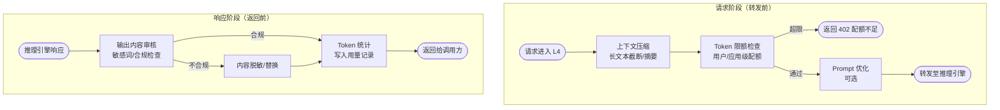
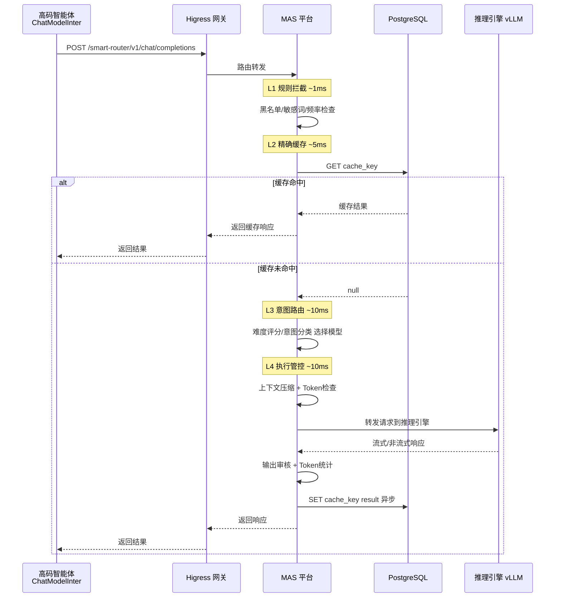
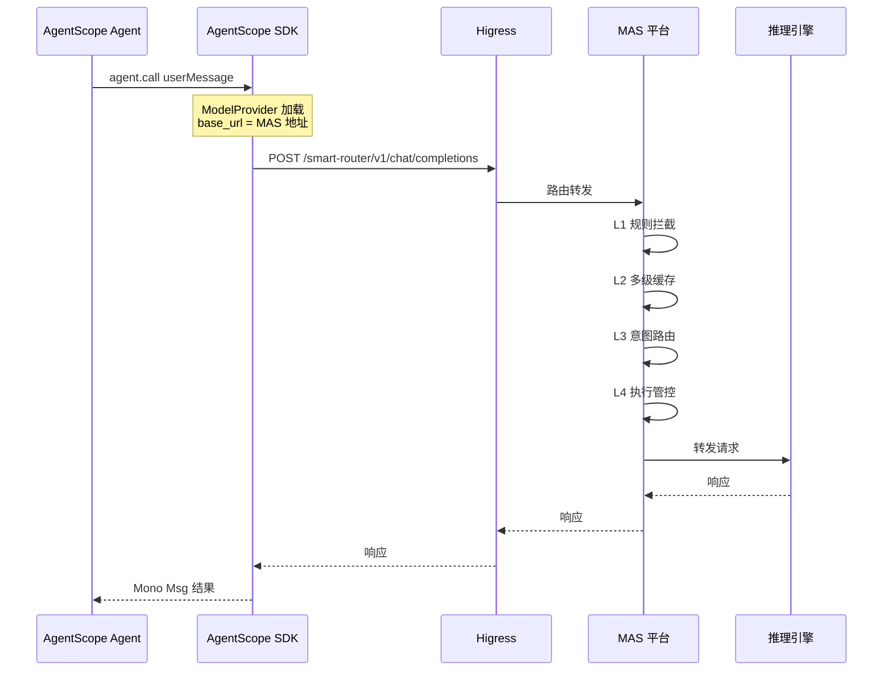
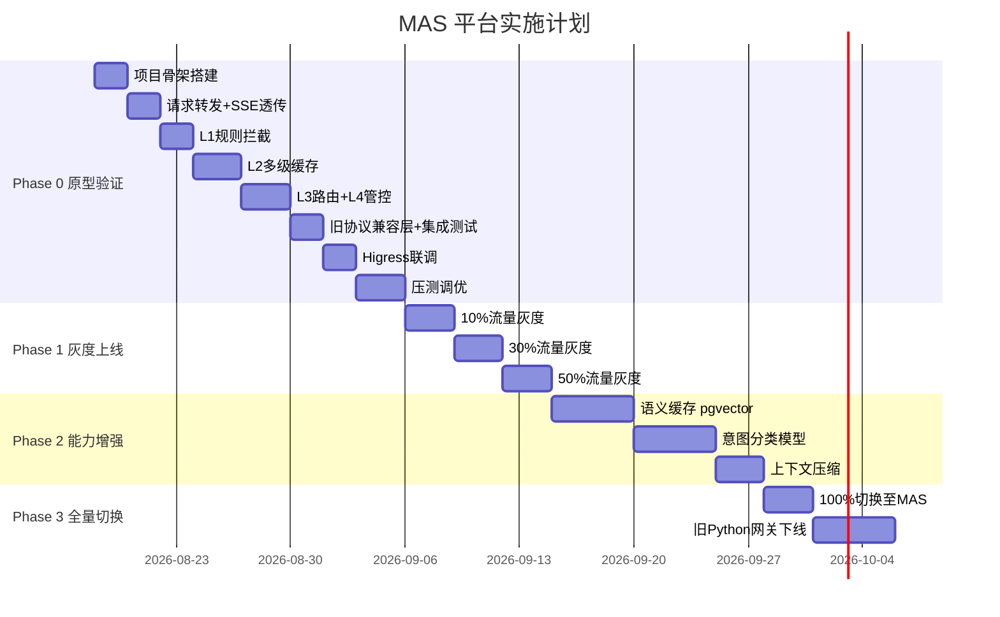

# 智能模型路由访问平台设计方案

> **版本**：v1.2  
> **状态**：根据已经实现原型完善 
> **日期**：2026-08-21

***

## 1. 概述

### 1.1 产品定位定位

智能模型路由访问平台（Model Access & Scheduling，简称 MAS）是一个 **OpenAI 兼容的 HTTP 代理服务**，插在智能体与底层大模型推理引擎之间，所有大模型调用先经过它，通过多级缓存/智能路由/流量管控，管控后再转发给真正的推理引擎。

**本质上就是：给所有大模型调用加了一个"总闸"，实现统一管控，统括缓存减少重复问题计算，智能路由把问题调度给合适的模型避免浪费算力，管控防止token滥用，把有限的token资源用于保障重要业务。**

### 1.2 核心目标

| 目标        | 说明                            |
| --------- | ----------------------------- |
| **统一入口**  | 所有大模型访问请求经过 MAS 统一收口          |
| **降本增效**  | 通过多级缓存（精确+语义）减少重复推理，降低算力消耗    |
| **智能路由**  | 根据请求意图自动选择最优模型/引擎，提升响应质量      |
| **安全管控**  | 输入/输出内容审核、Token 限额、调用频率控制     |
| **零侵入接入** | 高码智能体只需修改一个 base URL 配置即可完成接入 |

### 1.3 接入方式

> 高码智能体只需将 从旧网关地址改为 MAS 平台地址，即可完成接入。不需要改动任何业务逻辑代码。

***

## 2. 整体架构

### 2.1 全链路架构图




### 2.2 请求处理流程




**各场景性能指标：**

| 场景            | 总耗时   | 说明                       |
| ------------- | ----- | ------------------------ |
| 最佳（L2 精确缓存命中） | ~6ms  | 跳过 L3/L4，直接返回            |
| 良好（L2 语义缓存命中） | ~16ms | 跳过 L3/L4，直接返回            |
| 典型（难度路由）      | ~26ms | L1 + L2 + L3(难度评分) + L4 + 转发 |
| 标准（意图路由）      | ~31ms | L1 + L2 + L3(意图分类) + L4 + 转发 |
| 最差（含压缩 + 审核）  | ~50ms | 全链路 + 上下文压缩              |

### 2.3 与现有系统的关系

| 组件                        | 现有角色                                           | MAS 上线后变化                            |
| ------------------------- | ---------------------------------------------- | ------------------------------------ |
| **Higress**               | L7 反向代理 + 业务路由                                 | 职责收窄为 L7 流量入口 + TLS/认证/限流，业务路由交给 MAS |
| **ChatModelInter** (Java) | 调用 `gateway_service + "/ai/gateway/chatModel"` | 仅需修改 `gateway_service` 指向 MAS 地址     |
| **Nacos 配置**              | `app.algorithm.ai-gateway-service` = 旧网关地址     | 改为 MAS 地址即可                          |

***

## 3. 三类智能体对接方案

### 3.1 对接方式总览

三类智能体的执行方式不同，对接方式也不同，不需要强行抽象统一接口。




### 3.2 Type A：AgentScope Java 高码智能体

**特点**：由中行各业务团队独立开发，每种智能体有自己独立的前端入口或后端接口，执行链路各异。

**对接方式**：修改 Nacos 配置中的模型服务地址。

```properties
# 修改前（Nacos 配置）
app.algorithm.ai-gateway-service = http://higress:5050/alg-gateway

# 修改后
app.algorithm.ai-gateway-service = http://higress:5050/smart-router
```


**代码层面零改动**。现有 `ChatModelInter.callModel()` 中的调用逻辑不变：

```java
// ChatModelInter.java 中现有代码，无需修改
@Value("${app.algorithm.ai-gateway-service}")
private String gateway_service;

private String agent_url_path = "/ai/gateway/chatModel";

// 请求 URL 自动变为：
// http://higress:8080/smart-router/ai/gateway/chatModel
Request request = new Request.Builder()
    .url(gateway_service + agent_url_path)
    .post(jsonBody)
    .build();
```


对于基于 AgentScope Java 2.0 新建的高码智能体，通过 AgentScope 的 `ModelProvider` SPI 机制，将 `base_url` 配置为 MAS 地址即可：

```yaml
# AgentScope 智能体配置
model:
  provider: mas
  model-id: qwen-72b
  base-url: http://mas-host:port/smart-router
```


### 3.3 Type B：BOC AI 低代码平台智能体

**特点**：通过低代码平台可视化配置生成，模型调用由平台内部封装。

**对接方式**：在低代码平台的模型配置管理界面中，将模型服务的 base URL 修改为 MAS 地址。

| 配置项    | 修改前                               | 修改后                                |
| ------ | --------------------------------- | ---------------------------------- |
| 模型服务地址 | `http://higress:8080/alg-gateway` | `http://higress:8080/smart-router` |
| 接口路径   | `/ai/gateway/chatModel`           | `/v1/chat/completions`（OpenAI 标准）  |

**无需修改低代码平台代码**，仅需在管理界面更新 URL 配置。

### 3.4 Type C：未来 AgentKit 智能体

**特点**：使用字节跳动 AgentKit 框架开发，天然支持 OpenAI 兼容协议。

**对接方式**：AgentKit 的 LLM Client 配置 `base_url` 为 MAS 地址。

```python
from agentkit import LLMClient

client = LLMClient(
    base_url="http://mas-host:port/smart-router",
    api_key="your-api-key",
    model="qwen-72b"
)
```


### 3.5 三类智能体对比

| 维度   | Type A 高码           | Type B 低代码   | Type C AgentKit |
| ---- | ------------------- | ------------ | --------------- |
| 开发方式 | Java 代码开发           | 可视化配置        | Python 代码开发     |
| 框架   | AgentScope Java 2.0 | BOC AI 低代码平台 | 字节跳动 AgentKit   |
| 接入改动 | 改 Nacos 配置          | 改管理界面 URL    | 改 base_url 参数   |
| 协议   | OpenAI 兼容 / 自定义     | OpenAI 兼容    | OpenAI 兼容       |
| 改动量  | **仅配置**             | **仅配置**      | **仅配置**         |

***

## 4. 接口协议设计

### 4.1 OpenAI 兼容接口

MAS 平台对外暴露 OpenAI 标准兼容接口，确保任何支持 OpenAI SDK 的客户端都能直接接入。

#### 4.1.1 Chat Completions（核心接口）

**POST** `/smart-router/v1/chat/completions`

**请求体（非流式）：**

```json
{
  "model": "qwen-72b",
  "messages": [
    {"role": "system", "content": "你是一个有帮助的助手。"},
    {"role": "user", "content": "什么是机器学习？"}
  ],
  "temperature": 0.7,
  "max_tokens": 2048,
  "stream": false
}
```


**响应体（非流式）：**

```json
{
  "id": "chatcmpl-abc123",
  "object": "chat.completion",
  "created": 1723456789,
  "model": "qwen-72b",
  "choices": [
    {
      "index": 0,
      "message": {
        "role": "assistant",
        "content": "机器学习是..."
      },
      "finish_reason": "stop"
    }
  ],
  "usage": {
    "prompt_tokens": 25,
    "completion_tokens": 150,
    "total_tokens": 175
  },
  "x-mas-meta": {
    "cache_hit": false,
    "routed_to": "vllm-cluster-01",
    "pipeline_cost_ms": 36
  }
}
```


**流式请求（SSE）：**

```json
{
  "model": "qwen-72b",
  "messages": [{"role": "user", "content": "什么是机器学习？"}],
  "stream": true
}
```


**流式响应（SSE）：**

```
data: {"id":"chatcmpl-abc123","object":"chat.completion.chunk","choices":[{"index":0,"delta":{"role":"assistant","content":"机器"},"finish_reason":null}]}

data: {"id":"chatcmpl-abc123","object":"chat.completion.chunk","choices":[{"index":0,"delta":{"content":"学习"},"finish_reason":null}]}

data: {"id":"chatcmpl-abc123","object":"chat.completion.chunk","choices":[{"index":0,"delta":{},"finish_reason":"stop"}]}

data: [DONE]
```


#### 4.1.2 Embeddings

**POST** `/smart-router/v1/embeddings`

```json
{
  "model": "bge-m3",
  "input": "要向量化的文本"
}
```


#### 4.1.3 Models 列表

**GET** `/smart-router/v1/models`

```json
{
  "object": "list",
  "data": [
    {"id": "qwen-72b", "object": "model", "owned_by": "mas"},
    {"id": "deepseek-v3", "object": "model", "owned_by": "mas"}
  ]
}
```


### 4.2 兼容旧协议接口

为兼容现有调用方式，MAS 同时支持旧协议路径：

| 旧路径                                  | 映射到                                 | 说明                     |
| ------------------------------------ | ----------------------------------- | ---------------------- |
| `/smart-router/ai/gateway/chatModel` | `/smart-router/v1/chat/completions` | 兼容现有 ChatModelInter 调用 |
| `/smart-router/ai/gateway/chatAgent` | 转发至 Agent 服务                        | 兼容现有 AgentLlmInter 调用  |

### 4.3 扩展字段

MAS 在标准 OpenAI 响应中增加 `x-mas-meta` 扩展字段，提供路由元信息（可选返回）：

| 字段                            | 类型      | 说明                        |
| ----------------------------- | ------- | ------------------------- |
| `x-mas-meta.cache_hit`        | boolean | 是否命中缓存                    |
| `x-mas-meta.cache_level`      | string  | 缓存层级：`exact` / `semantic` |
| `x-mas-meta.routed_to`        | string  | 路由到的推理引擎标识                |
| `x-mas-meta.pipeline_cost_ms` | number  | MAS 内部调度耗时（ms）            |
| `x-mas-meta.intent`           | string  | 识别的意图分类                   |

***

## 5. 四层调度策略详细设计

### 5.1 L1 规则拦截层

**职责**：在请求进入后续处理前，基于预定义规则快速过滤不合规/不需要的请求。




**规则类型：**

| 规则类型 | 实现方式                 | 耗时   | 说明                       |
| ---- | -------------------- | ---- | ------------------------ |
| 黑名单  | HashSet 查找           | O(1) | 用户 ID / 模型名 / IP 黑名单     |
| 敏感词  | AC 自动机（Aho‑Corasick） | O(n) | 输入内容敏感词匹配                |
| 频率限制 | 内存滑动窗口（Bucket4j / Guava RateLimiter） | O(1) | 每用户/每应用 QPS 限制（原型用内存，生产可换 PG/JDBC 后端） |
| 参数校验 | 规则校验器                | O(1) | model 是否存在、max_tokens 范围 |

**降级策略**：L1 规则引擎异常时，默认放行（fail‑open），记录告警日志。

### 5.2 L2 多级缓存层

**职责**：对重复或语义相似的请求直接返回缓存结果，避免重复推理，大幅降低算力消耗。


#### 5.2.1 L2.1 精确缓存

**缓存键生成规则：**

```
cache_key = SHA256(model + "|" + messages + "|" + temperature + "|" + max_tokens)
```

> 序列化细则定稿见附录 G.4：messages 按原顺序紧凑 JSON（不排序）、排除 `stream` 字段、temperature / max_tokens 缺省占位 `null`。


**存储方案**：本地 Caffeine（一级，原型默认）+ PostgreSQL `mas_exact_cache` 表（二级，可跨实例共享）。**不引入 Redis**。

| 配置项  | 值       | 说明                              |
| ---- | ------- | ------------------------------- |
| TTL  | 30 分钟   | 缓存过期时间（PG 行级 expire_at 或定时清理） |
| 最大条目 | 100,000 | Caffeine 本地上限，超出后 LRU 淘汰           |
| 序列化  | JSON    | value 为完整的 chat completion 响应       |

#### 5.2.2 L2.2 语义缓存

**流程**：

1. 将请求 `messages` 通过 Embedding 模型转为向量
2. 在 PostgreSQL `pgvector` 扩展的向量表中检索最近邻（`<=> ` 余弦距离）
3. 若相似度 >= 阈值（默认 0.95），返回缓存结果
4. 否则标记为缓存未命中

**存储方案**：PostgreSQL + `pgvector` 扩展（向量列 `vector(1024)` + 近似索引 `ivfflat`）。**不引入 Faiss / Redis**。

| 配置项   | 值            | 说明           |
| ----- | ------------ | ------------ |
| 向量维度  | 1024（bge‑m3） | Embedding 维度 |
| 索引类型  | ivfflat（pgvector） | 向量近似索引    |
| 相似度阈值 | 0.95         | 高于此值视为命中     |
| TTL   | 60 分钟        | 语义缓存过期时间（行级 expire_at） |
| 最大条目  | 50,000       | 超出后按 TTL 清理    |

**降级策略**：语义缓存服务不可用时，自动跳过 L2.2，直接进入 L3。

### 5.3 L3 意图路由层

**职责**：根据请求内容判断意图和难度，选择最合适的模型和推理引擎。


#### 5.3.1 路由优先级

L3 按以下优先级进行路由决策（从高到低）：

1. **显式模型指定**：请求中明确指定 `model` 字段时，直接路由到该模型（不存在则返回 404）
2. **难度路由**（可配置开关）：无显式 model 且 `mas.routing.difficulty.enabled=true` 时，根据问题难度评分自动分流
3. **意图路由**：基于关键词规则识别意图类型，选择对应专业模型
4. **默认模型**：兜底使用 `mas.routing.default-model` 配置的模型

#### 5.3.2 难度路由（Difficulty-Based Routing）

**设计目标**：自动识别问题难易程度，将简单问题分流到小参数模型（降本），复杂问题路由到大参数模型（保质）。

**评分规则**（`RuleDifficultyClassifier`）：

基于以下特征加权计算难度评分（范围 [0, 1]）：

| 特征维度         | 权重     | 说明                                          |
| ------------ | ------ | ------------------------------------------- |
| **文本长度**     | 0.1-0.5 | >300 字 +0.5；100-300 字 +0.3；40-100 字 +0.1    |
| **复杂任务信号词**  | 0.2/个  | 命中"证明/推导/设计方案/架构/对比分析/优化/重构/算法/规划/深入分析"等 +0.2 |
| **简单问答信号词**  | -0.2   | 短文本（≤40字）+ 命中"是什么/什么是/多少钱/几点/翻译/总结一下" -0.2  |
| **多子任务结构**   | +0.15  | 多行文本（≥3行）或枚举结构（1. 2. ①②③ - 等）              |
| **代码上下文**    | +0.15  | 包含代码块（```）或代码关键词（function/class）          |

**路由决策**：

```
if (难度评分 >= mas.routing.difficulty.threshold):
    选择 intent_type='complex' 的模型（大参数模型，如 qwen-72b）
else:
    选择 intent_type='simple' 的模型（小参数模型，如 qwen-lite/qwen2.5:0.5b）
```

**配置项**（`application.yml`）：

```yaml
mas:
  routing:
    difficulty:
      enabled: true      # 难度路由开关，默认启用
      threshold: 0.5     # 难度评分阈值（0-1），>= 阈值走 complex 模型
```

**示例**：

| 用户输入                             | 难度评分  | 路由结果     | 说明                   |
| -------------------------------- | ----- | -------- | -------------------- |
| "什么是机器学习？"                       | 0.0   | simple   | 短文本 + 简单问答信号词        |
| "如何优化 Java 应用的内存使用？"            | 0.45  | simple   | 中等长度 + 单个复杂词（未达阈值）   |
| "请设计一个分布式缓存架构方案，对比 Redis 和 Memcached 的优缺点" | 0.95  | complex  | 长文本 + 多个复杂信号词 + 多子任务 |
| "帮我写一个快速排序的 Python 实现"          | 0.55  | complex  | 中等长度 + 代码关键词 + 算法信号词 |

**收益**：

- **成本优化**：简单问答（占比约 30-40%）使用小模型，单次推理成本降低 70-80%
- **质量保证**：复杂任务保持使用大参数模型，不影响响应质量
- **用户体验**：小模型推理延迟更低（100-200ms vs 500-1000ms），简单查询响应更快

#### 5.3.3 意图分类

当难度路由未启用或 `mas_model_config` 表中未配置 `simple`/`complex` 意图的模型时，回退到意图分类路由。

使用关键词规则将请求分为以下意图类别：

| 意图类别         | 关键词示例                   | 默认路由模型         |
| ------------ | ----------------------- | -------------- |
| `chat`       | 通用对话（默认）                | qwen‑72b       |
| `code`       | "写代码/实现/bug/函数"         | deepseek‑coder |
| `translate`  | "翻译/translate"          | qwen‑7b        |
| `math`       | "计算/公式/方程"              | deepseek‑r1    |
| `rag`        | 知识问答（需检索增强）             | qwen‑72b + RAG |
| `analysis`   | 文本分析/总结/提取               | qwen‑7b        |
| `multimodal` | 图片/多模态理解                | qwen‑vl        |
| `embedding`  | 文本向量化                   | bge‑m3         |
| `simple`     | 简单问题（难度路由专用）            | qwen‑lite      |
| `complex`    | 复杂问题（难度路由专用）            | qwen‑72b       |

#### 5.3.4 负载均衡与故障转移

在确定意图后，叠加以下策略：

| 策略       | 说明                                   |
| -------- | ------------------------------------ |
| **加权选择** | 同意图下多模型实例时，按 `weight` 字段加权随机选择       |
| **故障转移** | 目标引擎不可用时，自动切换到同意图的其他实例（生产环境需配合熔断器） |
| **灰度路由** | 支持按用户/应用维度将流量路由到新版本模型（预留能力）        |

**降级策略**：

- 难度评分异常时，默认使用 `complex` 模型（保守策略，保证质量）
- 意图分类失败时，默认路由到 `mas.routing.default-model` 配置的模型
- 目标模型不存在时，返回 404 `model_not_found` 错误

### 5.4 L4 执行管控层

**职责**：在请求转发前和响应返回后，执行安全管控和质量优化。




**Token 配额管理：**

| 维度   | 默认配额                 | 说明              |
| ---- | -------------------- | --------------- |
| 单次请求 | max_tokens <= 8192   | 单次最大输出 token    |
| 每分钟  | 100,000 tokens/min   | 每用户每分钟 token 限额 |
| 每天   | 5,000,000 tokens/day | 每用户每天 token 限额  |

***

## 6. Higress 路由配置方案

### 6.1 路由规则

Higress 新增路由规则，将 `/smart-router/**` 路径转发到 MAS 平台：

```yaml
# Higress 路由配置（新增部分）
apiVersion: networking.higress.io/v1
kind: HttpRoute
metadata:
  name: smart-router
spec:
  parentRefs:
    - name: default-gateway
  hostnames:
    - "*"
  rules:
    - matches:
        - path:
            type: PathPrefix
            value: /smart-router
      backendRefs:
        - name: mas-service
          port: 9090
          weight: 100
```


<br />

> **路径决策（重要，AI 编程必须遵循）**：Higress 使用 `PathPrefix: /smart-router` 转发，**不做路径重写**，因此 MAS 收到的完整路径为 `/smart-router/v1/...`。MAS 必须注册在全局前缀 `/smart-router` 下（Spring Boot 3.3 通过 `spring.webflux.base-path: /smart-router`，或控制器统一 `@RequestMapping("/smart-router")`）。所有控制器路径以此为前缀，详见 §9.2。

***

## 7. 核心流程时序图

### 7.1 高码智能体调用 LLM 完整时序




### 7.2 AgentScope Java 智能体调用时序




***

## 8. 数据模型

### 8.1 核心表设计

#### 8.1.1 模型配置表 `mas_model_config`

| 字段                 | 类型           | 可空  | 说明                             |
| ------------------ | ------------ | --- | ------------------------------ |
| id                 | bigint       | NO  | 主键                             |
| model_id           | varchar(64)  | NO  | 模型唯一标识（如 qwen‑72b）             |
| model_name         | varchar(128) | NO  | 模型显示名称                         |
| provider           | varchar(32)  | NO  | 提供商（vllm/sglang/ollama/openai） |
| endpoint_url       | varchar(512) | NO  | 推理引擎地址                         |
| intent_type        | varchar(32)  | NO  | 默认意图类型                         |
| weight             | int          | NO  | 路由权重                           |
| status             | tinyint      | NO  | 状态：0 禁用 1 启用                   |
| max_context_tokens | int          | YES | 最大上下文 token 数                  |
| created_at         | datetime     | NO  | 创建时间                           |
| updated_at         | datetime     | NO  | 更新时间                           |

#### 8.1.2 调用记录表 `mas_call_log`

| 字段                | 类型           | 可空  | 说明                  |
| ----------------- | ------------ | --- | ------------------- |
| id                | bigint       | NO  | 主键                  |
| trace_id          | varchar(32)  | NO  | 链路追踪 ID             |
| app_id            | varchar(64)  | YES | 调用方应用 ID            |
| user_id           | varchar(64)  | YES | 调用方用户 ID            |
| model_id          | varchar(64)  | NO  | 使用的模型               |
| intent_type       | varchar(32)  | YES | 识别的意图               |
| cache_hit         | tinyint      | NO  | 是否缓存命中              |
| cache_level       | varchar(16)  | YES | 缓存层级 exact/semantic |
| routed_to         | varchar(128) | YES | 路由到的引擎地址            |
| prompt_tokens     | int          | YES | 输入 token 数          |
| completion_tokens | int          | YES | 输出 token 数          |
| total_tokens      | int          | YES | 总 token 数           |
| pipeline_cost_ms  | int          | YES | MAS 调度耗时(ms)        |
| total_cost_ms     | int          | YES | 总耗时(ms)             |
| status            | tinyint      | NO  | 状态：0 成功 1 失败        |
| created_at        | datetime     | NO  | 调用时间                |

#### 8.1.3 Token 配额表 `mas_token_quota`

| 字段          | 类型          | 可空 | 说明                   |
| ----------- | ----------- | -- | -------------------- |
| id          | bigint      | NO | 主键                   |
| quota_type  | varchar(16) | NO | 配额维度：user/app/global |
| quota_key   | varchar(64) | NO | 配额对象标识               |
| period      | varchar(16) | NO | 周期：minute/hour/day   |
| token_limit | bigint      | NO | token 上限             |
| token_used  | bigint      | NO | 已使用 token 数          |
| reset_at    | datetime    | NO | 下次重置时间               |

> **PostgreSQL DDL（可直接执行；语义缓存前需先 `CREATE EXTENSION IF NOT EXISTS vector;`）**

```sql
-- 向量扩展（语义缓存前置，需 pgvector 已安装）
CREATE EXTENSION IF NOT EXISTS vector;

-- 8.1.1 模型配置表
CREATE TABLE mas_model_config (
    id                  BIGSERIAL PRIMARY KEY,
    model_id            VARCHAR(64)  NOT NULL,
    model_name          VARCHAR(128) NOT NULL,
    provider            VARCHAR(32)  NOT NULL,
    endpoint_url        VARCHAR(512) NOT NULL,
    intent_type         VARCHAR(32)  NOT NULL,
    weight              INT          NOT NULL DEFAULT 100,
    status              SMALLINT     NOT NULL DEFAULT 1,
    max_context_tokens  INT,
    created_at          TIMESTAMP    NOT NULL DEFAULT CURRENT_TIMESTAMP,
    updated_at          TIMESTAMP    NOT NULL DEFAULT CURRENT_TIMESTAMP,
    UNIQUE (model_id)
);

-- 8.1.2 调用记录表
CREATE TABLE mas_call_log (
    id                  BIGSERIAL PRIMARY KEY,
    trace_id            VARCHAR(32)  NOT NULL,
    app_id              VARCHAR(64),
    user_id             VARCHAR(64),
    model_id            VARCHAR(64)  NOT NULL,
    intent_type         VARCHAR(32),
    cache_hit           SMALLINT     NOT NULL DEFAULT 0,
    cache_level         VARCHAR(16),
    routed_to           VARCHAR(128),
    prompt_tokens       INT,
    completion_tokens   INT,
    total_tokens        INT,
    pipeline_cost_ms    INT,
    total_cost_ms       INT,
    status              SMALLINT     NOT NULL DEFAULT 0,
    created_at          TIMESTAMP    NOT NULL DEFAULT CURRENT_TIMESTAMP
);
CREATE INDEX idx_call_log_created ON mas_call_log (created_at);

-- 8.1.3 Token 配额表
CREATE TABLE mas_token_quota (
    id          BIGSERIAL PRIMARY KEY,
    quota_type  VARCHAR(16)  NOT NULL,
    quota_key   VARCHAR(64)  NOT NULL,
    period      VARCHAR(16)  NOT NULL,
    token_limit BIGINT       NOT NULL,
    token_used  BIGINT       NOT NULL DEFAULT 0,
    reset_at    TIMESTAMP    NOT NULL DEFAULT CURRENT_TIMESTAMP,
    UNIQUE (quota_type, quota_key, period)
);

-- L2.1 精确缓存表
CREATE TABLE mas_exact_cache (
    cache_key     VARCHAR(64) PRIMARY KEY,   -- SHA256(model|messages|temperature|max_tokens)
    model_id      VARCHAR(64),
    response_json TEXT       NOT NULL,
    created_at    TIMESTAMP  NOT NULL DEFAULT CURRENT_TIMESTAMP,
    expire_at     TIMESTAMP  NOT NULL
);
CREATE INDEX idx_exact_cache_expire ON mas_exact_cache (expire_at);

-- L2.2 语义缓存表（pgvector）
CREATE TABLE mas_semantic_cache (
    id            BIGSERIAL PRIMARY KEY,
    model_id      VARCHAR(64),
    embedding     vector(1024),
    response_json TEXT       NOT NULL,
    created_at    TIMESTAMP  NOT NULL DEFAULT CURRENT_TIMESTAMP,
    expire_at     TIMESTAMP  NOT NULL
);
CREATE INDEX idx_semantic_cache_vec ON mas_semantic_cache
    USING ivfflat (embedding vector_cosine_ops) WITH (lists = 100);
```

***

## 9. 技术选型

### 9.1 核心技术栈

| 组件 | 技术选型 | 版本 | 许可证 | 选型理由 |
| --- | --- | --- | --- | --- |
| **服务框架** | Spring Boot 3 + WebFlux | **3.3.x** | Apache-2.0 | 与现有后端技术栈一致，WebFlux 支持高并发 SSE（3.0.9 已 EOL，定稿 3.3.x） |
| **HTTP 客户端** | WebClient (Reactor) | - | Apache-2.0 | 非阻塞，适配 WebFlux |
| **缓存‑精确** | 本地 Caffeine + PostgreSQL `mas_exact_cache` | - | Apache-2.0 / PostgreSQL | 不引入 Redis；本地一级缓存 + PG 二级跨实例共享 |
| **缓存‑语义** | PostgreSQL + `pgvector` 扩展 | 0.7+ | PostgreSQL License | 向量检索直接落在 PG，信创友好，规避 Faiss/Redis |
| **Embedding** | 复用现有 bge‑m3 服务 | - | - | 通过 MAS 内部调用 Embedding 模型 |
| **意图分类** | DJL (Deep Java Library) 或 ONNX Runtime | 0.28+ / 1.18+ | Apache-2.0 / MIT | 纯 Java 本地推理 0.5B 分类模型，不依赖 Python 服务 |
| **敏感词** | Aho‑Corasick (ahocorasick‑java) | - | Apache-2.0 | 多模式匹配，O(n) 复杂度 |
| **频率限制** | Bucket4j（内存 / 或 JDBC 后端） | 8.x | Apache-2.0 | 滑动窗口限流，原型用内存，生产可切 PG/JDBC 后端 |
| **数据库** | PostgreSQL（生产可换 openGauss / KingbaseES） | 15+ | PostgreSQL License | 统一存储配置/记录/缓存，符合信创与零 AGPL 约束 |
| **注册中心** | Nacos | 现有 | Apache-2.0 | 服务注册与配置管理 |
| **路由能力** | Spring AI（`ChatClient` / 路由 SPI）+ Resilience4j | 1.0.x | Apache-2.0 | L3 模型路由、负载均衡、故障转移（Resilience4j 配合熔断） |

> **许可证红线**：全栈均为 Apache-2.0 / MIT / PostgreSQL License，**无 copyleft / AGPL 风险**。已移除 Redis（8 为 AGPL）、Faiss（需 JNI 且叠加 Redis）、MySQL（GPL 风险），统一 PostgreSQL。原型阶段不依赖任何外部缓存中间件。

### 9.2 项目结构

```
smart-model-router/
├── pom.xml
├── src/main/java/com/sunyard/llm/mas/
│   ├── MasApplication.java                # 启动类
│   ├── controller/
│   │   ├── ChatCompletionController.java  # /smart-router/v1/chat/completions
│   │   ├── EmbeddingController.java       # /smart-router/v1/embeddings
│   │   ├── ModelController.java           # /smart-router/v1/models
│   │   ├── LegacyCompatController.java    # /smart-router/ai/gateway/chatModel 兼容旧路径
│   │   └── admin/                         # 管理面管理 API（附录 H，后续迭代，原型不实现）
│   ├── pipeline/
│   │   ├── RoutingPipeline.java           # 流水线编排器
│   │   ├── PipelineContext.java           # 流水线上下文
│   │   └── stage/
│   │       ├── L1RuleInterceptStage.java
│   │       ├── L2MultiLevelCacheStage.java
│   │       ├── L3IntentRoutingStage.java
│   │       └── L4ExecutionControlStage.java
│   ├── service/
│   │   ├── CacheService.java              # 精确缓存服务
│   │   ├── SemanticCacheService.java      # 语义缓存
│   │   ├── IntentClassifier.java          # 意图分类
│   │   ├── ModelRouter.java               # 模型路由
│   │   └── ForwardService.java            # 请求转发
│   ├── repository/                        # R2DBC 仓储（缓存/配额/调用记录）
│   ├── exception/
│   │   └── GlobalExceptionHandler.java    # @ControllerAdvice 统一错误体（附录 G.2）
│   ├── config/
│   │   ├── MasProperties.java             # 配置属性（完整清单见附录 G.6）
│   │   └── WebClientConfig.java           # WebClient 配置
│   └── model/
│       ├── ChatCompletionRequest.java     # OpenAI 请求模型
│       ├── ChatCompletionResponse.java    # OpenAI 响应模型
│       └── MasMeta.java                   # 扩展元信息
└── src/main/resources/
    ├── application.yml                    # 含 spring.webflux.base-path: /smart-router
    └── sensitive-words.txt                # L1/L4 敏感词词表（每行一个词，可为空）
    # 注：意图分类 .onnx 不在原型范围；生产阶段由 DJL/ONNX Runtime 加载至本目录
```


***

## 10. 可运行原型方案

### 10.1 原型目标

实现一个最小可运行的 MAS 平台，具备：

* OpenAI 兼容的 `/smart-router/v1/chat/completions` 接口（流式 + 非流式）

* L1 规则拦截（黑名单 + 敏感词过滤 + 频率限制，内存 Bucket4j）

* L2 多级缓存（本地 Caffeine + PostgreSQL `mas_exact_cache` 精确缓存 + pgvector 语义缓存）

* L3 路由（模型指定优先 + 意图映射 + 默认路由，规则/配置驱动，**不加载 .onnx 意图分类模型**，预留 `IntentClassifier` SPI）

* L4 执行管控（Token 统计 + 配额检查 + 输出审核 + 上下文截断压缩）

* 请求转发到后端推理引擎（原型用本地 **Ollama** 或 **mock LLM 服务**，见附录 D）

**不包含**（后续迭代）：意图分类模型（DJL/ONNX 加载 .onnx，原型仅预留 `IntentClassifier` SPI）、摘要式上下文压缩（原型仅实现截断策略）、管理面（前端配置界面与管理 API，见附录 H）。

> 范围调整说明：原型范围由 v1.0 的最小原型扩展为完整 L1-L4，语义缓存、敏感词过滤、输出审核、上下文压缩（截断式）均已纳入，可执行编程规格见附录 G。

### 10.2 开发步骤

> 范围说明：下表按完整 L1-L4 原型重排（v1.0 最小原型为 14 天，扩展后约 19 天）。

| 阶段        | 任务                                                  | 预计工时 | 产出       |
| --------- | --------------------------------------------------- | ---- | -------- |
| Day 1‑2   | 项目骨架搭建：Spring Boot 3 + WebFlux 初始化，OpenAI 请求/响应模型定义，统一错误体（附录 G.2）与 trace_id | 2 天  | 可启动的空服务  |
| Day 3‑4   | 请求转发器：WebClient 非阻塞转发，SSE 流式透传（附录 G.5）      | 2 天  | 能透传到推理引擎 |
| Day 5‑6   | L1 规则拦截：黑名单 + 敏感词 AC 自动机 + 频率限制（内存 Bucket4j）                  | 2 天  | 基础安全过滤   |
| Day 7‑9   | L2 多级缓存：Caffeine + PG 精确缓存 + pgvector 语义缓存（含 embedding 调用与降级策略） | 3 天  | 重复/相似请求缓存命中 |
| Day 10‑12 | L3 路由 + L4 管控：模型指定/意图映射路由、Token 统计与配额、输出审核、上下文截断压缩                   | 3 天  | 完整四层流水线    |
| Day 13‑14 | 旧协议兼容层 `/ai/gateway/chatModel`（附录 G.3） + 集成测试（附录 G.9）  | 2 天  | 兼容层与回归保障   |
| Day 15‑16 | Higress 路由配置 + 联调                                   | 2 天  | 端到端打通    |
| Day 17‑19 | 压测 + 调优                                             | 3 天  | 性能基线     |

### 10.3 原型验证场景

| 场景         | 验证内容                     | 预期结果           |
| ---------- | ------------------------ | -------------- |
| 基础转发       | 智能体 → MAS → 推理引擎         | 正常返回对话结果       |
| 流式响应       | SSE 流式透传                 | 逐字输出正常         |
| 精确缓存       | 相同请求第二次                  | 命中缓存，耗时 < 10ms |
| 语义缓存       | 语义相似问法第二次                | 命中缓存，`x-mas-meta.cache_level == "semantic"` |
| 黑名单拦截      | 被禁用户调用                   | 返回 403         |
| 敏感词拦截      | 输入含敏感词                   | 返回 400         |
| 频率限制       | 短时间大量请求                  | 超限返回 429       |
| Higress 联调 | 智能体 → Higress → MAS → 引擎 | 全链路打通          |

#### 10.3.1 可执行验证命令集（可直接复制运行）

> 约定：MAS 本地监听 `http://localhost:9090`，全局前缀 `/smart-router`；经 Higress 访问为 `http://localhost:8080/smart-router`。以下以直连 MAS 为例。后端用本地 Ollama（`qwen2.5:0.5b` 或 `qwen2.5:7b`）。

**① 基础转发（非流式）**

```bash
curl -s -X POST http://localhost:9090/smart-router/v1/chat/completions \
  -H "Content-Type: application/json" \
  -d '{"model":"qwen-72b","messages":[{"role":"user","content":"你好，介绍一下杭州"}],"stream":false}' \
  | tee /tmp/r1.json
# 断言：返回 JSON 含 "choices"[0]."message"."content" 且 x-mas-meta.routed_to 非空
jq -e '.choices[0].message.content' /tmp/r1.json >/dev/null && echo "PASS: 基础转发"
```

**② 流式响应（SSE）**

```bash
curl -N -X POST http://localhost:9090/smart-router/v1/chat/completions \
  -H "Content-Type: application/json" \
  -d '{"model":"qwen-72b","messages":[{"role":"user","content":"写一句诗"}],"stream":true}' \
  | grep -c '"delta"'   # 统计 chunk 数
# 断言：输出包含多个 data: {...} 行，且以 "data: [DONE]" 结尾
```

**③ 精确缓存（第二次相同请求应命中）**

```bash
BODY='{"model":"qwen-72b","messages":[{"role":"user","content":"固定问题：1+1=?"}],"stream":false}'
curl -s -X POST http://localhost:9090/smart-router/v1/chat/completions -H "Content-Type: application/json" -d "$BODY" >/dev/null
curl -s -X POST http://localhost:9090/smart-router/v1/chat/completions -H "Content-Type: application/json" -d "$BODY" \
  | jq -e '.x-mas-meta.cache_hit == true' >/dev/null && echo "PASS: 精确缓存命中"
# 断言：第二次响应 x-mas-meta.cache_hit == true 且 pipeline_cost_ms < 10
```


**③-b 语义缓存（语义相似问法应命中，依赖附录 C 种子的 bge-m3 或附录 F mock embeddings）**

```bash
# 前提：③ 已写入"固定问题：1+1=?"的缓存；此处换一种问法
SBODY='{"model":"qwen-72b","messages":[{"role":"user","content":"请问 1 加 1 等于几"}],"stream":false}'
curl -s -X POST http://localhost:9090/smart-router/v1/chat/completions -H "Content-Type: application/json" -d "$SBODY" \
  | jq -e '.x-mas-meta.cache_hit == true and .x-mas-meta.cache_level == "semantic"' >/dev/null && echo "PASS: 语义缓存命中"
# 断言：cache_hit == true 且 cache_level == "semantic"；真实 bge-m3 与 mock 伪向量的相似度行为不同，
# mock 模式下仅验证链路连通（同文本必命中），阈值行为以真实 bge-m3 为准
```

**④ 黑名单拦截（被禁用户返回 403）**

```bash
curl -s -o /dev/null -w "%{http_code}\n" -X POST http://localhost:9090/smart-router/v1/chat/completions \
  -H "X-User-Id: banned-user" \
  -H "Content-Type: application/json" \
  -d '{"model":"qwen-72b","messages":[{"role":"user","content":"hi"}],"stream":false}'
# 断言：HTTP 状态码 == 403
```

**⑤ 频率限制（短时间大量请求返回 429）**

```bash
for i in $(seq 1 50); do
  code=$(curl -s -o /dev/null -w "%{http_code}" -X POST http://localhost:9090/smart-router/v1/chat/completions \
    -H "X-User-Id: stress-user" -H "Content-Type: application/json" \
    -d '{"model":"qwen-72b","messages":[{"role":"user","content":"hi"}],"stream":false}')
  if [ "$code" = "429" ]; then echo "PASS: 触发限流 ($code)"; break; fi
done
```

**⑥ Higress 联调（经网关访问）**

```bash
curl -s -X POST http://localhost:8080/smart-router/v1/chat/completions \
  -H "Content-Type: application/json" \
  -d '{"model":"qwen-72b","messages":[{"role":"user","content":"经 Higress 测试"}],"stream":false}' \
  | jq -e '.choices[0].message.content' >/dev/null && echo "PASS: Higress 全链路打通"
```

***

## 11. 落地计划

### 11.1 分阶段实施




### 11.2 各阶段验收标准

| 阶段           | 周期    | 核心交付        | 验收标准                    |
| ------------ | ----- | ----------- | ----------------------- |
| Phase 0 原型验证 | 3 周   | 完整 L1-L4 可运行 MAS | 端到端打通，§10.3.1 验证场景全部通过   |
| Phase 1 灰度上线 | 1.5 周 | 灰度流量切换      | 错误率 < 0.1%，延迟无明显劣化      |
| Phase 2 能力增强 | 2 周   | 语义缓存 + 意图路由 | 缓存命中率 > 30%，路由准确率 > 90% |
| Phase 3 全量切换 | 1.5 周 | 旧网关下线       | 全量运行稳定，旧网关完全下线          |

***

## 12. 风险与应对

| 风险         | 可能性 | 影响 | 应对策略                                        |
| ---------- | --- | -- | ------------------------------------------- |
| MAS 单点故障   | 中   | 高  | 多实例部署 + Higress 健康检查自动摘除；降级开关可旁路 MAS 直连推理引擎 |
| 语义缓存误命中    | 中   | 中  | 阈值可调（默认 0.95）；提供手动清除缓存接口                    |
| 意图分类不准     | 低   | 中  | 模型指定优先（跳过分类）；持续收集样本迭代模型                     |
| SSE 流式透传延迟 | 低   | 中  | WebFlux 非阻塞架构；首 token 延迟增加不超过 5ms           |
| 灰度期间数据不一致  | 低   | 低  | 新旧网关共用 PostgreSQL 缓存；调用记录双写                 |

***

## 13. 评审记录

| 评审人    | 日期     | 结论     | 意见     |
| ------ | ------ | ------ | ------ |
| <br /> | <br /> | <br /> | <br /> |

***

## 14. 可运行原型规格附录（AI 编程可交付）

> 本附录是「喂给 AI 编程助手」的规格说明。目标：**端到端生成可运行、可自测的完整 L1-L4 MAS 原型**（范围见 §10.1）。AI 工具必须严格遵循，不得擅自引入附录之外的技术选型（尤其禁止 Redis / Faiss / MySQL）。**附录 G 为可执行编程规格定稿；附录 E 与 G 冲突时以 G 为准。**

### A. 技术栈定稿（零 AGPL 红线）

| 用途 | 选型 | 版本 | 许可证 |
| --- | --- | --- | --- |
| 服务框架 | Spring Boot WebFlux | 3.3.x | Apache-2.0 |
| HTTP 客户端 | WebClient (Reactor Netty) | 同 Boot | Apache-2.0 |
| 精确缓存 | Caffeine（本地）+ PostgreSQL 表 `mas_exact_cache` | - | Apache-2.0 / PG |
| 语义缓存（生产） | PostgreSQL + pgvector | 0.7+ | PostgreSQL License |
| 意图分类（生产） | DJL 或 ONNX Runtime（**原型不加载**） | 0.28+ / 1.18+ | Apache-2.0 / MIT |
| 敏感词 | Aho‑Corasick (ahocorasick‑java) | 最新 | Apache-2.0 |
| 限流 | Bucket4j（内存） | 8.x | Apache-2.0 |
| 数据库 | PostgreSQL（openGauss / KingbaseES 可替） | 15+ | PostgreSQL License |
| 注册中心 | Nacos（可选，原型可用静态配置） | - | Apache-2.0 |
| Token 计数 | jtokkit | 1.x | MIT |
| 可观测性 | Spring Boot Actuator + Micrometer Prometheus | 同 Boot | Apache-2.0 |
| 路由/容错（可选） | Spring AI + Resilience4j | 1.0.x | Apache-2.0 |

**硬约束**：不引入 Redis、Faiss、MySQL 或任何 GPL/AGPL 组件。意图分类模型（DJL/ONNX）仅在生产阶段加载，原型以「规则/配置路由 + 精确缓存 + 语义缓存」跑通。

### B. 路径决策（写死，禁止猜测）

- Higress 使用 `PathPrefix: /smart-router` 转发且**不做路径重写**，MAS 收到的完整路径含 `/smart-router` 前缀。
- MAS 通过 `spring.webflux.base-path: /smart-router` 注册全局前缀。
- 最终端点（写死）：
  - `POST /smart-router/v1/chat/completions`
  - `POST /smart-router/v1/embeddings`
  - `GET  /smart-router/v1/models`
  - `POST /smart-router/ai/gateway/chatModel`（旧协议兼容，内部转发到上面 chat/completions）
- **禁止**让控制器直接注册 `/v1/...` 而不带前缀，否则经 Higress 必 404。

### C. 数据库初始化（PostgreSQL + pgvector）

建表语句见 §8（已含 `mas_model_config` / `mas_call_log` / `mas_token_quota` / `mas_exact_cache` / `mas_semantic_cache` 及 pgvector 扩展与索引）。启动顺序：

```sql
-- 1) 安装 pgvector 扩展（需在已安装 pgvector 的 PG 实例上执行一次）
CREATE EXTENSION IF NOT EXISTS vector;
-- 2) 执行 §8 的 DDL
-- 3) 种子数据：插入默认模型，使原型零配置可跑
INSERT INTO mas_model_config (model_id, model_name, provider, endpoint_url, intent_type, weight, status)
VALUES ('qwen-72b','Qwen-72B','ollama','http://localhost:11434/v1','chat',100,1)
ON CONFLICT (model_id) DO NOTHING;
-- 4) 种子数据：注册 embedding 模型，语义缓存（L2.2）的寻址依据（附录 G.6 mas.cache.embedding-model）；
--    缺失或端点不可用时 L2.2 按降级策略跳过，不影响其他功能
INSERT INTO mas_model_config (model_id, model_name, provider, endpoint_url, intent_type, weight, status)
VALUES ('bge-m3','BGE-M3','embedding','http://localhost:11434/v1','embedding',100,1)
ON CONFLICT (model_id) DO NOTHING;
```

### D. 原型运行环境（AI 工具据此一键启动）

**docker-compose.yml**（PostgreSQL+pgvector + 可选 Ollama）：

```yaml
services:
  postgres:
    image: ankane/pgvector:v0.7.0          # 已带 pgvector 的 PostgreSQL 16
    environment:
      POSTGRES_USER: mas
      POSTGRES_PASSWORD: mas123
      POSTGRES_DB: mas
    ports:
      - "5432:5432"
    healthcheck:
      test: ["CMD-SHELL", "pg_isready -U mas"]
      interval: 5s
      timeout: 5s
      retries: 10
  ollama:
    image: ollama/ollama
    ports:
      - "11434:11434"
    # 启动后执行：
    #   docker compose exec ollama ollama pull qwen2.5:0.5b   # 对话模型
    #   docker compose exec ollama ollama pull bge-m3         # 语义缓存 embedding；无 GPU/离线时跳过，由附录 F mock 的 /v1/embeddings 承接
```

**application.yml（关键片段）**：

```yaml
spring:
  webflux:
    base-path: /smart-router
  r2dbc:
    url: r2dbc:postgresql://localhost:5432/mas
    username: mas
    password: mas123
  application:
    name: mas
mas:
  backend:
    default-endpoint: http://localhost:11434/v1   # 本地 Ollama；无 GPU 时改用 mock（见 F）
  cache:
    exact-ttl: 30m
  rate-limit:
    per-user-qps: 20
  blacklist:
    users:
      - banned-user
```

**pom.xml 关键依赖**（Spring Boot 3.3.x parent 管理版本，下方省略 version 处由 parent 管理）：

```xml
<dependencies>
  <dependency>
    <groupId>org.springframework.boot</groupId>
    <artifactId>spring-boot-starter-webflux</artifactId>
  </dependency>
  <dependency>
    <groupId>org.springframework.boot</groupId>
    <artifactId>spring-boot-starter-data-r2dbc</artifactId>
  </dependency>
  <dependency>
    <groupId>org.postgresql</groupId>
    <artifactId>postgresql</artifactId>
    <scope>runtime</scope>
  </dependency>
  <dependency>
    <groupId>org.pgvector</groupId>
    <artifactId>pgvector</artifactId>
    <version>0.3.0</version>
  </dependency>
  <dependency>
    <groupId>com.github.ben-manes.caffeine</groupId>
    <artifactId>caffeine</artifactId>
  </dependency>
  <dependency>
    <groupId>io.github.bucket4j</groupId>
    <artifactId>bucket4j-core</artifactId>
    <version>8.10.0</version>
  </dependency>
  <dependency>
    <groupId>com.knuddels</groupId>
    <artifactId>jtokkit</artifactId>
    <version>1.1.0</version>
  </dependency>
  <!-- Aho-Corasick 敏感词；版本以 Maven Central 最新为准 -->
  <dependency>
    <groupId>org.ahocorasick</groupId>
    <artifactId>ahocorasick</artifactId>
    <version>0.6.2</version>
  </dependency>
  <!-- 可观测性：/actuator/health 与 /actuator/prometheus，见附录 G.9 -->
  <dependency>
    <groupId>org.springframework.boot</groupId>
    <artifactId>spring-boot-starter-actuator</artifactId>
  </dependency>
  <dependency>
    <groupId>io.micrometer</groupId>
    <artifactId>micrometer-registry-prometheus</artifactId>
  </dependency>
</dependencies>
```

**启动顺序**：

```bash
docker compose up -d
docker compose exec ollama ollama pull qwen2.5:0.5b   # 无 GPU 时跳过，改用 mock（见 F）
docker compose exec ollama ollama pull bge-m3         # 语义缓存 embedding；无 GPU/离线时跳过，由附录 F mock 承接
mvn spring-boot:run                                    # 或 ./mvnw spring-boot:run
```

### E. 原型范围红线（AI 工具务必遵守）

1. **意图分类模型不加载 .onnx**，但预留 `IntentClassifier` SPI 接口（默认实现为规则/关键词分类）。L3 路由按「请求显式 `model` 字段优先 → 否则按 `mas_model_config` 默认意图映射 → 否则关键词规则推断意图 → 否则默认 `mas.routing.default-model`」实现，纯配置/规则驱动。
2. **实现精确缓存（L2.1）与语义缓存（L2.2）**：语义缓存基于 pgvector，阈值默认 0.95，细则见附录 G.4/G.7。
3. **实现输出审核（敏感词 AC 自动机脱敏替换）与上下文压缩（截断策略）**；摘要式压缩预留接口，原型不实现。
4. **不引入 Redis / Faiss / MySQL / 任何外部缓存或向量中间件**。原型只依赖 PostgreSQL 与本地内存（Caffeine / Bucket4j）。
5. **SSE 必须流式透传**：用 `WebClient` 的 `retrieve().bodyToFlux(...)` 直接转发 `Flux`，禁止缓冲整段再返回。
6. **Token 统计**：用 jtokkit 近似计数写 `mas_call_log`；`usage` 字段若后端已返回则直接透传。流式响应按聚合后的完整文本计数（见附录 G.5）。
7. **零配置可跑**：应用启动时自动建表（或执行 §8 DDL）并插入附录 C 种子数据（`qwen-72b → Ollama endpoint` 与 `bge-m3 → embedding endpoint`），无需手工初始化。
8. 所有响应统一附加 `x-mas-meta`（cache_hit / cache_level / routed_to / pipeline_cost_ms / intent），便于 §10.3.1 断言。
9. **敏感词过滤在 L1（输入）与 L4（输出审核）均启用**，词表从 classpath `sensitive-words.txt` 加载（每行一个词），为空时跳过。
10. **认证与身份识别、统一错误响应契约见附录 G.1/G.2**，不得自定义错误体结构。

### F. 无 GPU / 离线 Mock 模式（可选）

无 Ollama/显卡时，用下面的极简 mock 服务器代替后端，让原型纯本地可跑：

```python
# mock_llm.py —— 返回 OpenAI 兼容的 chat/completions（含 SSE）与 embeddings
import json, hashlib
from http.server import BaseHTTPRequestHandler, HTTPServer

def fake_embedding(text, dim=1024):
    # 确定性伪向量：同文本同向量、不同文本可区分，满足语义缓存命中/未命中两类测试
    h = int.from_bytes(hashlib.sha256(text.encode()).digest(), 'big')
    vec = [((h >> (i % 224)) & 0xFF) / 255.0 for i in range(dim)]
    n = sum(x * x for x in vec) ** 0.5 or 1.0
    return [round(x / n, 6) for x in vec]

class H(BaseHTTPRequestHandler):
    def do_POST(self):
        n = int(self.headers.get('Content-Length', 0))
        body = json.loads(self.rfile.read(n) or b'{}')
        if self.path.endswith('/v1/embeddings'):
            text = body.get('input', '')
            if isinstance(text, list): text = text[0] if text else ''
            self.send_response(200); self.send_header('Content-Type', 'application/json'); self.end_headers()
            self.wfile.write(json.dumps({"data":[{"embedding":fake_embedding(text),"index":0}],
                                         "usage":{"prompt_tokens":5,"total_tokens":5}}).encode())
            return
        stream = body.get('stream', False)
        if stream:
            self.send_response(200); self.send_header('Content-Type', 'text/event-stream'); self.end_headers()
            for w in ["你好", "，", "这是", "Mock", "回复"]:
                self.wfile.write(f"data: {json.dumps({'choices':[{'delta':{'content':w}}]})}\n\n".encode())
            self.wfile.write(b"data: [DONE]\n\n")
        else:
            self.send_response(200); self.send_header('Content-Type', 'application/json'); self.end_headers()
            self.wfile.write(json.dumps({"choices":[{"message":{"role":"assistant","content":"Mock 回复"}}],
                                         "usage":{"prompt_tokens":5,"completion_tokens":5,"total_tokens":10}}).encode())
    def log_message(self, *a): pass

HTTPServer(('0.0.0.0', 11434), H).serve_forever()
```

将 `application.yml` 中 `mas.backend.default-endpoint` 指向 `http://localhost:11434/v1`（与 Ollama 路径一致），即可复用同一套转发逻辑。

**一键验证脚本 `verify.sh`**（覆盖 §10.3.1 场景含语义缓存与敏感词，失败即非零退出）：

```bash
#!/usr/bin/env bash
set -e
BASE=http://localhost:9090/smart-router
BODY='{"model":"qwen-72b","messages":[{"role":"user","content":"固定问题：1+1=?"}],"stream":false}'
echo "① 基础转发"; curl -sf -X POST $BASE/v1/chat/completions -H 'Content-Type: application/json' -d "$BODY" >/dev/null
echo "③ 精确缓存"; curl -s -X POST $BASE/v1/chat/completions -H 'Content-Type: application/json' -d "$BODY" >/dev/null
curl -s -X POST $BASE/v1/chat/completions -H 'Content-Type: application/json' -d "$BODY" | grep -q '"cache_hit":true' && echo "  PASS"
echo "③-b 语义缓存"   # 先写入后用语义相似问法命中；①已写入 BODY，此处直接换问法请求
SBODY='{"model":"qwen-72b","messages":[{"role":"user","content":"请问 1 加 1 等于几"}],"stream":false}'
curl -s -X POST $BASE/v1/chat/completions -H 'Content-Type: application/json' -d "$SBODY" | grep -q '"cache_hit":true.*"cache_level":"semantic"' && echo "  PASS"
echo "④ 黑名单"; [ "$(curl -s -o /dev/null -w '%{http_code}' -X POST $BASE/v1/chat/completions -H 'X-User-Id: banned-user' -H 'Content-Type: application/json' -d "$BODY")" = "403" ] && echo "  PASS"
echo "④-b 敏感词拦截"   # 前提：sensitive-words.txt 中已加入测试词条，下方内容需与词表一致
WORD='测试敏感词'
WBODY="{\"model\":\"qwen-72b\",\"messages\":[{\"role\":\"user\",\"content\":\"包含${WORD}的请求\"}],\"stream\":false}"
[ "$(curl -s -o /dev/null -w '%{http_code}' -X POST $BASE/v1/chat/completions -H 'Content-Type: application/json' -d "$WBODY")" = "400" ] && echo "  PASS"
echo "⑤ 限流"; for i in $(seq 1 50); do c=$(curl -s -o /dev/null -w '%{http_code}' -X POST $BASE/v1/chat/completions -H 'X-User-Id: stress' -H 'Content-Type: application/json' -d "$BODY"); [ "$c" = "429" ] && { echo "  PASS"; break; }; done
echo "ALL SCENARIOS CHECKED"
```

### G. 可执行编程规格（定稿，与附录 E 冲突时以本节为准）

> 本节是完整 L1-L4 原型的编程定稿规格。AI 编程工具按本节逐条实现，不得自行发挥契约细节。

#### G.1 认证与身份识别契约（写死）

| 项 | 规则 |
| --- | --- |
| 身份来源 | 请求头 `X-User-Id`（与 §10.3.1 验证命令对齐）；缺失时视为匿名用户 `anonymous`；用于黑名单、限流、配额与调用记录 |
| Bearer 校验 | `Authorization: Bearer` 原型阶段仅校验「若提供则非空」，非空即通过；生产由 Higress 承担真实鉴权 |
| 认证失败 | 返回 401，错误体遵循 G.2 |
| app_id | 请求头 `X-App-Id`，可选，写入 `mas_call_log.app_id` |

#### G.2 统一错误响应契约

所有异常必须返回 OpenAI 错误结构，禁止自定义：

```json
{"error": {"message": "human readable message", "type": "invalid_request_error", "code": "blacklisted"}}
```

状态码与 type/code 映射表（写死）：

| 场景 | HTTP | type | code |
| --- | --- | --- | --- |
| Bearer 校验失败 | 401 | authentication_error | invalid_api_key |
| L1 黑名单拦截 | 403 | permission_error | blacklisted |
| L1 输入敏感词命中 | 400 | content_filter | input_blocked |
| L1 频率限制超限 | 429 | rate_limit_error | rate_limited |
| 参数非法（model 不存在、max_tokens 越界等） | 400 | invalid_request_error | invalid_param |
| 请求的模型未在 `mas_model_config` 注册 | 404 | invalid_request_error | model_not_found |
| L4 Token 配额不足 | 402 | quota_error | quota_exceeded |
| 后端引擎超时 | 504 | upstream_error | engine_timeout |
| 后端引擎其他错误 | 502 | upstream_error | engine_error |
| MAS 内部未分类异常 | 500 | internal_error | internal |

后端引擎返回的错误必须包装为上表结构，**禁止透传引擎原始错误体**。

#### G.3 旧协议 `/ai/gateway/chatModel` 字段映射规格

旧网关协议报文结构为 `[待确认]` 项，下表给出默认假设，实现后需人工对照 ChatModelInter 实际报文一次性校准。

**请求映射（旧协议 → OpenAI）：**

| 旧字段 | OpenAI 字段 | 说明 |
| --- | --- | --- |
| `modelId` | `model` | 旧协议用 modelId 指定模型；缺失时走默认路由 |
| `messages` | `messages` | 结构假设一致（role/content 数组）`[待确认]` |
| `stream` | `stream` | 默认 false |
| `temperature` / `maxTokens` | `temperature` / `max_tokens` | `[待确认]` |

**响应映射（OpenAI → 旧协议）：**

| OpenAI 字段 | 旧字段 | 说明 |
| --- | --- | --- |
| `choices[0].message.content` | `data.content` | 旧响应包裹为 `{"code":0,"message":"success","data":{...}}` `[待确认]` |
| `usage` | `data.usage` | 原样透传 `[待确认]` |
| `id` / `model` | `data.requestId` / `data.modelId` | `[待确认]` |

旧协议请求统一按非流式处理（旧网关不支持 SSE）；错误时返回 `{"code":<非0>,"message":"<错误信息>","data":null}`，错误原因仍按 G.2 映射 HTTP 状态码。

#### G.4 缓存键与序列化规则（写死）

1. `cache_key = SHA256(model + "\n" + jsonMessages + "\n" + temperature + "\n" + maxTokens)`
   - `jsonMessages`：messages 按请求原始顺序（**不排序**）序列化为紧凑 JSON（无空格），每条仅保留 `role` 与 `content` 两个字段
   - `stream` 字段一律排除在键外；temperature / max_tokens 缺省时以字符串 `null` 占位
2. 精确缓存命中：重生成响应 `id`（新 UUID）与 `created`（当前秒级时间戳），其余原样返回；`x-mas-meta.cache_hit=true, cache_level="exact"`
3. 语义缓存：仅以**最后一条 `role=user` 的 message 文本**做 embedding；命中条件为余弦相似度 >= `mas.cache.semantic-threshold`；返回时同样重生成 `id`/`created`，`cache_level="semantic"`
4. 写缓存：非流式响应完成后**同时写精确与语义两级**；流式响应聚合完成后再写（见 G.5）；两级写入均为异步、失败仅告警不阻断

#### G.5 流式处理规格

1. SSE 透传：`WebClient.retrieve().bodyToFlux(String.class)` 按行转发，**禁止缓冲整段**（附录 E.5）
2. 透传同时用 `doOnNext` 增量拼接各 chunk 的 `delta.content`；`onComplete` 后异步：写两级缓存（G.4）、用 jtokkit 对聚合全文统计 token、写 `mas_call_log`
3. 流式场景缓存命中回放：将缓存的完整响应拆为单 token/chunk 序列，按 OpenAI `chat.completion.chunk` 格式逐条输出，末尾补 `data: [DONE]`
4. 流式响应中途后端断流：已输出的 chunk 不回滚，追加一条含 `finish_reason="error"` 的 chunk 后结束（不输出 `[DONE]` 之外的错误体）

#### G.6 配置项清单（`MasProperties` 绑定，前缀 `mas`）

| 配置键 | 类型 | 默认值 | 说明 |
| --- | --- | --- | --- |
| `mas.backend.default-endpoint` | string | `http://localhost:11434/v1` | 无模型配置时的兜底后端 |
| `mas.backend.timeout` | duration | `60s` | 后端引擎响应超时，超时按 G.2 返 504 |
| `mas.cache.exact-ttl` | duration | `30m` | 精确缓存 TTL |
| `mas.cache.max-exact-entries` | int | `100000` | Caffeine 本地上限 |
| `mas.cache.semantic-ttl` | duration | `60m` | 语义缓存 TTL |
| `mas.cache.semantic-threshold` | double | `0.95` | 语义命中阈值 |
| `mas.cache.max-semantic-entries` | int | `50000` | 语义缓存表上限，超出按 TTL 清理 |
| `mas.cache.embedding-model` | string | `bge-m3` | embedding 模型标识，需在 `mas_model_config` 中注册（provider=embedding） |
| `mas.rate-limit.per-user-qps` | int | `20` | Bucket4j 每用户 QPS |
| `mas.blacklist.users` | list<string> | `[banned-user]` | 配置式黑名单，与 PG 表合并生效 |
| `mas.sensitive-words.path` | string | `classpath:sensitive-words.txt` | AC 词表路径，文件缺失/为空时跳过敏感词检查 |
| `mas.quota.per-user-per-minute` | long | `100000` | 每分钟 token 限额 |
| `mas.quota.per-user-per-day` | long | `5000000` | 每天 token 限额 |
| `mas.routing.default-model` | string | `qwen-72b` | 兜底路由模型 |
| `mas.compress.max-context-tokens` | int | `4096` | 超过则触发 L4 截断压缩 |

> 管理面提示：以上除连接类（r2dbc、default-endpoint）外的配置项，后续均迁移至数据库由前端界面管理（附录 H.2）。原型阶段建议通过 `SettingProvider` 接口读取配置（默认实现读 `MasProperties`），避免后续接入管理面时重构四层流水线代码。

#### G.7 L1-L4 各 Stage 实现要点

- **L1**：黑名单（配置列表 + PG 表取并集）→ 敏感词（AC 自动机，启动时加载词表构建）→ Bucket4j 内存滑动窗口（按 X-User-Id 分桶）→ 参数校验；任一规则组件自身异常时 **fail-open** 放行并记录告警日志
- **L2**：先 Caffeine 后 PG `mas_exact_cache`（命中回填 Caffeine）；未命中再走语义缓存——调用 `mas.cache.embedding-model` 对应服务取向量，pgvector `<=>` 余弦检索取 Top1 判阈值；embedding 服务或 PG 异常时**降级跳过对应层**直接进 L3
- **L3**：显式 `model` 字段优先 → 关键词规则推断意图（`IntentClassifier` SPI 默认实现：命中代码关键词→`code`、检索关键词→`rag`，否则 `chat`）→ 按 `mas_model_config.intent_type` 匹配启用中模型 → 默认 `mas.routing.default-model`；同意图多实例时按 `weight` 加权轮询；Resilience4j 熔断器开启时自动切换同 provider 备用实例
- **L4**：上下文压缩按「保留全部 system message + 最近 N 轮 user/assistant」截断（jtokkit 估算 token 数，不超过 `mas.compress.max-context-tokens`）；配额检查对 `mas_token_quota` 原子累加（`UPDATE ... WHERE token_used + :delta <= token_limit`，失败返 402）；输出审核对非流式全文做 AC 敏感词替换为 `***`，流式在聚合后审核（仅记录告警，不阻断已输出内容）

#### G.8 代码规范与环境

- Java 17、Spring Boot 3.3.x；包名 `com.sunyard.llm.mas`（与 §9.2 一致）
- WebFlux 全链路非阻塞，**禁止在请求路径中调用 `block()`**；JDBC 交互一律 R2DBC
- trace_id：入口生成 UUID，写入响应头 `X-Trace-Id` 与 `mas_call_log.trace_id`，贯穿全链路日志
- 日志：JSON 行格式（logback 配置），字段含 `timestamp / level / trace_id / stage / message`
- 异常统一由 `@ControllerAdvice`（`GlobalExceptionHandler`）输出 G.2 结构；Stage 间通过 `PipelineContext` 传递 trace_id、用户身份、各层耗时

#### G.9 测试与可观测性

- **集成测试**：Spring Boot Test + Testcontainers PostgreSQL（pgvector 镜像）+ 附录 F `mock_llm.py`，JUnit 5 覆盖 §10.3.1 六场景，另加语义缓存命中（断言 `x-mas-meta.cache_level == "semantic"`）与敏感词拦截两场景
- **单元测试**：缓存键生成（G.4 规则回归）、AC 敏感词匹配、Bucket4j 限流窗口、配额原子累加、旧协议字段映射（G.3）
- **可观测性**：暴露 `/smart-router/actuator/health`（含 PG 连通性检查）与 `/smart-router/actuator/prometheus`；核心指标：请求计数/耗时（按 stage 分桶）、缓存命中率、限流触发数、后端错误率

### H. 管理面设计（后续迭代预留，不在 Phase 0 原型范围）

> 目标：为前端配置界面提供一套 REST 管理 API，实现模型路由、配额、黑名单、敏感词、缓存、运行参数的在线管理。**管理面是纯增量，不改变四层流水线、缓存键规则与协议契约**；数据面与管理面共用同一 PostgreSQL。

#### H.1 管理 API 清单

统一前缀 `/smart-router/admin/v1`，与数据面端点隔离；响应统一 `{"code":0,"message":"success","data":{...}}`，错误时 `code≠0`（管理面面向内部运维，不强制 OpenAI 错误体）。

| 分组 | 端点 | 说明 |
| --- | --- | --- |
| 模型路由 | `GET/POST/PUT/DELETE /models`；`PUT /models/{model_id}/status`；`PUT /models/{model_id}/weight` | 对应 `mas_model_config`；启停/权重调整即灰度开关 |
| Token 配额 | `GET/PUT /quotas`；`POST /quotas/{id}/reset` | 对应 `mas_token_quota` |
| 黑名单 | `GET/POST/DELETE /blacklist` | 对应 `mas_blacklist`（H.2 新增表），支持 user/model/ip 三类主体与过期时间 |
| 敏感词 | `GET /sensitive-words`；`PUT /sensitive-words`（整包替换） | 写入后触发各实例 AC 自动机重建（H.3） |
| 运行参数 | `GET/PUT /settings` | 对应 `mas_setting`（H.2）：限流 QPS、缓存 TTL、语义阈值、默认模型、压缩上限等 |
| 缓存管理 | `POST /cache/exact/clear`；`POST /cache/semantic/clear`；`GET /cache/stats` | 兑现 §12 风险表的「手动清除缓存接口」；clear 支持按 model_id 缩小范围 |
| 调用记录 | `GET /logs` | 分页查询 `mas_call_log`，按 app_id/user_id/model_id/时间/缓存命中筛选，供用量大盘 |
| 审计 | `GET /audits` | 分页查询 `mas_config_audit`（H.5） |

#### H.2 配置数据库化迁移表（静态配置 → 管理表）

原型阶段写在 `application.yml` / classpath 的配置，接入管理面时按下表迁移；迁移后 `application.yml` 仅保留连接类配置（r2dbc、default-endpoint 兜底）。

| 原静态配置 | 迁移目标 | 说明 |
| --- | --- | --- |
| `mas.blacklist.users` | 新表 `mas_blacklist` | 字段：subject_type(user/model/ip)、subject_key、reason、expire_at、created_by |
| `sensitive-words.txt` | 新表 `mas_sensitive_word` | 字段：word、status；**变更后必须重建 AC 自动机**（H.3 热加载覆盖） |
| `mas.rate-limit.*`、`mas.cache.*`、`mas.quota.*`、`mas.routing.default-model`、`mas.compress.max-context-tokens` | 新表 `mas_setting` | KV 结构：setting_key、setting_value、version、updated_by、updated_at |
| `mas_model_config` / `mas_token_quota` | 保持现表 | 已是数据库表，直接对接管理 API |

```sql
-- 附录 H 新增表 DDL（并入 §8 DDL 一并执行）
CREATE TABLE mas_blacklist (
    id           BIGSERIAL PRIMARY KEY,
    subject_type VARCHAR(16)  NOT NULL,          -- user / model / ip
    subject_key  VARCHAR(128) NOT NULL,
    reason       VARCHAR(256),
    expire_at    TIMESTAMP,                      -- NULL 表示永久
    created_by   VARCHAR(64)  NOT NULL,
    created_at   TIMESTAMP    NOT NULL DEFAULT CURRENT_TIMESTAMP,
    UNIQUE (subject_type, subject_key)
);

CREATE TABLE mas_sensitive_word (
    id         BIGSERIAL PRIMARY KEY,
    word       VARCHAR(128) NOT NULL UNIQUE,
    status     SMALLINT     NOT NULL DEFAULT 1,  -- 0 禁用 1 启用
    updated_by VARCHAR(64),
    updated_at TIMESTAMP    NOT NULL DEFAULT CURRENT_TIMESTAMP
);

CREATE TABLE mas_setting (
    setting_key   VARCHAR(64) PRIMARY KEY,
    setting_value VARCHAR(1024) NOT NULL,
    version       BIGINT        NOT NULL DEFAULT 1,   -- 每次更新 +1，供热加载轮询
    updated_by    VARCHAR(64),
    updated_at    TIMESTAMP     NOT NULL DEFAULT CURRENT_TIMESTAMP
);
```

#### H.3 热加载与多实例一致性机制（定稿：Nacos 通知 + DB 兜底轮询）

多实例部署下，管理 API 写入 DB 后需保证所有实例生效，机制定稿为：

1. **事实源 = PostgreSQL 管理表**；`application.yml` 仅作启动兜底
2. 管理 API 写库成功后，通过 **Nacos 发布配置变更通知**（dataId：`mas-config-notify`，内容为 `mas_setting.version` 与各表 `max(updated_at)`），各实例监听后立即重载
3. 各实例同时以 **10 秒周期轮询 DB 版本号兜底**（防 Nacos 通知丢失）；一致性窗口 ≤ 10s
4. 重载动作：刷新模型路由内存快照（原子替换，不阻断在途请求）、重建黑名单 Set、重建 AC 自动机（敏感词）、更新 Bucket4j 参数与缓存阈值
5. 重载失败时**保留旧配置继续服务**并告警，严禁因配置加载失败导致服务不可用

#### H.4 管理员鉴权方案

| 阶段 | 方案 |
| --- | --- |
| 原型/内部验证 | 管理 API 网络隔离（仅内网/Higress 管理域名可达）+ 静态令牌 `X-Admin-Token` 校验 |
| 生产 | 接全行统一认证（OAuth2/OIDC），RBAC 两角色：`admin`（读写）/ `viewer`（只读）；鉴权优先放 Higress 层，应用层用 Spring Security WebFlux 兼容 |

管理 API 必须携带管理员身份（静态令牌映射的 admin_id 或 OIDC 主体），写入审计表（H.5）；未携带/无效一律 401。

#### H.5 配置变更审计表

所有写类管理操作（含缓存清除）强制写审计，支持「谁在何时把什么从 A 改成 B」回溯：

```sql
CREATE TABLE mas_config_audit (
    id          BIGSERIAL PRIMARY KEY,
    admin_id    VARCHAR(64)  NOT NULL,
    action      VARCHAR(32)  NOT NULL,   -- create / update / delete / clear_cache / reload
    target_type VARCHAR(32)  NOT NULL,   -- model / quota / blacklist / setting / sensitive_word / cache
    target_key  VARCHAR(128),
    before_json TEXT,
    after_json  TEXT,
    client_ip   VARCHAR(64),
    created_at  TIMESTAMP    NOT NULL DEFAULT CURRENT_TIMESTAMP
);
CREATE INDEX idx_audit_created ON mas_config_audit (created_at);
```

#### H.6 前端界面说明

- 前端不在本方案技术约束内，仅依赖 H.1 管理 API；推荐页面：模型路由管理（启停/权重/灰度）、配额管理、黑名单与敏感词、缓存管理、调用日志与用量大盘、审计查询
- 写操作要求二次确认，并展示变更前后 diff（数据取自审计表 before_json/after_json）
- 模型启停、权重调整建议与 §5.3.2 灰度路由联动：新版本模型先低权重上线，界面逐步调权

#### H.7 落地节奏

- 管理面安排在 **Phase 2 能力增强阶段**同步交付，不阻塞 Phase 0/1
- 实现时仅新增 `controller/admin/` 与管理服务层，L1-L4 流水线代码零改动；前提是原型阶段已按附录 G.6 提示通过 `SettingProvider` 接口读配置
- 验收标准：管理 API 全部可用；修改任一配置后所有实例 ≤10s 生效；审计记录完整；前端页面完成六类管理操作闭环

###
